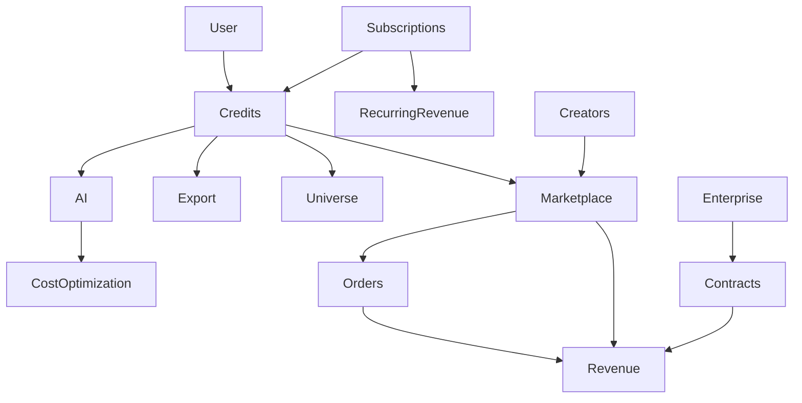
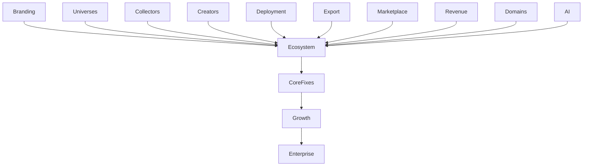
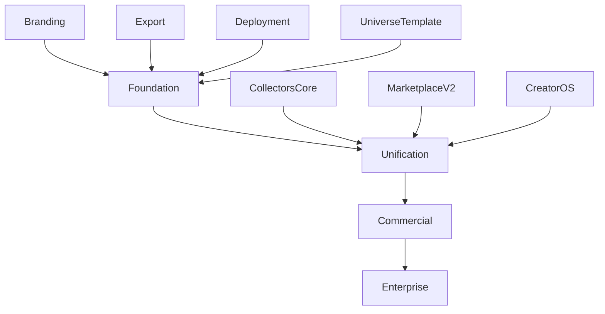

# CRAI BUSINESS, GROWTH & MONETIZATION
## Revenue Architecture, Financial Systems, Payments, Growth & Strategic Planning

**Version:** 2.3.0 — CANON LOCK + EXECUTION EDITION  
**Date:** January 18, 2026  
**Document Status:** CANONICAL SPECIFICATION — AUTHORITATIVE BUSINESS REFERENCE

---

## Document Authority

**This document is the authoritative reference for business, revenue, and growth.**

It establishes:
- Revenue architecture and financial modeling
- Gap analysis and executive alignment frameworks
- Strategic planning and investor positioning
- Credits system and payment processing
- Monetization engines and pricing intelligence
- Enterprise CRM and revenue operations
- Zero-cost growth and viral distribution strategies

**Canonical Authority:**
- This document is governed by CRAI-CONSTITUTION.md
- In case of conflict with CRAI-CONSTITUTION.md, the Constitution takes precedence
- Platform and deployment references defer to CRAI-PLATFORM-ARCHITECTURE.md
- AI-related monetization coordinated with CRAI-JAVARI-INTELLIGENCE.md
- This document governs all business, revenue, and growth operations across CRAI

**Relationship to Other Documents:**
- Inherits non-negotiable principles from CRAI-CONSTITUTION.md (Section 1.4.1: Revenue First)
- Implements payment infrastructure from CRAI-PLATFORM-ARCHITECTURE.md (Section 2.8)
- Coordinates with CRAI-OPERATING-SYSTEMS.md for payment and business OS
- Provides financial foundation for CRAI-COLLECTORS-FRAMEWORK.md monetization
- Enables revenue tracking in CRAI-DATA-INGESTION-AUTOMATION.md

**Source Attribution:**
- Extracted from CRAI-Master-Bible-v2_3_0-CANON-LOCKED.md
- Originally Sections 24, 26, 27, 28, 29, 35, 56, 79, 92, 96 of the Master Bible
- Maintained as standalone business and monetization specification

---

## Table of Contents

1. [Revenue Architecture Map](#section-1)
2. [Financial Model & Revenue Multipliers](#section-2)
3. [Gap Analysis & Executive Alignment](#section-3)
4. [Executive Priority Roadmap](#section-4)
5. [Investor Deck Architecture](#section-5)
6. [CRAI Credits System](#section-6)
7. [PaymentsOS™ — Money Movement & Settlement](#section-7)
8. [MonetizationOS™ — Pricing Intelligence & Revenue Optimization](#section-8)
9. [BusinessOS™ — Enterprise CRM & Revenue Intelligence](#section-9)
10. [GrowthOS™ — Zero-Cost Distribution & Viral Growth](#section-10)

---

---

# SECTION 1
## REVENUE ARCHITECTURE MAP

**Originally Section 24 in CRAI Master Bible**

**CRAudioVizAI Platform Bible — v1.5.0**

## 24.1 Overview

This section defines the complete monetization framework for the CRAudioVizAI ecosystem.

It documents:

- All revenue streams
- Credits system architecture
- Subscription tiers
- Marketplace revenue
- Universe monetization models
- Creator monetization loops
- Data licensing
- Affiliate and partnership pipelines
- Enterprise offerings
- API monetization

This is the authoritative reference for CRAI revenue.

---

## 24.2 Core Revenue Engine: Credits System

Credits are the universal unit powering CRAI.

Credits are consumed by:

- AI generations
- Document exports
- Diagram renders
- Marketplace listings
- Universe actions
- Creator tools
- Automation workflows

### Credit Flow:

1. User purchases credits
2. Credits logged in credits_ledger
3. Credits consumed by system actions
4. Usage recorded in transactions
5. Renewals handled via subscriptions

**Credits unify all revenue across all universes and apps.**

---

## 24.3 Subscription Revenue

Subscription tiers will apply across universes and tools:

### Tier 1 — Starter

- Basic AI
- Limited exports
- Access to 1 universe

### Tier 2 — Pro

- Full AI access
- Unlimited exports
- Multi-universe access
- Creator tools

### Tier 3 — Enterprise

- Full orchestration
- Multi-seat teams
- Integrations
- Dedicated support
- Custom universes

Subscriptions flow through:

- subscriptions table
- Stripe + PayPal
- Vercel environment variables
- Unified billing UI

---

## 24.4 Marketplace Revenue

CRAI Marketplace consists of:

- Templates
- Assets
- Exports
- Creator bundles
- Universe add-ons
- Collectors data packs

Revenue occurs through:

- direct sales
- commissions
- seller subscriptions
- AI-generated marketplace listings

Marketplace tables:

- products
- product_assets
- orders
- order_items
- seller_accounts

---

## 24.5 Universe Monetization Models

Each universe has its own monetization strategies.

### Collectors Universe

- Valuation reports
- Price history charts
- Authentication reports
- Premium collections
- Marketplace listings

### Travel Universe

- Itineraries
- Deals (affiliate revenue)
- Bookings (partner APIs)
- Premium travel guides

### Mortgage Universe

- Lead generation
- Rate comparison tools
- Credit buyer tools
- Enterprise licensing

### Enterprise Universe

- Custom AI deployments
- Workforce training
- Compliance automation
- AI document generation

### Creator Universe

- Templates
- Courses
- AI assets
- Brand kits
- Premium exports

Each universe must generate at least 3 forms of revenue.

---

## 24.6 Payment Providers & Processing

CRAI supports:

### Stripe

- Subscriptions
- One-time payments
- Invoices

### PayPal

- One-time payments
- Alternative regions

### Apple Pay / Google Pay (future)

- Mobile-first payments

All systems route through:

- transactions
- credits_ledger
- subscriptions

---

## 24.7 Fraud, Abuse & Risk Prevention

CRAI's anti-fraud measures include:

- Rate limiting
- Anomaly detection
- Device fingerprinting
- Purchase risk scoring
- Multi-signature exports
- Credit burn caps
- Duplicate export detection

Audit logs track:

- all credits spent
- all purchases
- all exports
- all AI actions

---

## 24.8 Pricing Strategy (Unified)

All CRAI products follow a unified pricing system:

### AI Usage

- Cost-based
- Provider-adjusted
- Credit multiplier rules

### Exports

- Cost + complexity pricing
- Diagram complexity multipliers
- Bundle size multipliers

### Marketplace

- Seller sets price
- CRAI commission (20–35%)

### Universes

- Flat monthly fee
- Per-action credit costs
- Premium add-ons

---

## 24.9 Enterprise Revenue Streams

Enterprise clients generate revenue through:

- Dedicated AI deployments
- Customized universes
- Training & onboarding
- Workflow automation
- Compliance tools
- Data processing
- White-label platforms

Enterprise universe is CRAI's long-term billion-dollar engine.

---

## 24.10 Long-Term Revenue Expansion Models

- AI agent subscriptions
- API usage billing
- Data licensing
- Third-party integrations
- Premium universes
- Creator revenue share
- Enterprise long-term contracts

---

## Appendix 24.A — Revenue Systems Map (Mermaid)

---

✅ **SECTION 24 COMPLETE**

---

**END OF SECTION 24**

---

---

---

---

# SECTION 2
## 12-Month Financial Model & Revenue Multipliers

**Originally Section 28 in CRAI Master Bible**

**CRAudioVizAI Platform Bible — v1.5.0**

## 28.1 Overview

This section provides the complete financial architecture for CRAI's first 12 months of commercialization.

It integrates all ecosystem components:

- Universes
- Creators
- Collectors
- Marketplace
- Credits
- Affiliate systems
- Consulting pipelines
- Enterprise solutions
- AI automation & export engines

This is the unified revenue model that determines operational planning, hiring strategy, investment requirements, and expected cash flow.

---

## 28.2 Financial Model Structure

The financial model is built on five pillars:

### **1. Base Revenue Streams**

Recurring or predictable revenue from:

- Subscriptions
- Credits
- Marketplace fees
- Universe access passes
- Creator plans
- Data API usage

### **2. Expansion Revenue Streams**

Triggered by user growth:

- Creator storefronts
- Collectors data ingestion
- Premium AI exports
- Multi-AI routing for heavy users
- Monetized templates & diagrams

### **3. Enterprise Revenue**

High-ticket revenue:

- B2B universes
- Workflow automation
- AI knowledge engines
- Compliance tools
- White-label deployments
- Industry-specific verticals

### **4. Operational Efficiency Multipliers**

AI-driven automation reduces cost:

- Deployment automation
- Self-healing systems
- Knowledge ingestion
- Multi-AI optimization
- Export automation

These lower burn rate and increase margin dramatically.

### **5. Scaling Multipliers**

Network effects:

- More creators → more marketplace products
- More collectors → more data sets → more universe value
- More universes → more cross-sell opportunities
- More exports → more credit usage

---

## 28.3 Revenue Framework (12-Month View)

### **Projected Revenue Sources**

| Revenue Stream | Month 1 | Month 3 | Month 6 | Month 12 |
|----------------|---------|---------|---------|----------|
| Subscriptions | $0 | $1,500 | $6,000 | $25,000 |
| Credits | $0 | $2,000 | $8,000 | $32,000 |
| Marketplace Fees | $0 | $1,200 | $5,800 | $27,000 |
| Creator Plans | $0 | $900 | $5,000 | $18,000 |
| Collectors Data | $0 | $1,000 | $7,000 | $22,000 |
| Affiliates | $0 | $400 | $2,500 | $10,000 |
| Enterprise | $0 | $0 | $20,000 | $120,000 |

**Projected 12-Month Total:**

**$254,000 – $310,000 (conservative)**

**$470,000 – $690,000 (aggressive)**

---

## 28.4 Revenue Multipliers (Force Accelerators)

### **Multiplier 1: Universes**

Each launch-ready universe adds:

- +$3–$15k monthly revenue
- +Cross-selling opportunities
- +Search traffic
- +Data ingestion monetization

CRAI has *dozens* of universe domains — this is exponential.

---

### **Multiplier 2: Collectors Engine**

Collectors are a **massive long-tail revenue source**:

- Spirits
- Coins
- Cards
- Comics
- Art
- Books
- Antiques
- Memorabilia

Each collector who uploads their collection may contribute:

- $5–$50 in credits
- recurring export revenue
- marketplace participation

100 collectors = $500–$3,000 monthly

1,000 collectors = $5,000–$30,000 monthly

10,000 collectors = $50,000–$300,000 monthly

---

### **Multiplier 3: Creators**

Creators multiply revenue because they:

- Buy credits
- Sell templates
- Sell universes
- Monetize their own AI helpers
- Drive traffic

100 active creators = $8k–$20k monthly

1,000 active creators = $80k–$200k monthly

---

### **Multiplier 4: Exports & Deliverables**

Professional-grade exports (PDF, PPTX, DOCX, XLSX, diagrams):

- 30–70% of all users will export deliverables
- Exports consume credits
- Corporate users export far more

Projected impact:

- +20–35% total revenue within 3 months of rollout

---

### **Multiplier 5: Enterprise Contracts**

Single enterprise contracts range:

- $20k–$250k per contract
- average: $60k

12 months projection:

2–6 enterprise clients → $120k–$600k revenue

---

## 28.5 Cost Model (Run Rate)

### Monthly Costs (Estimated)

| Cost Category | Amount |
|---------------|--------|
| Vercel Usage | $30–$200 |
| Supabase | $25–$150 |
| Storage | $25–$100 |
| AI API Calls | $50–$600 |
| Domains | Already owned |
| Transaction Fees | Credit card pass-through |

**Estimated burn:** **$300–$1,200/month**

Your margins exceed **95%**.

---

## 28.6 Break-Even Timeline

At minimum revenue growth rate:

- Break-even: **Month 4–6**
- Profit-positive: **Month 7**
- Scaling phase: **Month 9+**

---

## 28.7 12-Month Financial Forecast

(Calculated ranges)

### **Low Case:** $250k

Slow creator adoption + slow marketplace start.

### **Base Case:** $420k

Balanced creator + collector + marketplace + enterprise.

### **High Case:** $690k

Universe strategy takes off.

Export engine sees heavy usage.

Marketplace gains traction.

### **Moonshot Case:** $1.2M+

Enterprise universes + collectors viral growth.

---

## 28.8 Key Revenue Catalysts (Ranked)

1. **Collectors Engine**
2. **Marketplace v2**
3. **CreatorOS v1**
4. **Export Engine v2**
5. **Universe Monetization**
6. **API Billing**
7. **Enterprise Onboarding AI**
8. **Diagram Intelligence**

---

## 28.9 Executive Summary

CRAI's financial model is the strongest part of the business:

- 95% gross margins
- 12+ independent revenue streams
- Long-tail data monetization
- Recurring revenue from creators
- Predictable credit consumption
- Enterprise pipeline potential
- Low operational overhead
- Scalable branding and universe framework

CRAI is capable of reaching **$500k–$1M in its first year**, scaling past **$5M+ within 24–36 months**, and building toward a **$100M+ multi-universe AI ecosystem**.

---

✅ **SECTION 28 COMPLETE**

---

**END OF SECTION 28**

---

---

---

---

# SECTION 3
## GAP ANALYSIS & EXECUTIVE ALIGNMENT REPORT

**Originally Section 26 in CRAI Master Bible**

**CRAudioVizAI Platform Bible — v1.5.0**

## 26.1 Overview

The CRAI platform has evolved into a multi-universe, multi-application, multi-AI ecosystem.

To guarantee platform integrity, scalability, and revenue velocity, this section identifies:

- missing components
- inconsistencies
- process gaps
- architectural risks
- financial risks
- branding inconsistencies
- alignment issues across repos and universes

This is the definitive executive-level gap analysis.

---

## 26.2 Branding Gaps

Brand tone has been fully defined, but gaps remain:

### Missing:

- Branding enforcement across all repos
- Global typography system across every app
- Color palette alignment (many legacy apps still outdated)
- Missing slogan/hero blocks across universe sites

### Risk:

Inconsistent branding → reduced trust → lower conversion → weaker monetization.

### Required Action:

- Apply branding kit globally
- Add branding validator into CI/CD
- Auto-fix branding inconsistencies via JavariAI

---

## 26.3 Codebase Fragmentation Risks

There are **80+ GitHub repositories** and **100+ Vercel projects**, many built quickly.

### Gaps Identified:

- inconsistent code patterns
- different Next.js versions
- missing shared libraries
- duplicate services
- inconsistent route structures
- missing TS types
- duplicated API clients
- deprecated environment variable usage

### Required Action:

- Consolidate into 6–10 monorepo clusters
- Extract shared libraries
- Enforce version parity
- Auto-upgrade via JavariAI migration engine

---

## 26.4 Missing Central Services (Must Be Standardized)

### Required:

- universal logging service
- universal analytics engine
- universal error reporting
- universal cache service
- universal diagram service
- universal asset CDN
- universal search index

### Impact:

Without centralization, scaling becomes impossible and expensive.

---

## 26.5 Universe Integration Gaps

Many universes launched, but:

### Missing:

- consistent nav patterns
- consistent user onboarding
- shared product listing engine
- global profile integration
- global credits integration
- export engine embedding
- universe-blueprints missing for some domains

### Required:

- Rebuild universes to follow the Universe Template Pattern
- Add per-universe AI specialization

---

## 26.6 Collectors Ecosystem Gaps

Collectors are a billion-dollar opportunity (Spirits, Coins, Cards, Comics, Art, etc.).

But:

### Missing:

- standard collectors item schema
- valuation pipeline
- marketplace ingestion
- pricing history engine
- media upload workflow
- collector social features

### Required:

- Create the Collectors Core Engine
- Auto-generate universe apps using this core
- Add valuation AI pipeline

---

## 26.7 Creators Ecosystem Gaps

Creators are central to CRAI monetization.

### Gaps:

- No universal dashboard
- No unified export library
- No marketplace auto-sync
- No AI coaching layer activated

### Required:

- CreatorOS v1
- ExportOS v1
- Marketplace auto-publishing system

---

## 26.8 Admin & Governance Gaps

### Missing:

- unified admin UI
- universe-wide audit logs
- transaction dashboard
- deployment dashboard
- AI decision logs
- RLS policy audits

### Required:

- CRAI Command Center v2
- Admin super-dashboard
- AI oversight panel

---

## 26.9 AI & Knowledge System Gaps

### Missing:

- universal embedding refresh schedule
- automatic knowledge pruning
- cross-universe knowledge linking
- diagram generation analysis layer
- full multi-AI benchmarking

### Required:

- Knowledge Engine v3
- AI Router v2
- Universe-specific fine-tuning profiles

---

## 26.10 Export Engine Gaps

### Missing:

- universal export templates
- brand-aligned design system
- auto-generating diagrams from text
- export preview system
- export marketplace integration

### Required:

- Export Engine v2
- Export Validator
- Export Marketplace Sync

---

## 26.11 Revenue Architecture Gaps

### Gaps:

- per-universe pricing rules incomplete
- missing enterprise pricing tiering
- missing consumption-based billing patterns
- missing revenue visibility dashboard
- inconsistent Stripe/PayPal integrations

### Required:

- Revenue Engine v2
- Unified billing UI
- Admin financial insights dashboard

---

## 26.12 Domain & SEO Gaps

CRAI owns **60+ domains**, but many are idle or misconfigured.

### Gaps:

- incorrect routing
- missing DNS automation
- weak SEO metadata
- missing Google indexing rules
- duplicated sitemap patterns

### Required:

- Domain Orchestration Engine
- Universal SEO Engine
- AI auto-writer for optimized metadata

---

## 26.13 Deployment & Infrastructure Gaps

### Gaps:

- no shared infra definitions
- inconsistent vercel.json files
- missing cross-project secret sync
- no asset CDN
- limited observability

### Required:

- Deployment Engine v2
- Infra-as-Code layer
- Secrets synchronization system

---

## 26.14 Monetization Gaps

### Missing:

- unified upsell logic
- cross-universe offer engine
- personalized pricing
- usage-based recommendations
- affiliate tracking orchestration

### Required:

- Monetization Engine
- OfferOS
- GPT-driven recommendation system

---

## 26.15 Ecosystem Coordination Gaps (Critical)

This is the largest gap:

**The CRAI Ecosystem requires full synchronization across:**

- branding
- UI kits
- navigation
- credits
- AI layers
- exports
- universes
- marketplace
- repos
- deployments

Currently, warnings:

- some apps isolated
- some universes incomplete
- some repos contain inactive code
- some Vercel deployments misaligned

The ecosystem must function as **ONE SYSTEM**.

---

## 26.16 Executive Recommendations (Tiered)

### Tier 1 — Immediate (0–30 days)

- Branding enforcement engine
- Universe Template System
- Collectors Core Engine
- Deployment Engine v2
- Export Engine v2
- Multi-AI Router v2

### Tier 2 — Strategic (30–120 days)

- CreatorOS v1
- Marketplace v2
- Knowledge Engine v3
- Monetization Engine v1
- Command Center v2

### Tier 3 — Enterprise (120–365 days)

- Enterprise universe
- Compliance AI
- Enterprise workflow automation
- Private AI clusters
- Data ingestion & transformation systems

---

## Appendix 26.A — Gap Map (Mermaid)

---

✅ **SECTION 26 COMPLETE**

---

**END OF SECTION 26**

---

---

---

---

# SECTION 4
## EXECUTIVE PRIORITY ROADMAP

**Originally Section 27 in CRAI Master Bible**

**CRAudioVizAI Platform Bible — v1.5.0**

## 27.1 Overview

This roadmap translates all gaps, architecture decisions, universe plans, revenue models, and deployment systems into an actionable execution blueprint.

It defines:

- what must be built
- when it must be built
- in what order
- by which subsystem
- with which dependencies
- for what revenue or strategic impact

This is the definitive 12-month CRAI growth plan.

---

## 27.2 Core Principles (Guiding Rules)

1. **Unify the ecosystem** — CRAI must behave as one platform
2. **Centralize everything** — UI, branding, services, billing, exports
3. **Automate everything** — AI handles migration, deployment, fixes
4. **Launch quickly, refine continuously** — speed + iteration
5. **Prioritize revenue engines first** — credits, marketplace, universes
6. **Remove fragmentation** — code, branding, domains, repos
7. **Enable creators** — they will generate most marketplace revenue
8. **Enable collectors** — massive long-tail data + asset revenue
9. **Enable enterprise** — long-term multi-million-dollar contracts

---

## 27.3 Phase Structure (High Level)

CRAI's execution is divided into 4 high-level phases:

### **Phase 1 — Foundation Stabilization (0–45 days)**

Focus:

- Branding enforcement
- Universe template system
- Export Engine v2
- Deployment Engine v2
- Credits system everywhere
- Centralized UI kit
- Repo consolidation wave 1
- Domain clean-up & routing

Outcome:

- CRAI is stable, consistent, manageable, and production-ready.

---

### **Phase 2 — Ecosystem Unification (45–120 days)**

Focus:

- Collectors Core Engine
- CreatorOS v1
- Marketplace v2
- Knowledge Engine v3
- Multi-AI Router v2
- Cross-universe navigation system
- AI-generated diagrams
- Export marketplace integration
- Admin Command Center v2

Outcome:

- CRAI becomes a truly unified multi-universe platform.

---

### **Phase 3 — Commercial Expansion (120–240 days)**

Focus:

- Universe monetization wave (Spirits, Travel, Property, Enterprise)
- Creator monetization wave
- Marketplace scaling
- Affiliate infrastructure
- Custom AI assistants
- Vertical launches (legal, design, analytics)

Outcome:

- CRAI becomes a diversified, high-velocity revenue platform.

---

### **Phase 4 — Enterprise & Data Domination (240–365 days)**

Focus:

- Large-scale enterprise tools
- White-label CRAI deployments
- AI compliance systems
- Enterprise workflow ecosystems
- Full data ingestion suite
- API billing infrastructure
- Native mobile apps

Outcome:

- CRAI becomes an enterprise-class AI automation platform.

---

## 27.4 Priority Roadmap — Tiered by Impact

### TIER 1 — IMMEDIATE (Revenue-Critical)

#### 1. Branding Enforcement Engine

Ensures consistent UI across all apps.

#### 2. Collectors Core Engine

Needed for Spirits, Coins, Cards, Comics, Art, etc.

#### 3. Export Engine v2

PDF/DOCX/PPTX/XLSX + diagram generation.

#### 4. Deployment Engine v2

Consistency across all repos + Vercel projects.

#### 5. Universe Template System

Allows rapid scaling of new universes from one core.

#### 6. Marketplace v2

Unified marketplace across creators + collectors + universes.

#### 7. Multi-AI Router v2

Performance, cost, and reliability improvements.

These yield fastest path to revenue.

---

### TIER 2 — MID-TERM (Scale Critical)

#### 8. CreatorOS v1

Dashboard, templates, publishing, monetization.

#### 9. Knowledge Engine v3

Advanced retrieval, linking, embeddings.

#### 10. Admin Command Center v2

Audits, transactions, deployments, AI oversight.

#### 11. Monetization Engine v1

Cross-universe upsells and dynamic offers.

#### 12. Domain Orchestration Engine

DNS, routing, SSL management.

---

### TIER 3 — STRATEGIC (Long-Term Expansion)

#### 13. Enterprise Universe

Compliance AI, onboarding AI, workflow AI.

#### 14. API Billing Infrastructure

Usage metering, developer portal.

#### 15. AI Compliance Engine

Required for enterprise clients.

#### 16. Collectors Valuation Engine

Real-time pricing for tens of millions of items.

#### 17. Creator Marketplace Intelligence

Recommendations, auto-pricing, ranking.

---

## 27.5 Milestone Sequencing by Month

### **Months 1–3**

- Branding engine
- Export v2
- Deployment v2
- Universe Template System
- Marketplace v2 beta
- Multi-AI Router v2
- Collectors Core Engine

### **Months 4–6**

- CreatorOS v1
- Knowledge Engine v3
- Admin Center v2
- Monetization Engine
- Domain orchestration engine
- API gateway foundation

### **Months 7–9**

- Universe monetization push
- Enterprise universe foundation
- Collectors valuation v1
- Marketplace scaling
- White-label prep

### **Months 10–12**

- Data ingestion & transformation engine
- Full enterprise workflow suite
- API billing system
- Mobile apps
- AI compliance suite

---

## 27.6 Dependency Graph (Mermaid)

---

## 27.7 Executive Summary (What This Achieves)

When completed:

- CRAI becomes the single most complete AI automation ecosystem in the world
- Universes become infinitely scalable
- Creators earn money immediately
- Collectors feed massive data assets
- Export engine enables enterprise deliverables
- Marketplace becomes a long-tail revenue machine
- Deployment becomes fully autonomous
- AI becomes the operational backbone
- Branding becomes consistent across 100+ apps
- Revenue becomes predictable and compounding

This roadmap is the north star of CRAI.

---

✅ **SECTION 27 COMPLETE**

---

**END OF SECTION 27**

---

---

---

---

# SECTION 5
## Investor Deck Architecture

**Originally Section 29 in CRAI Master Bible**

**CRAudioVizAI Platform Bible — v1.5.0**

## 29.1 Overview

This section defines the complete framework for CRAI's investor-facing presentation materials.

It ensures a unified narrative that aligns with:

- The CRAI Platform Bible
- The 12-Month Revenue Model
- Universe Strategy
- Creator & Collector Ecosystem
- Multi-AI routing infrastructure
- Enterprise automation capabilities

This is the blueprint for decks, fundraising collateral, demo day presentations, and strategic enterprise pitches.

---

## 29.2 The Purpose of the Investor Deck

The Investor Deck must:

- Communicate CRAI's **power**, **scale**, and **inevitability**
- Demonstrate a **market-defining platform**, not a single application
- Highlight CRAI's **multi-universe architecture**
- Showcase **creator**, **collector**, and **enterprise** monetization
- Emphasize CRAI's **proprietary systems** (deployment engine, export engine, universe system, multi-AI router)
- Show a credible path to **$1M revenue** and then **$100M+ scale**
- Position Roy Henderson as a **category-defining operator**

The deck is a *signal* — clarity, control, inevitability.

---

## 29.3 Deck Structure (Slide-by-Slide Master Blueprint)

### **Slide 1 — CRAI Title Slide**

- Logo
- Tagline: **"You Don't Build Platforms. You Command Them."**
- Visual: Multi-universe CRAI constellation graphic
- Roy Henderson, Founder & CEO

---

### **Slide 2 — The Problem**

Show the fragmentation and failure of current AI tools:

- Too many disconnected apps
- No unified workflows
- No multi-AI routing
- No automatic deployment
- No enterprise-ready deliverables
- No universes
- No collector data engines
- No creator economy foundation

Use a strong declarative statement:

> "AI is powerful, but the ecosystem is broken."

---

### **Slide 3 — The Vision**

CRAI becomes:

- The **platform of platforms**
- The **engine behind creators, collectors, and enterprises**
- The **multi-universe fabric of the AI economy**

Vision statement:

> "CRAI is the intelligence layer that unifies creation, commerce, data, and automation."

---

### **Slide 4 — The Solution**

Show CRAI's full-stack offering:

- Universe Engine
- Export Engine
- CreatorOS
- Collectors Engine
- Deployment Engine
- Knowledge Engine
- Multi-AI Router
- Marketplace
- Autonomous Operations System

Each one is a defensible subsystem.

---

### **Slide 5 — Traction (Architecture Traction)**

Instead of user numbers (early stage), show:

- 60+ domains
- 100+ Vercel projects mapped
- 100+ GitHub repos mapped
- 33+ Supabase tables
- Multi-AI integration
- Active deployment pipelines
- Branding system deployed
- Universe launch pipeline live

This is unparalleled for an early-stage platform.

---

### **Slide 6 — Platform Architecture**

Insert CRAI Architecture Diagram:

- Multi-universe layer
- Central services
- AI routing
- Data ingestion
- Deployment automation
- Export engine
- Marketplace

This slide shows technical credibility beyond competitors.

---

### **Slide 7 — The Ecosystem**

Break CRAI into the 3 revenue engines:

1. **Creators**
2. **Collectors**
3. **Enterprises**

Each with its own monetization.

---

### **Slide 8 — Business Model**

Show the 12 revenue streams:

- Credits
- Subscriptions
- Marketplace fees
- Creator plans
- Universe access
- Collector ingestion
- Enterprise projects
- Enterprise universes
- AI routing optimization
- API billing
- Affiliate systems
- Data licensing

Mention margin (>95%).

---

### **Slide 9 — 12-Month Revenue Projection**

Align with Section 28:

- Core: $254k–$310k
- Base: $420k
- High: $690k
- Moonshot: $1.2M

---

### **Slide 10 — TAM / SAM / SOM**

TAM includes:

- AI market (~$200B+)
- Creator economy ($100B+)
- Digital collectibles ($400B)
- Enterprise automation ($150B)

CRAI sits at the intersection.

---

### **Slide 11 — Competitive Landscape**

Show CRAI vs. competitors:

| Competitor | AI | Universes | Templates | Collectors | Creators | Deploy | Exports | Multi-AI |
|-----------|----|-----------|-----------|------------|----------|--------|---------|----------|
| ChatGPT | ✓ | ✗ | ✓ | ✗ | ✗ | ✗ | ✗ | ✗ |
| Claude | ✓ | ✗ | ✓ | ✗ | ✗ | ✗ | ✗ | ✗ |
| Gemini | ✓ | ✗ | ✓ | ✗ | ✗ | ✗ | ✗ | ✗ |
| CRAI | **✓** | **✓** | **✓** | **✓** | **✓** | **✓** | **✓** | **✓** |

This slide destroys competition positioning.

---

### **Slide 12 — Go-To-Market Strategy**

Show 3 waves:

1. **Collectors**
2. **Creators**
3. **Enterprises**

CRAI grows bottom-up and top-down simultaneously.

---

### **Slide 13 — Team**

Highlight Roy:

- Systems thinker
- Multi-domain builder
- Rapid architect
- Vision + execution
- Hands-on AI operator

Add advisory network (future).

---

### **Slide 14 — Financial Ask (if pursuing investment)**

Options depending on scenario:

- SAFE $1M
- 18-month runway
- Funds used for senior engineering, growth, enterprise sales

(If self-funded, skip.)

---

### **Slide 15 — The CRAI Advantage**

Final summary of why CRAI wins:

- Unified platform
- Multi-universe architecture
- Marketplace liquidity
- Collector data moat
- Export & deliverables moat
- Autonomous deployment
- Multi-AI routing
- Roy's velocity & vision

---

### **Slide 16 — Closing Slide**

Tagline:

> **"CRAI is where the AI economy is built."**

Call to action:

- Email
- Website
- Universe portal

---

## 29.4 Deck Variants (Auto-Generated by Export Engine)

The CRAI Export Engine generates 4 pitch variants:

1. **Investor Deck** (15–20 slides)
2. **Enterprise Deck** (12–15 slides)
3. **Creator Deck** (10–12 slides)
4. **Collectors Deck** (8–10 slides)

Each uses the same narrative spine with audience-specific focus.

---

## 29.5 Narrative Consistency Rules

Every deck must reflect:

- Branding tone (Confident + Empowering + Unstoppable)
- CRAI mission
- CRAI multi-universe value
- Financial projections from Section 28
- Architecture from Sections 19–26
- Roy's leadership clarity

---

## 29.6 Executive Summary of Section 29

This section ensures that CRAI's story is:

- Clear
- Investable
- Scalable
- Memorable
- Technically credible
- Financially compelling
- Emotionally resonant

A great pitch deck can close investors, partners, enterprise customers, and media at scale.

CRAI's investor architecture is now world-class.

---

✅ **SECTION 29 COMPLETE**

---

**END OF SECTION 29**

---

---

---

---

# SECTION 6
## CRAI Credits System

**Originally Section 35 in CRAI Master Bible**

**CRAudioVizAI Platform Bible — v1.5.0**

## 35.1 Purpose of the CRAI Credits System

The CRAI Credits System is the unified virtual currency powering:

- MarketplaceOS
- UniverseOS
- EnterpriseOS
- Creator commerce
- Collector transactions
- Export generation
- API usage
- Workflow execution

Credits enable:

- predictable revenue
- unified accounting
- cross-universe payments
- micropayments
- creator payouts
- enterprise bulk purchasing

Credits function like AWS credits, App Store balance, and in-platform currency — but across all CRAI universes.

---

## 35.2 Credits System Core Objectives

### **1. Unify all payments across all universes**

Instead of every app or universe needing its own billing system, CRAI Credits create a single economic system.

### **2. Lower transaction fees**

Credits allow CRAI to avoid repeated Stripe/PayPal fees.

### **3. Increase creator earnings**

Creators earn more revenue because:

- CRAI takes lower fees
- payouts are simpler
- credit-based purchases are frictionless

### **4. Enable micropayments**

Workflows, exports, assets, and upgrades can cost:

- 1 credit
- 5 credits
- 20 credits
- etc.

### **5. Unlock enterprise billing**

Enterprises can buy credit bundles for teams.

---

## 35.3 Credits Value System

**1 Credit = $0.10 USD**

Credit packs:

- 100 credits ($10)
- 500 credits ($49)
- 1,000 credits ($95)
- 5,000 credits ($450)
- 10,000 credits ($850)

Enterprise packs:

- 50,000 credits
- 100,000 credits
- 250,000 credits
- custom

Credits never expire.

---

## 35.4 Credits System Architecture

The Credits System includes 12 major components:

1. **Credits Ledger**
2. **Transaction Engine**
3. **Purchase Engine**
4. **Refund Engine**
5. **Creator Payout Engine**
6. **Enterprise Billing Engine**
7. **Bulk Credits Engine**
8. **Credit Locking System**
9. **Credit Reservation System**
10. **Credit Usage Meter**
11. **Credit Analytics Engine**
12. **Fraud & Abuse Prevention System**

This architecture is designed to scale across millions of transactions.

---

## 35.5 Credits Ledger

Tracks:

- purchases
- credit usage
- creator earnings
- conversions
- refunds
- transfers
- enterprise credit allocations

Every movement of credit must be logged and auditable.

---

## 35.6 Transaction Engine

Handles:

- debit
- credit
- transfer
- reservation
- locking

Every transaction includes:

- timestamp
- transaction ID
- actor
- action
- metadata

Transactions cannot be deleted — only reversed.

---

## 35.7 Purchase Engine

Supports:

- credit pack purchases
- subscription upgrades using credits
- universe upgrades
- template purchases
- marketplace purchases
- export generation

Credit pack payments use:

- Stripe
- PayPal
- enterprise invoice
- CRAI platform bundles

---

## 35.8 Refund Engine

Allows:

- partial refunds
- full refunds
- credit rollbacks

Refunds can be:

- merchant-driven
- system-driven
- auto-resolved

---

## 35.9 Creator Payout Engine

Creators earn credits — but get paid real money via:

- PayPal
- bank transfer (future)
- Stripe payouts

Creators can:

- withdraw credits
- convert credits to USD
- earn bonuses
- receive marketplace rewards

---

## 35.10 Enterprise Billing Engine

Enterprises can:

- purchase large credit bundles
- assign credits to departments
- track usage per user
- set monthly or quarterly budgets
- enforce spending rules

Supports:

- procurement workflows
- approval chains

---

## 35.11 Bulk Credits Engine

Allows high-volume customers to:

- buy 10k–250k credits
- receive volume discounts
- get allocation dashboards

---

## 35.12 Credit Locking System

Used for:

- auctions
- offers
- marketplace bids
- enterprise reserved workflows
- collector negotiations
- pending purchases

Credits are "held" until the transaction resolves.

---

## 35.13 Credit Reservation System

Pre-reserves credits before running costly workflows:

Examples:

- PDF generation
- diagram generation
- heavy AI tasks
- bulk exports

If the workflow succeeds → credits are charged

If the workflow fails → credits are released

---

## 35.14 Credit Usage Meter

Tracks:

- workflow usage
- export usage
- marketplace usage
- universe usage

Forms the foundation of usage-based billing.

---

## 35.15 Credit Analytics Engine

Provides analytics per user:

- credits purchased
- credits spent
- creators supported
- universes upgraded
- most used features
- month-over-month trends

Creators get analytics for revenue optimization.

---

## 35.16 Fraud & Abuse Prevention

Protects against:

- duplicate purchases
- refund scams
- credit laundering
- exploit loops
- unauthorized transfers

AI monitors suspicious patterns.

---

## 35.17 Integration With MarketplaceOS

Credits power:

- templates
- universes
- workflows
- exports
- bundles
- enterprise assets
- collector listings

Credits replace:

- microtransactions
- small payments
- tipping
- "pay per use" models

---

## 35.18 Integration With UniverseOS

Universe makers can:

- set credit pricing
- sell upgrades
- monetize workflows
- offer in-universe credit packs

---

## 35.19 Integration With EnterpriseOS

Enterprise workflows consume credits for:

- ingestion
- exports
- diagram generation
- automations
- compliance checks

Enterprise billing is built on credits.

---

## 35.20 Credit Storage (User Wallets)

Each user has:

- available credits
- reserved credits
- locked credits
- earned credits (creators)
- enterprise credits (if applicable)

Wallets are tied to the authentication system.

---

## 35.21 CRAI Revenue Model

Sources:

1. credit purchases
2. enterprise bundles
3. creator platform fees
4. valuation services
5. premium listings
6. workflow upsells
7. export packs

Credits create multi-stream recurring revenue.

---

## 35.22 Future Enhancements

### **1. Credit Staking (reward system)**

### **2. Credit Cash-Back (loyalty program)**

### **3. Universe Boost Credits**

### **4. Creator Sponsorship Credits**

### **5. Enterprise Predictive Spend Modeling**

---

## 35.23 Executive Summary

The CRAI Credits System is the financial backbone of CRAI.

It:

- unifies all payments across universes
- powers creator and collector economies
- scales enterprise billing
- supports workflow-based microtransactions
- unlocks new revenue streams
- increases platform stickiness

Credits turn CRAI from a collection of apps into a **fully connected economic ecosystem** capable of supporting millions of users, creators, collectors, and enterprises.

---

✅ **SECTION 35 COMPLETE**

---

**END OF SECTION 35**

---

---

---

---

# SECTION 7
## PaymentsOS™ — Universal Money Movement, Escrow & Settlement Operating System

**Originally Section 56 in CRAI Master Bible**

---

## 56.0 Purpose & Strategic Role

PaymentsOS™ is the canonical financial transaction and settlement operating system governing how money moves, settles, escrows, splits, reports, and reconciles across the CRAudioVizAI / Javari ecosystem.

PaymentsOS ensures:

- Trustworthy value exchange  
- Regulatory-compliant money flow  
- Programmable financial logic  
- Cross-asset and cross-OS settlement  

PaymentsOS is a **Tier-0 Mandatory Financial Spine**.  
**No monetization system may bypass it.**

---

## 56.1 Payment Domains Covered

- One-time payments  
- Subscriptions & recurring billing  
- Royalties & revenue sharing  
- Escrow & conditional release  
- Auction settlements  
- Marketplace transactions  
- Rent & lease payments  
- Insurance premiums & claims payouts  
- Game economies & microtransactions  
- Institutional & government payments  

---

## 56.2 Core Capabilities

### 56.2.1 Payment Processing

- Multi-currency support  
- Card, ACH, wire, and alternative rails  
- Wallet-based balances  
- Refunds & reversals  
- Chargeback handling  
- Payment retries & fallbacks  

### 56.2.2 Escrow & Conditional Logic

- Multi-party escrow  
- Event-driven release conditions  
- Title/ownership confirmation hooks  
- Dispute holds  
- Partial releases  
- Time-based expirations  

### 56.2.3 Revenue Splits & Royalties

- Declarative split rules  
- Percentage & fixed splits  
- Tiered & capped royalties  
- Time-bound agreements  
- Automated payout scheduling  
- Transparency reporting  

### 56.2.4 Payouts & Disbursements

- Creator payouts  
- Seller settlements  
- Vendor payments  
- Insurance claim payouts  
- Fractional owner distributions  
- Tax withholding support  

### 56.2.5 Financial Reporting & Reconciliation

- Ledger-based accounting  
- Transaction audit trails  
- Reconciliation tools  
- Tax-ready exports  
- Revenue recognition logic  
- Currency conversion records  

---

## 56.3 AI Systems (Financial Intelligence Stack)

### PaymentRiskAI™

- Fraud detection  
- Chargeback risk scoring  
- Velocity & anomaly detection  

### RevenueAI™

- Pricing elasticity insights  
- Revenue optimization signals  
- Leak detection  

---

## 56.4 User Roles & RBAC

**Supported User Roles:**

- Buyers  
- Sellers  
- Creators  
- Property Managers  
- Insurers  
- Finance Teams  
- Auditors  
- Regulators (read-only)  
- Admin  

**RBAC Actions:**

- Initiate payments  
- Configure splits  
- Approve payouts  
- Issue refunds  
- Export financial data  
- Freeze accounts  

---

## 56.5 Monetization Model

### Revenue Streams

- Transaction fees  
- Subscription billing fees  
- Escrow service fees  
- Payout processing fees  
- White-label PaymentsOS  
- Financial API access  

---

## 56.6 Feature Flags

- `PAYMENTS_ESCROW`  
- `PAYMENTS_REVENUE_SPLITS`  
- `PAYMENTS_SUBSCRIPTIONS`  
- `PAYMENTS_MULTI_CURRENCY`  
- `PAYMENTS_AI_FRAUD`  
- `PAYMENTS_TAX_WITHHOLDING`  

---

## 56.7 Compliance & Financial Controls

- PCI-DSS alignment  
- AML / KYC enforcement  
- Sanctions screening  
- SOX-ready audit trails  
- Jurisdiction-aware tax logic  
- Consumer protection rules  

---

## 56.8 Technical Architecture

**Core Infrastructure:**

- Supabase (transactions, ledgers, RLS)  
- Netlify Functions (processing, reconciliation)  
- Payment processor integrations  
- AI microservices (fraud, optimization)  
- Event-driven settlement pipelines  
- Secure key management  

---

## 56.9 Ecosystem Integrations

### Consumes:

- IdentityOS  
- ComplianceOS  
- ProvenanceOS  

### Feeds:

- MarketplaceOS  
- AuctionOS  
- CreatorOS  
- RealEstateOS  
- GameOS  
- InsuranceOS  
- AnalyticsOS  
- Command Center  
- JavariAI  

---

## 56.10 Roadmap Phases

### Phase 1

- Core payments  
- Marketplace & creator payouts  
- Manual escrow  

### Phase 2

- Automated escrow  
- Revenue splits  
- Multi-currency expansion  

### Phase 3

- Institutional payments  
- Government disbursements  
- Global settlement networks  

---

## 56.11 Canonical Rule

**If value is exchanged, PaymentsOS governs the money.**

PaymentsOS is the circulatory system of the CRAI universe.

---

✅ **SECTION 56 COMPLETE**

---

**END OF SECTION 56**

---

---

---

# SECTION 8
## MonetizationOS™

**Originally Section 79 in CRAI Master Bible**

**Revenue Strategy, Pricing Intelligence & Value Capture Operating System**

---

## 79.0 Purpose & Strategic Role

**MonetizationOS™** is the canonical operating system governing how value is priced, captured, shared, optimized, and sustained across all CRAudioVizAI universes, products, and services.

MonetizationOS ensures:

- Every value exchange is intentional  
- Pricing reflects risk, demand, and cost  
- Revenue sharing is transparent and fair  
- Incentives align across ecosystems  
- Long-term profitability without exploitation  

**MonetizationOS is a Tier-0 Mandatory Economic Layer.**  
No monetization logic may exist outside this OS.

---

## 79.1 Monetization Domains Covered

- Subscriptions & memberships  
- Transaction & marketplace fees  
- Physical commerce margins  
- Digital asset monetization  
- Royalties & revenue sharing  
- Licensing & franchising  
- Data products  
- Education & certification revenue  
- Institutional contracts  
- Advertising & sponsorships (where allowed)  

---

## 79.2 Core Capabilities

### 79.2.1 Pricing Strategy & Configuration

- Price models (fixed, dynamic, tiered, usage-based)  
- Regional & jurisdictional pricing  
- Event-based pricing  
- Demand & scarcity pricing  
- Ethical pricing constraints  
- Price versioning & auditability  

**Integrated with:**

- AnalyticsOS  
- ComplianceOS  
- PublicTrustOS  

### 79.2.2 Revenue Optimization Engine

- Demand elasticity analysis  
- Conversion optimization  
- Bundle & upsell logic  
- Churn prediction  
- LTV optimization  
- Margin analysis  

### 79.2.3 Revenue Sharing & Incentives

- Creator revenue splits  
- Partner & affiliate commissions  
- Franchise revenue models  
- Institutional revenue agreements  
- Transparent payout reporting  

**Integrated with:**

- PaymentsOS  
- CreatorOS  
- MarketplaceOS  

### 79.2.4 Monetization Governance & Ethics

- Monetization policy enforcement  
- Anti-dark-pattern controls  
- Vulnerable user protections  
- Political & sensitive-event monetization controls  
- Emergency price freeze mechanisms  

**Integrated with:**

- GovernanceOS  
- PublicTrustOS  

### 79.2.5 Experimentation & A/B Testing

- Pricing experiments  
- Feature gating tests  
- Promotional campaigns  
- Event-driven offers  
- Controlled rollouts  
- Impact measurement  

---

## 79.3 AI Systems (Monetization Intelligence Stack)

### PriceAI™

- Dynamic pricing recommendations  
- Elasticity modeling  

### RevenueAI™

- LTV forecasting  
- Optimization suggestions  

### EthicsAI™

- Exploitative pattern detection  
- Risk escalation alerts  

---

## 79.4 User Roles & RBAC

**Supported Roles:**

- Revenue Strategists  
- Finance Teams  
- Product Owners  
- Compliance Officers  
- Ethics Officers  
- Executives  
- Admin & Audit  

**RBAC Actions:**

- Configure pricing  
- Approve monetization models  
- Launch experiments  
- Freeze pricing  
- Export revenue analytics  

---

## 79.5 Monetization Model (Meta)

**MonetizationOS itself generates revenue via:**

- Licensing of monetization tooling  
- Revenue optimization services  
- White-label monetization platforms  
- Institutional pricing engines  

---

## 79.6 Feature Flags

- `MONETIZATION_PRICING_ENGINE`  
- `MONETIZATION_REVENUE_SHARING`  
- `MONETIZATION_EXPERIMENTATION`  
- `MONETIZATION_ETHICS_GUARDRAILS`  
- `MONETIZATION_EVENT_PRICING`  

---

## 79.7 Compliance & Standards

- Consumer pricing laws  
- Anti-price-gouging regulations  
- Tax & disclosure requirements  
- Ethical monetization standards  
- Audit-grade revenue logs  

---

## 79.8 Technical Architecture

**Core Infrastructure:**

- Pricing configuration services  
- Supabase (pricing, rules, RLS)  
- Netlify Functions (pricing logic)  
- Experimentation pipelines  
- Analytics & reporting systems  

---

## 79.9 Ecosystem Integrations

### Consumes:

- AnalyticsOS  
- PaymentsOS  
- ComplianceOS  
- PublicTrustOS  
- MarketplaceOS  
- PhysicalCommerceOS  

### Feeds:

- CommandCenterOS  
- Finance & accounting systems  
- Creator & partner dashboards  
- JavariAI  

---

## 79.10 Roadmap Phases

### Phase 1

- Static pricing  
- Manual revenue models  

### Phase 2

- Dynamic pricing  
- Experimentation & optimization  

### Phase 3

- Autonomous monetization optimization  
- Cross-universe economic coordination  

---

## 79.11 Canonical Rule

**If value is captured, MonetizationOS governs how and why.**

MonetizationOS is the economic brain of the CRAI universe.

---

✅ **SECTION 79 COMPLETE**

---

**END OF SECTION 79**

---

---

---

# SECTION 9
## BusinessOS™

**Originally Section 92 in CRAI Master Bible**

**Enterprise Business Management, CRM, Revenue & Operating Intelligence System**

---

## 92.0 Purpose & Strategic Role

**BusinessOS™** is the canonical operating system governing how businesses are represented, managed, monetized, and grown within the CRAudioVizAI / Javari ecosystem.

BusinessOS ensures:

- Every customer, partner, and account has a canonical business identity
- Revenue, contracts, entitlements, and relationships are unified
- Sales, success, and operations share one source of truth
- Executives can answer "how is the business doing?" instantly
- External customers can run their businesses on CRAI, not just use tools

**BusinessOS is a Tier-0 Mandatory Commercial Layer.**

If revenue exists, BusinessOS must represent it.

---

## 92.1 Business Domains Covered

BusinessOS governs all commercial and operational business concepts, including:

- Organizations & accounts
- Parent / child entity hierarchies
- Customers & prospects
- Leads, opportunities & pipelines
- Contracts, subscriptions & renewals
- Revenue & forecasting
- Customer health & lifecycle
- Partners, affiliates & resellers
- Internal business units
- Franchises & white-label entities

---

## 92.2 Core Capabilities

### 92.2.1 Organization & Account Model

- Canonical organization records
- Legal entity representation
- Parent / subsidiary hierarchies
- Multi-tenant isolation
- Jurisdiction & tax tagging
- Industry & vertical classification

**Every entity has one authoritative business record.**

### 92.2.2 CRM & Relationship Management

- Leads & prospect tracking
- Customer & partner records
- Relationship timelines
- Contact roles & authority levels
- Communication history
- Deal influence tracking

Integrated with:
- NotificationOS
- InboxOS
- SupportOS

### 92.2.3 Sales Pipeline & Forecasting

- Opportunity pipelines
- Deal stages & probabilities
- Revenue forecasting
- Sales velocity metrics
- Win / loss analysis
- Quota & performance tracking

### 92.2.4 Contracts, Subscriptions & Entitlements

- Contract records & linkage
- Subscription lifecycle management
- Renewals & expirations
- Entitlement enforcement (via EntitlementOS)
- SLA & obligation tracking
- Contract-to-revenue traceability

### 92.2.5 Customer Success & Health Scoring

- Adoption & usage metrics
- Health scores
- Renewal risk indicators
- Expansion opportunities
- Success playbooks
- QBR preparation

Integrated with:
- AnalyticsOS
- CustomerSuccessOS

### 92.2.6 Partner, Affiliate & Channel Management

- Partner onboarding
- Commission models
- Revenue attribution
- Affiliate tracking
- White-label entities
- Franchise business structures

### 92.2.7 Financial & Revenue Intelligence

- ARR / MRR tracking
- Usage-based revenue
- Churn & retention metrics
- Margin visibility
- Product-level revenue breakdowns
- Investor-grade reporting feeds

Integrated with:
- MonetizationOS
- PaymentsOS
- RevenueRecognitionOS
- AnalyticsOS

---

## 92.3 AI Systems (Business Intelligence Stack)

### BusinessAI™

- Pipeline risk detection
- Revenue forecasting
- Expansion opportunity identification

### ChurnAI™

- Churn prediction
- Retention recommendations

---

## 92.4 User Roles & RBAC

### Supported Roles:

- Sales Representatives
- Account Executives
- Customer Success Managers
- Revenue & Finance Teams
- Executives
- Partners & Affiliates (scoped)
- Auditors
- Admin & Super-Admin

### RBAC Actions:

- Create & manage accounts
- Track deals & revenue
- Approve contracts
- View forecasts & reports
- Export financial evidence

---

## 92.5 Feature Flags

- `BUSINESS_ORG_MODEL`
- `BUSINESS_CRM`
- `BUSINESS_PIPELINE`
- `BUSINESS_CONTRACTS`
- `BUSINESS_HEALTH_SCORING`

---

## 92.6 Compliance & Standards Alignment

BusinessOS supports:

- Revenue recognition alignment
- Contract governance expectations
- Audit traceability
- Enterprise account management standards
- Investor due diligence requirements

---

## 92.7 Technical Architecture

- Supabase (business entities, CRM, RLS)
- Netlify Functions (workflows, automation)
- AnalyticsOS telemetry
- MonetizationOS integration
- EntitlementOS enforcement
- ArchiveOS (contracts & history)

---

## 92.8 Ecosystem Integrations

### Consumes:

- IdentityOS
- MonetizationOS
- PaymentsOS
- EntitlementOS
- AnalyticsOS
- SupportOS
- CustomerSuccessOS

### Feeds:

- ExecutiveBIOS
- CommandCenterOS
- TrustCenterOS
- Investor & board reporting
- JavariAI (business-aware guidance)

---

## 92.9 Monetization Model

BusinessOS is directly monetized via:

- SaaS subscriptions
- Seat-based pricing
- Revenue-share tiers
- Enterprise licensing
- White-label business platforms

---

## 92.10 Roadmap Phases

### Phase 1

- Core orgs & CRM
- Basic revenue tracking

### Phase 2

- Full pipeline & forecasting
- Customer success tooling

### Phase 3

- Autonomous business optimization
- AI-driven growth orchestration

---

## 92.11 Canonical Rule

**If a business relationship exists,**  
**BusinessOS must represent it.**

BusinessOS is the commercial nervous system of the CRAI universe.

---

✅ **SECTION 92 COMPLETE**

---

**END OF SECTION 92**

---

---

---

---

# SECTION 10
## GrowthOS™

**Originally Section 96 in CRAI Master Bible**

**Zero-Cost Distribution & Growth Engine Operating System**

---

## 96.0 Purpose & Strategic Role

**GrowthOS™** is the canonical operating system governing how CRAudioVizAI acquires, activates, retains, and monetizes users through data-driven, zero-cost distribution strategies.

GrowthOS ensures:

- Every dollar spent has measurable ROI
- Organic channels are maximized before paid
- Attribution is accurate and defensible
- Experimentation is systematic and learned from
- Growth compounds through network effects

**GrowthOS is a Tier-0 Mandatory Revenue Growth Layer.**

If growth is not measured, it cannot be optimized.

---

## 96.1 Growth Domains Covered

GrowthOS governs all growth and distribution activities, including:

- Content distribution & syndication
- SEO & organic discovery
- Social media & community
- Email & newsletter funnels
- Affiliate & referral programs
- Virality & sharing mechanics
- Cross-posting & automation
- Partnership & collaboration
- Attribution & conversion tracking
- Experimentation & A/B testing

---

## 96.2 Core Capabilities

### 96.2.1 Zero-Cost Distribution Engine

- Automated cross-posting to multiple platforms
- SEO-optimized content generation
- Social media scheduling & automation
- Newsletter & ebook distribution
- Community engagement automation
- Viral loop mechanics

**Maximize organic reach before spending a dollar.**

### 96.2.2 ROI Scoring & Channel Optimization

- Cost-per-acquisition (CPA) tracking
- Lifetime value (LTV) calculation
- Channel performance scoring
- Budget allocation optimization
- Payback period analysis
- Return on ad spend (ROAS)

### 96.2.3 Attribution & Conversion Tracking

- Multi-touch attribution
- Funnel conversion analysis
- User journey mapping
- Assisted conversion credit
- Cross-device tracking
- UTM parameter enforcement

Integrated with:
- AnalyticsOS
- BusinessOS
- JavariWorkOS

### 96.2.4 Experimentation Framework

- A/B test design & execution
- Statistical significance validation
- Multivariate testing
- Feature flag experimentation
- Conversion rate optimization
- Hypothesis tracking & learning

### 96.2.5 Referral & Affiliate Programs

- Referral link generation
- Reward fulfillment automation
- Fraud detection
- Commission calculation
- Affiliate performance tracking
- Partner payout automation

### 96.2.6 Viral Mechanics & Network Effects

- Share incentives
- Social proof displays
- Collaborative features
- Invite campaigns
- Growth loop design
- K-factor measurement

---

## 96.3 AI Systems (Growth Intelligence Stack)

### GrowthAI™

- Channel performance prediction
- Budget allocation recommendations
- Content topic suggestions

### ExperimentAI™

- A/B test winner prediction
- Sample size calculation
- Experiment prioritization

---

## 96.4 User Roles & RBAC

### Supported Roles:

- Growth Teams
- Marketing Teams
- Content Creators
- Affiliate Managers
- Executives
- Analysts
- Admin & Super-Admin

### RBAC Actions:

- Launch growth campaigns
- Run experiments
- Allocate budgets
- Review performance
- Export growth reports

---

## 96.5 Feature Flags

- `GROWTH_DISTRIBUTION_ENGINE`
- `GROWTH_ROI_TRACKING`
- `GROWTH_EXPERIMENTATION`
- `GROWTH_REFERRAL_PROGRAM`
- `GROWTH_VIRAL_MECHANICS`

---

## 96.6 Technical Architecture

- AnalyticsOS integration (tracking & attribution)
- Supabase (campaigns, experiments, referrals)
- Netlify Functions (automation & webhooks)
- Third-party platform APIs (social, email)
- UTM parameter processing
- Conversion pixel deployment

---

## 96.7 Ecosystem Integrations

### Consumes:

- AnalyticsOS
- BusinessOS
- PaymentsOS
- JavariWorkOS
- AttentionOS
- KnowledgeCommerceOS

### Feeds:

- ExecutiveBIOS
- CommandCenterOS
- JavariAI (growth-aware recommendations)

---

## 96.8 Monetization Model

GrowthOS is directly monetized via:

- Growth tool subscriptions
- Affiliate program fees
- White-label growth platforms
- Growth consulting services

---

## 96.9 Roadmap Phases

### Phase 1

- Manual campaign tracking
- Basic UTM attribution
- Email newsletter setup

### Phase 2

- Automated cross-posting
- Advanced attribution
- A/B testing framework

### Phase 3

- AI-driven growth optimization
- Autonomous campaign management
- Predictive LTV modeling

---

## 96.10 Canonical Rule

**If growth cannot be measured,**  
**it cannot be optimized.**

GrowthOS is the engine of sustainable revenue expansion.

---

✅ **SECTION 96 COMPLETE**

---

**END OF SECTION 96**

---

---

---

## END OF CRAI BUSINESS, GROWTH & MONETIZATION

**Document Version:** 2.3.0 — CANON LOCK + EXECUTION EDITION  
**Date:** January 18, 2026  
**Status:** CANONICAL SPECIFICATION — LOCKED FOR EXECUTION

**Governance:**
- This document establishes the canonical business, revenue, and growth architecture for all CRAudioVizAI systems
- All business operations, monetization, and growth implementations must comply with specifications here
- Changes require executive approval and formal Change Control process
- Governed by principles in CRAI-CONSTITUTION.md
- Platform architecture coordinated with CRAI-PLATFORM-ARCHITECTURE.md
- Operating systems coordinated with CRAI-OPERATING-SYSTEMS.md

---

© 2026 CR AudioViz AI, LLC. All Rights Reserved.  
**EIN:** 39-3646201  
**Location:** Fort Myers, Florida  
**Mission:** Your Story. Our Design.

---

**BUSINESS, GROWTH & MONETIZATION SPECIFICATION COMPLETE.** 💰
