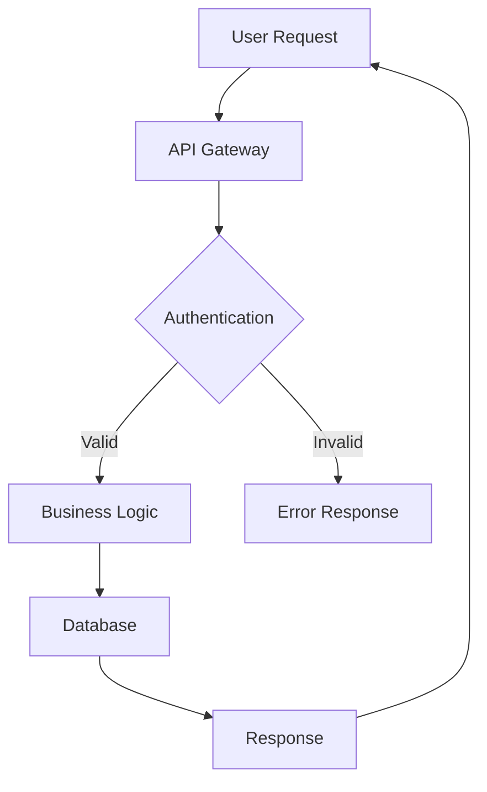

# CRAI-COMMS-DEVELOPER-EXPORT.md
**CRAudioVizAI Canonical Document 9 of 12**  
**Version:** 3.0 — EXECUTION CANON  
**Status:** AUTHORITATIVE COMMUNICATIONS, DEVELOPER EXPERIENCE & EXPORT SPECIFICATION

---

## 0. PURPOSE OF THIS DOCUMENT

This document defines the communications, developer experience, and data export architecture for CRAI.

This includes:
- Communications & Branding — Brand identity, messaging, voice
- Developer Experience (DX) — APIs, SDKs, documentation
- Documentation Systems — Technical docs, guides, references
- NotificationOS™ — Multi-channel notification delivery
- ExportOS™ — Data export and portability
- DiagramOS™ — Visual documentation and architecture diagrams

This document establishes enterprise-grade communication, developer tools, and data portability capabilities.

**Governed by:** CRAI-CONSTITUTION.md  
**Coordinates with:** All 11 other canonical documents

---

## 1. COMMUNICATIONS & BRANDING

### 1.1 Brand Identity

**Company Name:** CR AudioViz AI, LLC

**Brand Names:**
- CRAI (primary platform brand)
- Javari AI (AI orchestration system)
- CollectorsOS™, CreatorOS™, MarketplaceOS™ (operating systems)

**Tagline:** "Your Story. Our Design."

**Mission:** Empower creators, collectors, and communities through AI-powered tools and marketplaces.

**Vision:** Become the universal platform for digital creation, collection, and commerce.

**Values:**
- Customer Success First
- Quality Without Shortcuts (Henderson Standard)
- Transparency and Honesty
- Innovation Through AI
- Community-Driven Growth

### 1.2 Brand Voice & Tone

**Brand Voice Characteristics:**
- Professional yet approachable
- Confident but not arrogant
- Helpful and educational
- Transparent and honest
- Empowering and supportive

**Tone Variations by Context:**

**Marketing & Sales:**
- Enthusiastic and inspiring
- Benefit-focused
- Action-oriented
- Example: "Transform your collection into a professional portfolio in minutes."

**Product & Support:**
- Clear and instructive
- Patient and helpful
- Solution-focused
- Example: "Let's walk through setting up your first collection."

**Technical & Developer:**
- Precise and detailed
- Technical but accessible
- Example-driven
- Example: "The API returns a paginated response with a maximum of 100 items per page."

**Crisis & Incidents:**
- Calm and reassuring
- Transparent about issues
- Solution-oriented
- Example: "We've identified the issue and are implementing a fix. Expected resolution: 30 minutes."

### 1.3 Visual Identity

**Brand Colors:**
```
Primary:
- CRAI Blue:    #2563EB
- CRAI Navy:    #1E3A8A

Secondary:
- Success Green: #10B981
- Warning Yellow: #F59E0B
- Error Red:     #EF4444
- Info Blue:     #3B82F6

Neutrals:
- Gray 900:     #111827
- Gray 700:     #374151
- Gray 500:     #6B7280
- Gray 300:     #D1D5DB
- Gray 100:     #F3F4F6
- White:        #FFFFFF
```

**Typography:**
```
Primary Font:   Inter (sans-serif)
- Headers:      Inter Bold
- Body:         Inter Regular
- Code:         JetBrains Mono

Font Sizes:
- H1:           3rem (48px)
- H2:           2.25rem (36px)
- H3:           1.875rem (30px)
- H4:           1.5rem (24px)
- Body:         1rem (16px)
- Small:        0.875rem (14px)
```

**Logo Usage:**
- Primary logo: Full color on white background
- Reversed logo: White on dark background
- Icon logo: For small spaces (app icons, favicons)
- Minimum size: 32px height (icon), 120px width (full logo)

### 1.4 Messaging Framework

**Positioning Statement:**
"CRAI is the AI-powered platform that empowers creators and collectors to build, organize, and monetize their passions through professional-grade tools, intelligent automation, and vibrant marketplaces."

**Key Messages:**

**For Collectors:**
- "Catalog, value, and protect your collection with AI-powered tools"
- "Professional collection management without the complexity"
- "Your collection, your data, your control"

**For Creators:**
- "Create professional content with AI assistance"
- "From idea to published in minutes"
- "Build once, publish everywhere"

**For Marketplace Users:**
- "Buy and sell with confidence"
- "Fair fees, transparent processes"
- "Global marketplace, local community"

**For Developers:**
- "Build on CRAI with powerful APIs"
- "Comprehensive docs, helpful support"
- "Scale with confidence"

---

## 2. DEVELOPER EXPERIENCE (DX)

### 2.1 Developer-First Philosophy

**Core DX Principles:**
1. **Clear Documentation** — Comprehensive, accurate, always up-to-date
2. **Working Examples** — Real code that developers can copy and run
3. **Fast Onboarding** — From signup to first API call in <5 minutes
4. **Predictable APIs** — Consistent patterns, clear conventions
5. **Helpful Errors** — Actionable error messages with solutions
6. **Transparent Pricing** — Clear cost estimation before execution
7. **Responsive Support** — Fast responses to developer questions

### 2.2 API Design Standards

**RESTful API Conventions:**

**Resource Naming:**
- Plural nouns for collections: `/api/v1/collections`, `/api/v1/items`
- Singular nouns for singletons: `/api/v1/profile`, `/api/v1/settings`
- Lowercase, hyphen-separated: `/api/v1/marketplace-listings`

**HTTP Methods:**
```
GET    - Retrieve resource(s)
POST   - Create new resource
PUT    - Replace entire resource
PATCH  - Update partial resource
DELETE - Remove resource
```

**Response Format:**
```json
{
  "data": {
    "id": "item_123",
    "type": "collection_item",
    "attributes": {
      "title": "1909-S VDB Lincoln Cent",
      "value": 1250.00
    }
  },
  "meta": {
    "timestamp": "2026-01-18T02:00:00Z",
    "request_id": "req_abc123"
  }
}
```

**Pagination:**
```json
{
  "data": [...],
  "pagination": {
    "page": 1,
    "per_page": 25,
    "total_pages": 10,
    "total_items": 250
  },
  "links": {
    "first": "/api/v1/collections?page=1",
    "prev": null,
    "next": "/api/v1/collections?page=2",
    "last": "/api/v1/collections?page=10"
  }
}
```

**Error Format:**
```json
{
  "error": {
    "code": "RESOURCE_NOT_FOUND",
    "message": "Collection with ID 'col_123' was not found",
    "details": {
      "resource_type": "collection",
      "resource_id": "col_123"
    },
    "documentation_url": "https://docs.craudiovizai.com/errors#resource-not-found",
    "request_id": "req_abc123"
  }
}
```

### 2.3 SDKs & Client Libraries

**Official SDKs:**

**JavaScript/TypeScript SDK:**
```typescript
import { CRAIClient } from '@craudiovizai/sdk'

const client = new CRAIClient({
  apiKey: process.env.CRAI_API_KEY
})

// Create collection
const collection = await client.collections.create({
  name: 'My Coin Collection',
  category: 'coins'
})

// Add item
const item = await client.collections.items.create(collection.id, {
  title: '1909-S VDB Lincoln Cent',
  value: 1250.00
})
```

**Python SDK:**
```python
from crai import CRAIClient

client = CRAIClient(api_key=os.environ['CRAI_API_KEY'])

# Create collection
collection = client.collections.create(
    name='My Coin Collection',
    category='coins'
)

# Add item
item = client.collections.items.create(
    collection_id=collection.id,
    title='1909-S VDB Lincoln Cent',
    value=1250.00
)
```

**SDK Features:**
- Type safety (TypeScript)
- Automatic retries
- Rate limit handling
- Webhook signature verification
- Built-in pagination helpers
- Comprehensive error handling

### 2.4 Developer Portal

**Portal Features:**

**Dashboard:**
- API key management
- Usage analytics
- Cost tracking
- Rate limit monitoring
- Recent requests log

**Documentation:**
- API reference (interactive)
- Guides and tutorials
- Code examples
- Webhook documentation
- Changelog

**Tools:**
- API explorer (try endpoints)
- Webhook tester
- Postman collection
- OpenAPI spec download

**Support:**
- Developer forum
- GitHub discussions
- Email support
- Office hours (weekly)

---

## 3. DOCUMENTATION SYSTEMS

### 3.1 Documentation Types

**1. API Reference Documentation**
- Auto-generated from OpenAPI spec
- Interactive API explorer
- Code examples in multiple languages
- Request/response samples

**2. Guides & Tutorials**
- Getting started guide
- Quickstart tutorials
- Best practices
- Use case guides
- Migration guides

**3. Conceptual Documentation**
- Architecture overview
- System concepts
- Security model
- Data model

**4. SDK Documentation**
- Installation instructions
- Configuration guide
- Usage examples
- API reference

**5. Video Tutorials**
- Platform overview
- Feature walkthroughs
- Integration guides
- Advanced techniques

### 3.2 Documentation Standards

**Writing Standards:**

**Clarity:**
- Use simple, direct language
- Define technical terms on first use
- Use active voice
- Keep sentences short (<25 words)

**Structure:**
- Start with context (what/why)
- Explain the concept
- Provide examples
- Link to related docs

**Code Examples:**
- Runnable, tested code
- Comments explaining key points
- Error handling included
- Real-world use cases

**Consistency:**
- Standard terminology
- Consistent formatting
- Uniform code style
- Predictable structure

### 3.3 Documentation Architecture

**Documentation Site Structure:**
```
docs.craudiovizai.com/
├── Getting Started
│   ├── Overview
│   ├── Quickstart
│   ├── Authentication
│   └── First API Call
│
├── Guides
│   ├── Collections
│   ├── Marketplace
│   ├── AI Features
│   └── Webhooks
│
├── API Reference
│   ├── Authentication
│   ├── Collections
│   ├── Marketplace
│   ├── Credits
│   └── Webhooks
│
├── SDKs
│   ├── JavaScript/TypeScript
│   ├── Python
│   └── REST API
│
└── Resources
    ├── Changelog
    ├── Status Page
    ├── Support
    └── Community
```

---

## 4. NOTIFICATIONOS™

### 4.1 Purpose & Scope

**Purpose:** Deliver notifications across all channels

**Responsibilities:**
- Multi-channel delivery (email, SMS, push, in-app)
- Notification routing and prioritization
- User preference management
- Delivery tracking and analytics
- Template management
- Rate limiting and throttling

### 4.2 Notification Channels

**Email (Primary Channel):**
- Provider: Resend
- Capabilities: Transactional, marketing, triggered
- Delivery rate: 99.9%
- Bounce handling: Automatic
- Templates: HTML + plain text

**SMS (Future):**
- Provider: Twilio
- Use cases: 2FA, urgent alerts
- Opt-in required
- Cost: Per-message charges

**Push Notifications (Future):**
- Provider: Firebase Cloud Messaging
- Platforms: Web, iOS, Android
- Use cases: Real-time updates, alerts

**In-App Notifications:**
- Real-time via WebSocket
- Persistent notification center
- Read/unread tracking
- Action buttons

### 4.3 Notification Types

**Transactional:**
- Account creation welcome
- Password reset
- Email verification
- Payment confirmation
- Order confirmation
- Subscription renewal

**Operational:**
- Collection export ready
- Appraisal complete
- Item sold notification
- Bid placed/outbid
- Price alert triggered

**Marketing:**
- Feature announcements
- Product updates
- Educational content
- Promotional offers
- Newsletter

**Social:**
- New follower
- Comment on item
- Message received
- Mention notification

**Security:**
- Login from new device
- Password changed
- API key created
- Suspicious activity

### 4.4 Notification Preferences

**User Controls:**

**Channel Preferences:**
- Email: On/Off per category
- SMS: On/Off per category
- Push: On/Off per category
- In-app: Always on (can mark as read)

**Frequency Preferences:**
- Real-time (immediate)
- Digest (daily/weekly)
- Important only
- Muted

**Category Preferences:**
```typescript
interface NotificationPreferences {
  transactional: {
    email: boolean      // Cannot disable
    sms: boolean
    push: boolean
  }
  operational: {
    email: boolean
    sms: boolean
    push: boolean
    frequency: 'realtime' | 'digest'
  }
  marketing: {
    email: boolean
    sms: boolean        // Opt-in required
    push: boolean
  }
  social: {
    email: boolean
    push: boolean
    frequency: 'realtime' | 'digest'
  }
}
```

### 4.5 Notification Templates

**Template System:**

**Email Templates:**
```handlebars
{{!-- welcome-email.hbs --}}
<h1>Welcome to CRAI, {{user.name}}!</h1>

<p>We're excited to have you join our community of creators and collectors.</p>

<a href="{{ctaUrl}}">Get Started</a>

<p>Need help? <a href="{{supportUrl}}">Contact our support team</a></p>
```

**Template Variables:**
- User data: `{{user.name}}`, `{{user.email}}`
- Platform data: `{{platform.name}}`, `{{platform.url}}`
- Dynamic content: `{{item.title}}`, `{{order.total}}`
- CTAs: `{{ctaUrl}}`, `{{ctaText}}`

**Template Management:**
- Version control (Git)
- Preview mode
- A/B testing support
- Localization (future)

### 4.6 Delivery Tracking

**Metrics Tracked:**
- Sent count
- Delivered count
- Opened count (email)
- Clicked count (email)
- Bounced count
- Complained count (spam)
- Unsubscribed count

**Delivery Status:**
```typescript
enum DeliveryStatus {
  QUEUED = 'queued',
  SENT = 'sent',
  DELIVERED = 'delivered',
  OPENED = 'opened',
  CLICKED = 'clicked',
  BOUNCED = 'bounced',
  FAILED = 'failed'
}
```

---

## 5. EXPORTOS™

### 5.1 Purpose & Scope

**Purpose:** Enable data export and portability

**Responsibilities:**
- Data export requests
- Export format generation
- Large export handling
- Export delivery
- Data portability compliance (GDPR)

### 5.2 Export Types

**User Data Export:**
- Complete account data
- GDPR compliance (right to access)
- Formats: JSON, CSV
- Delivery: Download link (30-day expiration)

**Collection Export:**
- Single collection or all collections
- Formats: JSON, CSV, Excel
- Images: ZIP archive
- Delivery: Immediate download (<1GB), email link (>1GB)

**Transaction History:**
- Purchases, sales, payments
- Formats: CSV, Excel, PDF
- Date range filtering
- Tax reporting format

**Analytics Export:**
- Usage statistics
- Performance metrics
- Formats: CSV, JSON
- Scheduled exports (daily, weekly, monthly)

### 5.3 Export Formats

**JSON Export:**
```json
{
  "export_metadata": {
    "export_date": "2026-01-18T02:00:00Z",
    "export_type": "collection",
    "version": "1.0"
  },
  "collections": [
    {
      "id": "col_123",
      "name": "My Coin Collection",
      "items": [
        {
          "id": "item_456",
          "title": "1909-S VDB Lincoln Cent",
          "value": 1250.00,
          "images": ["https://..."]
        }
      ]
    }
  ]
}
```

**CSV Export:**
```csv
collection_id,collection_name,item_id,item_title,item_value,acquisition_date
col_123,My Coin Collection,item_456,1909-S VDB Lincoln Cent,1250.00,2024-06-15
```

**Excel Export:**
- Multiple sheets (collections, items, valuations)
- Formatted cells (currency, dates)
- Summary sheet with totals
- Charts and graphs (optional)

**PDF Export:**
- Professional formatting
- Portfolio summary
- Item catalog with images
- Valuation reports

### 5.4 Export Workflow

**Export Request:**
1. User initiates export
2. System validates request
3. Export job queued
4. User receives confirmation

**Export Processing:**
1. Fetch data from database
2. Transform to export format
3. Generate file(s)
4. Upload to secure storage
5. Generate download link

**Export Delivery:**
1. Send email notification
2. Download link (30-day expiration)
3. Track download events
4. Auto-delete after expiration

**Large Exports (>1GB):**
- Split into multiple files
- ZIP archive
- Chunk-based download
- Resume support

### 5.5 Data Portability

**GDPR Compliance:**
- Right to access (user data export)
- Right to portability (machine-readable format)
- Response time: 30 days
- Free of charge

**Export Contents:**
- Profile information
- Collections and items
- Transactions and orders
- Messages and communications
- Analytics and usage data
- Uploaded files and images

**Data Exclusions:**
- Derived/calculated data (can be recalculated)
- System-generated IDs (internal use)
- Other users' data (privacy protection)

---

## 6. DIAGRAMOS™

### 6.1 Purpose & Scope

**Purpose:** Generate visual documentation and architecture diagrams

**Responsibilities:**
- Architecture diagram generation
- System topology visualization
- Data flow diagrams
- ERD (entity-relationship diagrams)
- Sequence diagrams
- Deployment diagrams

### 6.2 Diagram Types

**Architecture Diagrams:**
- System overview
- Component architecture
- Network topology
- Infrastructure layout

**Data Flow Diagrams:**
- Data ingestion pipelines
- Processing workflows
- API request flow
- Event propagation

**Entity-Relationship Diagrams:**
- Database schema
- Table relationships
- Foreign key constraints

**Sequence Diagrams:**
- API request/response flow
- Authentication flow
- Workflow execution
- Multi-system interactions

**Deployment Diagrams:**
- Production environment
- Staging environment
- DR environment

### 6.3 Diagram Generation

**Tools:**
- Mermaid (text-based diagrams)
- PlantUML (UML diagrams)
- Excalidraw (hand-drawn style)
- Lucidchart (professional diagrams)

**Mermaid Example:**


**Diagram Storage:**
- Source files (version controlled in Git)
- Generated images (PNG, SVG)
- Documentation integration
- Auto-generation on commit

### 6.4 Documentation Integration

**Embedded Diagrams:**
```markdown
# Architecture Overview

The following diagram shows the system architecture:


```

**Interactive Diagrams:**
- Clickable components
- Hover tooltips
- Zoom/pan functionality
- Dark mode support

---

## 7. CONTENT MANAGEMENT

### 7.1 Marketing Content

**Website Content:**
- Homepage
- Product pages
- Pricing page
- About page
- Blog posts

**Content Guidelines:**
- SEO optimization
- Clear value propositions
- Strong calls-to-action
- Social proof (testimonials, case studies)
- Mobile-optimized

### 7.2 Educational Content

**Blog:**
- Product updates (weekly)
- Industry insights (bi-weekly)
- How-to guides (weekly)
- Case studies (monthly)

**Video Content:**
- Product demos
- Feature tutorials
- Customer success stories
- Webinars (monthly)

**Downloadable Resources:**
- eBooks and guides
- Templates and checklists
- Whitepapers
- Industry reports

### 7.3 Community Content

**Forum:**
- Category-specific discussions
- Feature requests
- Bug reports
- General discussion

**Knowledge Base:**
- FAQs
- Troubleshooting guides
- Best practices
- Tips and tricks

**User-Generated Content:**
- Collection showcases
- Success stories
- Product reviews
- Community highlights

---

## 8. SUPPORT SYSTEMS

### 8.1 Support Channels

**Self-Service:**
- Knowledge base
- Video tutorials
- Community forum
- Documentation

**Email Support:**
- support@craudiovizai.com
- Response time: 24 hours (business days)
- Available: 24/7
- Languages: English

**Live Chat (Future):**
- Business hours: 9am-6pm EST
- Average response: <5 minutes
- Handoff to email for complex issues

**Developer Support:**
- developers@craudiovizai.com
- Technical support for API issues
- Response time: 12 hours

### 8.2 Support SLAs

**Free Tier:**
- Email support: 48 hours
- No live chat
- Community forum access

**Pro Tier:**
- Email support: 24 hours
- Priority queue
- Community forum access

**Teams Tier:**
- Email support: 12 hours
- Live chat (future)
- Priority support

**Enterprise Tier:**
- Email support: 4 hours
- Dedicated support contact
- Phone support (critical issues)
- Custom SLA available

### 8.3 Support Workflow

**Ticket Management:**
1. User submits ticket
2. Auto-acknowledgment email
3. Ticket assigned to agent
4. Agent investigates and responds
5. User replies (if needed)
6. Issue resolved
7. Ticket closed
8. Follow-up survey

**Escalation:**
- L1: General support (email, chat)
- L2: Technical support (API, integrations)
- L3: Engineering (bugs, outages)
- Critical: Immediate escalation to on-call engineer

---

## 9. LOCALIZATION (FUTURE)

### 9.1 Internationalization (i18n)

**Supported Languages (Phase 2):**
- English (US) — Default
- Spanish (ES, MX)
- French (FR)
- German (DE)
- Japanese (JP)

**Translation Strategy:**
- Professional translation services
- Community contributions (beta)
- Machine translation (review required)
- Continuous localization

### 9.2 Regional Considerations

**Currency:**
- Display in user's local currency
- Conversion based on current rates
- Base currency: USD

**Date/Time:**
- User's timezone
- Locale-specific formatting
- ISO 8601 for APIs

**Units:**
- Metric/Imperial based on locale
- User preference override

---

## 10. API ENDPOINTS

### 10.1 Notifications APIs

```
Notifications:
GET  /api/v1/notifications
POST /api/v1/notifications/send
PATCH /api/v1/notifications/:id/read
GET  /api/v1/notifications/preferences
PATCH /api/v1/notifications/preferences

Templates:
GET  /api/v1/notifications/templates
POST /api/v1/notifications/templates
```

### 10.2 Export APIs

```
Exports:
POST /api/v1/exports
GET  /api/v1/exports
GET  /api/v1/exports/:id
GET  /api/v1/exports/:id/download
DELETE /api/v1/exports/:id
```

### 10.3 Documentation APIs

```
Documentation:
GET  /api/v1/docs
GET  /api/v1/docs/openapi.json
GET  /api/v1/docs/changelog
GET  /api/v1/docs/status
```

---

## 11. FINAL DECLARATION

This document establishes comprehensive communications, developer experience, and data export capabilities for CRAI, including:
- Brand identity and messaging
- Developer-first API design
- Comprehensive documentation systems
- Multi-channel notifications (NotificationOS™)
- Data export and portability (ExportOS™)
- Visual documentation (DiagramOS™)

All communications, developer tools, and export operations are governed by CRAI-CONSTITUTION.md and coordinated with all other canonical documents.

**Document 9 of 12 — Communications, Developer Experience & Export Foundation**

---

© 2026 CR AudioViz AI, LLC. All Rights Reserved.  
**EIN:** 39-3646201  
**Location:** Fort Myers, Florida  
**Mission:** Your Story. Our Design.

---

✅ **END OF CRAI-COMMS-DEVELOPER-EXPORT.md v3.0 — READY FOR CANON LOCK**
