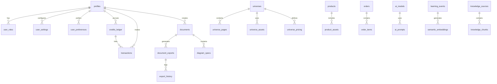

# CRAI DATA INGESTION & AUTOMATION
## Data Architecture, Pipelines, Governance, Automation & Intelligence Acquisition

**Version:** 2.3.0 — CANON LOCK + EXECUTION EDITION  
**Date:** January 18, 2026  
**Document Status:** CANONICAL SPECIFICATION — AUTHORITATIVE DATA & AUTOMATION REFERENCE

---

## Document Authority

**This document defines data architecture, ingestion, automation, and governance.**

It establishes:
- Data architecture, ingestion pipelines, and compliance frameworks
- Automated crawlers, asset discovery, and continuous data acquisition
- Database master mapping and schema governance
- Workflow orchestration and autonomous execution systems
- Data governance, lineage tracking, and quality management
- Long-term retention, archival, and legal hold procedures
- Social scanning, trend detection, and attention intelligence

**Canonical Authority:**
- This document is governed by CRAI-CONSTITUTION.md
- In case of conflict with CRAI-CONSTITUTION.md, the Constitution takes precedence
- Platform and deployment references defer to CRAI-PLATFORM-ARCHITECTURE.md
- AI-related automation coordinated with CRAI-JAVARI-INTELLIGENCE.md
- This document governs all data ingestion, automation, and governance across CRAI

**Relationship to Other Documents:**
- Inherits non-negotiable principles from CRAI-CONSTITUTION.md
- Implements data layer architecture from CRAI-CONSTITUTION.md Section 2.5
- Uses infrastructure from CRAI-PLATFORM-ARCHITECTURE.md
- Leverages AI capabilities from CRAI-JAVARI-INTELLIGENCE.md for intelligent automation
- Provides data foundation for CRAI-COLLECTORS-FRAMEWORK.md and all universe implementations

**Source Attribution:**
- Extracted from CRAI-Master-Bible-v2_3_0-CANON-LOCKED.md
- Originally Sections 7, 12, 22, 59, 66, 67, and 97 of the Master Bible
- Maintained as standalone data and automation specification

---

## Table of Contents

1. [Data Architecture, Ingestion Pipelines, Compliance & Auditability](#section-1)
2. [Automated Crawlers, Asset Discovery & Continuous Data Acquisition](#section-2)
3. [Supabase Database Master Map](#section-3)
4. [AutomationOS™ — Workflow, Orchestration & Autonomous Execution](#section-4)
5. [DataOS™ — Universal Data Governance, Lineage & Quality](#section-5)
6. [ArchiveOS™ — Long-Term Retention & Legal Hold](#section-6)
7. [AttentionOS™ — Social Scanning & Trend Detection](#section-7)

---

<a name="section-1"></a>

---

# SECTION 1
## Data Architecture, Ingestion Pipelines, Compliance, and Auditability

**Originally Section 7 in CRAI Master Bible**

---

## 7.1 Overview

The CRAudioVizAI data architecture governs:

- What data enters the system
- How data is classified and normalized
- How data is validated
- How compliance is enforced
- How the system remains secure, auditable, and reversible

The system is designed to scale to millions of records across dozens of universes while maintaining:

- Legal compliance
- High accuracy
- Reproducibility
- Deterministic behavior

**No data enters the platform unregulated.**

---

## 7.2 Data Classes

All data in CRAudioVizAI belongs to one of five classes:

### Official Data

- Government databases
- Commercial datasets (licensed)
- Open datasets with proper attribution (e.g., ODbL sources)

### User-Submitted Data

- Uploads (images, descriptions)
- Community contributions
- Corrections

### AI-Enriched Data

- AI-generated descriptions
- Attribute extraction
- Summaries
- Classification or tagging

### System-Generated Data

- Logs
- Audit trails
- Event streams
- Telemetry

### Derived Data

- Valuation estimates
- Similarity clusters
- Condition grades
- AI scoring metadata

**Each class has different storage, compliance, and lifecycle rules.**

---

## 7.3 Data Flow (End-to-End)

All data passes through a six-stage ingestion and validation pipeline, regardless of universe or domain.
```
Source → Intake → Normalization → Validation → Enrichment → Moderation → Storage
```

Each stage is described below.

---

## 7.4 Stage 1 — Source Acquisition

Data may originate from:

- Official public records (e.g., TTB for spirits)
- Open datasets (e.g., Open Food Facts)
- Licensed sources (future)
- User uploads
- Partner integrations
- AI-suggested expansions (always flagged as AI-derived)

**Every data source must have:**

- Licensing clarity (required)
- Attribution policies (if applicable)
- PII assessment (if any)
- Access control rules

**Unauthorized sources cannot be used.**

---

## 7.5 Stage 2 — Intake

The intake process:

- Receives raw data
- Extracts identifiers
- Flags data type
- Timestamps ingestion
- Assigns provenance metadata
- Stores intake log in immutable storage

**Metadata includes:**

- source_type
- source_id
- ingested_at
- ingested_by (user, system, or automation)
- universe
- domain

**If provenance is missing or unclear → rejected.**

---

## 7.6 Stage 3 — Normalization

Raw data is transformed into the CRAudioVizAI base schema, ensuring:

- Standardized field names
- Predictable formats
- Valid types
- Case consistency
- Attribute mapping
- Domain-specific extension mapping

**Examples:**

- "proof" → "ABV" (spirits)
- "issue_no" → "issue_number" (comics)

**Normalization is deterministic and repeatable.**

---

## 7.7 Stage 4 — Validation

Validation is a strict, multi-step process.

### 7.7.1 Structural Validation

- Required fields present
- Allowed values only
- Attribute types correct
- Internal consistency checks

### 7.7.2 Compliance Validation

**Examples:**

- Alcohol data cannot include minors
- Health data cannot include medical advice
- Civic data must prove document authenticity

**If validation fails:**

- Item enters "rejected_with_reason"
- Reason must be machine-readable

### 7.7.3 Safety Validation

- Profanity filters
- Copyright infringement checks
- Dangerous content detection
- Misuse detection

**Violations → escalation or auto-rejection based on severity.**

---

## 7.8 Stage 5 — Enrichment

This is where AI-assisted enhancements occur (never silent, always flagged).

**Enrichment operations include:**

- AI descriptions
- Tag generation
- Condition scoring (vision models)
- Attribute inference
- Similarity clustering
- Rarity assessment
- Cross-referencing external data sources

**Enrichment entries must record:**

- Model used
- Model version
- Cost
- Confidence score
- Source inputs

**No enrichment occurs without auditability.**

---

## 7.9 Stage 6 — Moderation

Moderation ensures that data entering the platform is:

- Legal
- Safe
- Relevant
- Not harmful
- In compliance with the Universe ruleset

**Moderation layers:**

- AI pre-check
- Rule-based filter
- Human reviewer (if required)
- Universe-specific compliance review

**Moderation categories:**

- Copyright
- Illicit content
- Age-gated restrictions
- Hate / violence
- NSFW filter (varies by universe)

**Moderation must be explainable and reversible.**

---

## 7.10 Storage Architecture: Supabase + Extensions

All data passing validation is stored in Supabase with:

- Strict RLS policies
- Scoped table access
- Immutable audit logs
- Soft-deleted record tracking
- Version history (temporal tables)

**Additional storage systems include:**

- Supabase Storage for media
- Edge caches (Vercel) for performance
- Object hashing for deduplication

**Storage requirements:**

- Never overwrite raw data
- Keep all versions
- Tag all AI-generated fields
- Maintain provenance chain

---

## 7.11 Data Provenance Chain (Mandatory)

Every data item must have a complete provenance chain:
```
Original Source → Intake → Transformations → Validations → Enrichments → Moderation → Final State
```

**For each step, we store:**

- Who/what performed the step
- When
- Why
- Inputs
- Outputs
- Confidence scores (if AI is involved)

**This enables:**

- Forensic audits
- Regulatory compliance
- Reversibility
- Error correction

**This is non-negotiable for every universe and domain.**

---

## 7.12 Compliance Requirements (Per Universe)

Each Universe has specific compliance needs.

**Examples:**

### Spirits Universe

- TTB COLA verification
- Age restrictions
- Label/image legality
- No alcohol sales facilitation

### Health Universe

- No medical advice
- No unverified claims
- Strict disclaimers
- Possible HIPAA-adjacent control (if dealing with sensitive info)

### Civic Universe

- Legal document authenticity checks
- Anti-misinformation rules
- Evidence chain requirements

### Business Universe

- Liability disclaimers
- Regulatory requirement checks
- Document accuracy validation

**Compliance rules are feature-flagged and enforced by Javari's Policy Engine.**

---

## 7.13 Logging & Auditability

**Audit logs track:**

- All API calls
- All data writes
- All AI calls (with cost)
- All validation failures
- All enrichment actions
- All human overrides
- All policy violations

**Audit logs must be:**

- Immutable
- Searchable
- Time-sorted
- Accessible by authorized roles
- Exportable for compliance

---

## 7.14 Error Handling & Recovery

When data processing fails:

1. Error is logged
2. Root cause is categorized
3. Data enters a holding state
4. Correction or retry path is provided
5. Human override can be applied (logged)

**If systemic issues arise:**

- Pipeline can be paused
- Feature flags can disable ingestion
- Rollback tools restore last known good dataset

---

## 7.15 Data Lifecycle Policy

**Data lifecycle stages:**

- Active
- Deprecated
- Archived
- Deleted (soft-delete only)

**Soft deletion:**

- Retains data
- Retains provenance
- Removes UI visibility
- Prevents re-ingestion of duplicates

**Hard deletion is never automatic and rarely allowed.**

---

## 7.16 Future Data Architecture Extensions

Future upgrades include:

- Vector search for all universes
- Cross-universe semantic linking
- Real-time ingestion monitoring dashboards
- Federated identity for external data contributors
- Marketplace-oriented valuation pipelines
- Automated compliance scanners for complex universes (Health, Civic)

---

**END OF SECTION 7**

---

<a name="section-8"></a>

---


---

<a name="section-2"></a>

---

# SECTION 2
## Automated Crawlers, Affiliate Systems, Asset Discovery, Museum/Archive Ingestion, Competitor Intelligence, and Continuous Data Acquisition

**Originally Section 12 in CRAI Master Bible**

---

## 12.1 Purpose of This Section

Section 12 defines the autonomous intelligence systems responsible for continuously gathering:

- Data
- Opportunities
- Assets
- Competitive signals
- Collector content
- Business leads
- Affiliate updates
- Public domain media
- Museums & historical datasets
- Product updates
- Universe-specific knowledge

This is the external nervous system of CRAI — always listening, always watching, always learning.

These systems run 24/7, forming part of CRAI's strategic advantage.

---

## 12.2 The Four Classes of Crawlers

The CRAI ecosystem uses four crawler families:

**Data Crawlers**

- Public APIs
- Museums
- Open catalogs
- Product databases
- Archive.org
- Wikipedia/Wikidata
- Open Food Facts
- Government datasets

**Asset Crawlers**

- Images
- Videos
- Public domain works
- Creative Commons media
- Audio samples
- Object references
- Icons & UI libraries

**Business/Operational Crawlers**

- Affiliate networks
- Partner dashboards
- Grant systems
- Opportunity feeds
- Pricing pages
- Company updates

**Competitor Intelligence Crawlers**

- New features
- Product changes
- Marketing campaigns
- SEO & content updates
- Release notes
- App store updates
- Company job posts

Together, these create a self-updating platform.

---

## 12.3 Continuous Data Crawling for Collectors Universes

Collectors apps require massive, ongoing ingestion of:

- Museum catalogs
- Auction results
- Public exhibits
- Verified reference images
- Historical documents
- Open databases
- Specialty collector sources
- Community contributions
- Archival metadata

### 12.3.1 Museum Crawler Types

CRAI crawls:

- Smithsonian
- The Met
- Rijksmuseum
- Library of Congress
- British Museum
- OpenGLAM repositories
- Local/regional museums

### 12.3.2 Ingestion Steps

1. Retrieve metadata
2. Normalize to collector schema
3. Deduplicate
4. Enrich with AI
5. Assign rarity
6. Validate licensing
7. Add to collectors universe

A growing internal library of artifacts powers collectors universes.

---

## 12.4 Affiliate Program Automation

CRAI must continuously handle:

### 12.4.1 New Affiliate Invitations

Crawlers connect to:

- Affiliate networks
- Referral dashboards
- Partner portals

Detect:

- New approvals
- New requirements
- New payouts
- New opportunities

### 12.4.2 Affiliate Email Parsing

Email Intelligence (Section 13.5) processes:

- Affiliate approvals
- URLs
- Tracking links
- Terms and agreements
- Required onboarding actions

### 12.4.3 Affiliate Enforcement

Javari automatically:

- Stores affiliate details
- Creates onboarding tasks
- Adds tracking links into products
- Suggests where affiliates fit into universes
- Alerts operator of deadlines or opportunities

---

## 12.5 Business Opportunity Detection

Crawlers analyze:

- Company updates
- Funding rounds
- Industry trends
- Market gaps
- RFPs
- Government grants
- Incubators / accelerators
- Tech community chatter

Javari summarizes opportunities:

- Potential partnerships
- High-value markets
- Untapped niches
- Competitor weaknesses
- Feature gaps

This fuels the Roadmap Engine (Section 14).

---

## 12.6 Public Domain & CC0 Asset Acquisition

CRAI must automatically acquire:

- Public domain art
- Historical documents
- Maps
- Photographs
- Diagrams
- Audio samples
- Videos
- Illustrations
- Cultural heritage assets

### 12.6.1 Licensing Rules (Mandatory)

CRAI only uses assets that are:

- Public domain
- CC0
- Permissively licensed
- Authorized by the source

Assets are:

- Downloaded
- Hashed
- Tagged
- Stored in crav-assets repo
- Linked to provenance metadata

---

## 12.7 Nonstop API Ingestion Engine

Javari's data ingestion engine runs continuously:

**Supported Ingestion Types**

- REST
- GraphQL
- RSS
- Webhooks
- HTML scrapers (where legal)
- File-based ingestion
- Browserless capture (if permitted)

**Features**

- Automatic retry
- Rate limit handling
- Schema mapping
- API drift detection
- Source deprecation alerts
- Caching
- Hash comparison for changes

This ensures the system is always up-to-date.

---

## 12.8 Competitor Intelligence Crawlers

CRAI must continuously check competitors for:

### 12.8.1 Product Updates

- Pricing changes
- Feature launches
- UX changes
- API changes
- AI model updates
- Terms of service changes

### 12.8.2 Marketing Signals

- Landing pages
- Ads
- Email newsletters
- SEO strategy changes

### 12.8.3 Organizational Clues

- Job postings
- Investor updates
- Leadership changes

### 12.8.4 App Store Crawling

- Version changes
- Release notes
- User complaints
- Market shifts

All competitor intelligence goes to:

- Command Center (Section 9)
- Roadmap Engine (Section 14)

---

## 12.9 Automated Opportunity Summaries

Every day, Javari generates:

- Opportunity briefings
- Market trend reports
- Affiliate updates summary
- Competitor updates summary
- Universe-specific insights
- Potential risks
- Feature recommendations
- Gaps in our platform
- Recommended ingestion sources

This is a daily intelligence briefing.

---

## 12.10 AI-Enriched Data Pipeline

Crawlers feed directly into AI tasks:

- Summarization
- Classification
- Attribute extraction
- Duplicate detection
- Valuation suggestions
- Universe placement
- Feature discovery

Javari then:

- Approves or escalates
- Stores data properly
- Notifies operators

---

## 12.11 File, Image, and Document Processing

All gathered assets undergo:

- Hashing
- Deduplication
- Licensing review
- Metadata tagging
- Structured storage in assets repo
- Linking to Supabase entries
- Optional vector embedding for search

This is the backbone of collectors universes and knowledge universes.

---

## 12.12 Continuous Learning Loop

All crawled content contributes to:

- Vendor reliability scoring
- Feature gap detection
- Universe configuration updates
- Roadmap engine analysis
- Javari knowledge reinforcement
- Multi-AI orchestration improvements

This creates a self-improving ecosystem.

---

## 12.13 Governance of Crawling Systems

**Rules:**

- No scraping that violates robots.txt
- No scraping behind paywalls
- No PII ingestion
- No copyright violations
- No aggressive crawling
- No bypassing access controls

**All crawlers must:**

- Respect rate limits
- Respect domain rules
- Be auditable
- Be logged

---

## 12.14 Future Enhancements

Planned expansions:

- Real-time social media trend scanning
- Product price tracking
- YouTube video knowledge extraction
- AI model benchmarking crawlers
- Industry news sentiment analysis
- Autonomous research assistants
- Data marketplace integrations
- 3D model ingestion for AR collectors apps

---

**END OF SECTION 12**

---

<a name="section-13"></a>

---


---

<a name="section-3"></a>

---

# SECTION 3
## SUPABASE DATABASE MASTER MAP

**Originally Section 22 in CRAI Master Bible**

**CRAudioVizAI Platform Bible — v1.5.0**

## 22.1 Overview

This section defines the complete data architecture of the CRAudioVizAI ecosystem within Supabase.

It includes:

- 33+ tables (and growing)
- Unified data model for the CRAI Platform
- User → Credits → Payments → AI → Universe → Export flow
- Security model
- Relationship diagrams (ERD)
- Data ownership per universe
- Gaps, missing tables, and integration requirements
- Future roadmap for schema automation

This section is the authoritative database reference for CRAI.

---

## 22.2 Table Inventory (Categorized)

### (1) User Management Tables

- profiles
- user_settings
- user_roles
- user_preferences
- user_sessions

**Purpose:**

Identity, personalization, RBAC, session analytics.

---

### (2) Credits, Payments, and Monetization

- credits_ledger
- credit_packages
- subscriptions
- transactions
- payment_providers

**Purpose:**

Unified revenue system across all universes and creator tools.

---

### (3) AI, Knowledge & Learning Systems

- ai_prompts
- ai_models
- learning_events
- knowledge_chunks
- knowledge_sources
- semantic_embeddings

**Purpose:**

Javari AI learning, knowledge ingestion, embedding generation, and evaluation.

---

### (4) Export & Document Generation

- documents
- document_exports
- export_jobs
- diagram_specs
- export_history

**Purpose:**

PDF, DOCX, PPTX, XLSX generation + diagram rendering.

---

### (5) Universe & Application Data Tables

- universes
- universe_settings
- universe_pricing
- universe_assets
- universe_pages

Each universe must integrate with:

- Credits
- AI
- Export engine
- Marketplace (as needed)

---

### (6) Marketplace & Sales Tables

- products
- product_assets
- orders
- order_items
- seller_accounts

**Purpose:**

Template marketplace, asset marketplace, creator commerce.

---

### (7) System & Infrastructure Tables

- audit_logs
- system_events
- api_keys
- feature_flags
- routing_rules

**Purpose:**

Security, visibility, monitoring, AI routing, system health.

---

## 22.3 Database Relationship Diagram (ERD — Mermaid)

Below is the ERD describing all core relationships:



This is the baseline ERD; Section 26 will describe required expansions.

---

## 22.4 Table Dependencies & Data Flow

### User → Credits → Purchase → Export

1. User profile created
2. Credits assigned or purchased
3. Credits consumed by:
   - AI generation
   - Document export
   - Diagram generation
   - Universe-specific actions
4. Export job created
5. Export job logs into export_history

### Universe → Page → Asset Flow

1. Universe defined
2. Universe settings loaded
3. Universe pricing evaluated
4. Universe assets used for:
   - Landing pages
   - Marketplace
   - Templates

### AI → Learning → Knowledge → Embeddings Flow

1. Knowledge sources ingested
2. Chunks created
3. Embeddings generated
4. Learning events logged
5. AI improvements pushed back into:
   - ai_models
   - routing_rules

---

## 22.5 Universe Data Layers

Each universe requires the following mandatory tables:

- universe_pages
- universe_assets
- universe_settings
- universe_pricing
- universe_stats

Missing tables must be auto-created during universe deployment.

### Universe lifecycles:

1. Creation
2. Data initialization
3. Engagement tracking
4. Monetization
5. Export integration

---

## 22.6 AI & Knowledge Graph Data Requirements

Required tables for AI intelligence:

- semantic_embeddings
- knowledge_sources
- knowledge_chunks
- learning_events
- ai_models
- ai_prompts

Required fields include:

- vector embedding (float[])
- token usage
- model routing metadata
- semantic cluster ID
- universe affinity index

This ensures all universes and apps contribute to Javari's continuous learning.

---

## 22.7 Missing Tables (Critical Gaps)

The following tables are recommended for Phase 6:

### Export & Diagram Expansion

- diagram_templates
- diagram_themes
- export_bundles

### Collectors Engine

- collector_items
- collector_sources
- collector_attributes
- collector_market_values
- collector_price_history

### CreatorOS

- creator_templates
- creator_assets
- creator_projects
- creator_revenue

### Enterprise

- enterprise_accounts
- enterprise_teams
- enterprise_usage
- enterprise_audit

These tables will unlock future universes and new revenue lines.

---

## 22.8 Security & Access Controls

Supabase RLS (Row-Level Security) must guarantee:

- Users can only see their own documents, exports, sessions, purchases
- Universe data segmented by ownership
- Marketplace seller data isolated
- AI logs anonymized
- Audit logs append-only
- API keys hashed and salted

AI models must never store user content without encryption.

---

## 22.9 90-Day Database Roadmap

### Phase 1 (0–14 days)

- Create missing tables
- Apply full RLS
- Add indexes for performance
- Add foreign key constraints

### Phase 2 (15–45 days)

- Collectors Engine tables
- CreatorOS tables
- Enterprise tables
- Marketplace expansion

### Phase 3 (45–90 days)

- Automated schema generator
- AI schema optimization
- Universe-level data isolation
- Diagram intelligence improvements

---

## Appendix 22.A — Full Supabase Table Inventory (authoritative list)

Includes:

- All 33+ tables
- Purpose
- Relationships
- Status (healthy / needs expansion / missing)

---

✅ **SECTION 22 COMPLETE**

---

**END OF SECTION 22**


---

<a name="section-23"></a>

---


---

<a name="section-4"></a>

---

# SECTION 4
## AutomationOS™ — Universal Workflow, Orchestration & Autonomous Execution Platform

**Originally Section 59 in CRAI Master Bible**

---

## 59.0 Purpose & Strategic Role

AutomationOS™ is the canonical workflow, orchestration, and automation operating system for the CRAudioVizAI / Javari ecosystem.

AutomationOS governs:

- How work flows  
- How systems react  
- How decisions execute  
- How humans and AI collaborate at scale  

AutomationOS transforms:

**Manual processes**  
→ **Autonomous systems**

**Static rules**  
→ **Adaptive execution**

AutomationOS is a **Tier-0 Efficiency & Scale Engine**.  
**No complex system operates without orchestration.**

---

## 59.1 Automation Domains Covered

- Business workflows  
- Financial processes  
- Compliance enforcement  
- Content pipelines  
- Asset lifecycle automation  
- Property operations  
- Insurance & claims flows  
- Auction & marketplace flows  
- AI agent coordination  
- Human-in-the-loop approvals  

---

## 59.2 Core Capabilities

### 59.2.1 Workflow Engine

- Declarative workflow definitions  
- Conditional branching  
- Parallel execution  
- Time-based triggers  
- Retry & compensation logic  
- State persistence  

### 59.2.2 Event-Driven Orchestration

- Cross-OS event subscriptions  
- Reactive automation  
- Rule-based execution  
- Escalation & fallback paths  
- Idempotent execution guarantees  

### 59.2.3 Human-in-the-Loop Controls

- Approval gates  
- Review checkpoints  
- Override & exception handling  
- SLA tracking  
- Accountability logging  

### 59.2.4 AI-Agent Orchestration

- Multi-agent coordination  
- Task delegation  
- Confidence-based execution  
- Guardrails & kill switches  
- Explainable decisions  

### 59.2.5 Automation Monitoring

- Workflow health dashboards  
- Failure detection  
- Bottleneck analysis  
- Cost & efficiency metrics  

---

## 59.3 AI Systems (Automation Intelligence Stack)

### OrchestratorAI™

- Workflow optimization  
- Path selection  
- Load balancing  

### AutonomyAI™

- Decision confidence scoring  
- Human-vs-AI execution thresholds  
- Continuous improvement learning  

---

## 59.4 User Roles & RBAC

**Supported User Roles:**

- Operators  
- Automation Designers  
- Compliance Officers  
- AI Supervisors  
- Admin & Audit  

**RBAC Actions:**

- Design workflows  
- Deploy automations  
- Pause/resume execution  
- Override decisions  
- Export execution logs  

---

## 59.5 Monetization Model

### Revenue Streams

- Automation subscriptions  
- Per-workflow execution fees  
- AI orchestration services  
- Enterprise automation licensing  
- White-label AutomationOS  

---

## 59.6 Feature Flags

- `AUTOMATION_WORKFLOWS`  
- `AUTOMATION_EVENT_DRIVEN`  
- `AUTOMATION_HUMAN_IN_LOOP`  
- `AUTOMATION_AI_AGENTS`  
- `AUTOMATION_EXECUTION_LOGS`  

---

## 59.7 Compliance & Governance

- Full auditability  
- Explainable execution paths  
- Jurisdiction-aware enforcement  
- Kill-switch enforcement  
- Separation of duties  

---

## 59.8 Technical Architecture

**Core Infrastructure:**

- Supabase (workflows, state, RLS)  
- Netlify Functions (execution engine)  
- Event bus integrations  
- AI microservices (orchestration)  
- Distributed task queues  
- Immutable execution logs  

---

## 59.9 Ecosystem Integrations

### Consumes:

- All OS layers (events & actions)  

### Feeds:

- NotificationOS  
- AnalyticsOS  
- ComplianceOS  
- Command Center  
- JavariAI  

---

## 59.10 Roadmap Phases

### Phase 1

- Core workflows  
- Manual triggers  
- Logging  

### Phase 2

- Event-driven automation  
- Human-in-the-loop  
- AI assistance  

### Phase 3

- Autonomous execution  
- Self-optimizing workflows  
- Cross-org orchestration  

---

## 59.11 Canonical Rule

**If something repeats, AutomationOS should own it.**

AutomationOS is the engine of scale.

---

✅ **SECTION 59 COMPLETE**

---

**END OF SECTION 59**


---

<a name="section-60"></a>

---

<a name="section-5"></a>

---

# SECTION 5
## DataOS™ — Universal Data Governance, Lineage, Quality & Sharing Operating System

**Originally Section 66 in CRAI Master Bible**

---

## 66.0 Purpose & Strategic Role

DataOS™ is the canonical operating system for all data within the CRAudioVizAI / Javari ecosystem—governing how data is collected, classified, governed, shared, monetized, retained, and retired.

DataOS ensures:

- Data is trustworthy by design  
- Lineage is provable  
- Access is policy-driven  
- Sharing is intentional  
- Monetization is ethical and compliant  

DataOS is a **Tier-0 Mandatory Information Plane**.  
**No data may exist outside its governance.**

---

## 66.1 Data Domains Covered

- User & identity data  
- Asset & provenance data  
- Financial & payments data  
- Marketplace & auction data  
- Property & operational data  
- Education & certification records  
- Telemetry & analytics events  
- AI training & inference data  
- Third-party & partner datasets  

---

## 66.2 Core Capabilities

### 66.2.1 Data Ingestion & Classification

- Source registration  
- Schema discovery  
- Automated classification (PII, PHI, PCI, IP)  
- Sensitivity labeling  
- Jurisdiction tagging  

### 66.2.2 Data Lineage & Provenance

- End-to-end lineage graphs  
- Transformation tracking  
- Versioning & snapshots  
- Dependency mapping  
- Reproducibility guarantees  

**Integrated with:**

- ProvenanceOS  
- AnalyticsOS  

### 66.2.3 Access Control & Sharing

- Policy-based access (ABAC/RBAC)  
- Purpose limitation enforcement  
- Consent-aware access  
- Time-bound sharing  
- Secure data rooms  
- Data contracts & SLAs  

### 66.2.4 Data Quality & Integrity

- Validation rules  
- Anomaly detection  
- Completeness & freshness checks  
- Drift detection  
- Quality scoring  

### 66.2.5 Data Monetization & Exchange

- Anonymization & aggregation  
- Data products & packages  
- Usage metering  
- Licensing terms  
- Revenue sharing  
- Marketplace integration  

### 66.2.6 Retention, Deletion & Legal Holds

- Jurisdiction-aware retention  
- Right-to-delete workflows  
- Legal hold enforcement  
- Cold storage tiering  
- Verifiable deletion proofs  

---

## 66.3 AI Systems (Data Intelligence Stack)

### DataQualityAI™

- Quality scoring  
- Drift & anomaly detection  
- Root-cause analysis  

### PrivacyAI™

- Re-identification risk detection  
- Differential privacy tuning  
- Redaction recommendations  

### LineageAI™

- Impact analysis  
- Change risk prediction  
- Dependency optimization  

---

## 66.4 User Roles & RBAC

**Supported User Roles:**

- Data Owners  
- Data Stewards  
- Analysts  
- Engineers  
- Compliance Officers  
- Privacy Officers  
- Regulators (read-only)  
- Admin & Audit  

**RBAC Actions:**

- Register datasets  
- Approve sharing  
- Configure policies  
- Initiate deletion  
- Export lineage & audits  

---

## 66.5 Monetization Model

### Revenue Streams

- Data product subscriptions  
- Usage-based data APIs  
- Secure data room access  
- Enterprise data governance licensing  
- Co-branded data partnerships  

---

## 66.6 Feature Flags

- `DATA_CLASSIFICATION`  
- `DATA_LINEAGE`  
- `DATA_SECURE_SHARING`  
- `DATA_MONETIZATION`  
- `DATA_LEGAL_HOLDS`  
- `DATA_DIFFERENTIAL_PRIVACY`  

---

## 66.7 Compliance & Standards

- GDPR / CCPA / CPRA  
- Data residency laws  
- SOC 2  
- ISO 27001  
- Industry-specific mandates  
- Audit-grade data handling  

---

## 66.8 Technical Architecture

**Core Infrastructure:**

- Data catalogs & registries  
- Supabase (metadata, policies, RLS)  
- Netlify Functions (policy enforcement)  
- Stream & batch pipelines  
- AI microservices (quality, privacy)  
- Secure storage tiers  

---

## 66.9 Ecosystem Integrations

### Consumes:

- All OS layers (data producers)  

### Feeds:

- AnalyticsOS  
- ComplianceOS  
- SecurityOS  
- CommandCenterOS  
- External partners (governed)  

---

## 66.10 Roadmap Phases

### Phase 1

- Data catalog  
- Classification & lineage  
- Access policies  

### Phase 2

- Secure sharing  
- Data products  
- Quality automation  

### Phase 3

- Global data exchange  
- Privacy-preserving analytics  
- Institutional data markets  

---

## 66.11 Canonical Rule

**If data exists, DataOS governs its life.**

DataOS is the custodian of truth at scale.

---

✅ **SECTION 66 COMPLETE**

---

**END OF SECTION 66**


---

<a name="section-67"></a>

---

<a name="section-6"></a>

---

# SECTION 6
## ArchiveOS™ — Universal Long-Term Retention, Cold Storage & Legal Hold Operating System

**Originally Section 67 in CRAI Master Bible**

---

## 67.0 Purpose & Strategic Role

ArchiveOS™ is the canonical operating system for long-term data, asset, and record preservation within the CRAudioVizAI / Javari ecosystem.

ArchiveOS governs:

- What must be kept  
- For how long  
- In what form  
- Under which legal authority  
- With what proof of integrity  

ArchiveOS is a **Tier-0 Mandatory Preservation Plane**.  
**If something must survive time, ArchiveOS owns it.**

---

## 67.1 Archive Domains Covered

- Legal & compliance records  
- Financial ledgers & tax records  
- Provenance & chain-of-custody data  
- Contracts & agreements  
- Education & certification histories  
- Audit logs & incident records  
- Cultural & historical assets  
- AI model versions & decisions  
- System state snapshots  
- User-requested archives  

---

## 67.2 Core Capabilities

### 67.2.1 Retention Policy Engine

- Jurisdiction-aware retention rules  
- Policy versioning  
- Mandatory vs optional retention  
- Asset- and data-type mapping  
- Automatic lifecycle transitions  

### 67.2.2 Cold & Deep Storage

- Tiered storage (warm, cold, deep cold)  
- Cost-optimized archival tiers  
- Integrity-first storage formats  
- Media & format durability guarantees  
- Geographic redundancy  

### 67.2.3 Legal Holds & Freezes

- Litigation hold enforcement  
- Regulatory freeze controls  
- Override of deletion workflows  
- Scope-limited holds  
- Hold justification & audit logs  

### 67.2.4 Integrity & Verifiability

- Hash-based integrity checks  
- Periodic re-verification  
- Tamper-evidence  
- Chain-of-custody preservation  
- Verifiable deletion proofs (when released)  

### 67.2.5 Retrieval & Restoration

- Searchable archive indexes  
- Time-bounded access grants  
- Evidence bundle exports  
- Partial or full restoration  
- Chain-of-access logging  

---

## 67.3 AI Systems (Archive Intelligence Stack)

### RetentionAI™

- Policy conflict detection  
- Retention optimization  
- Risk-based retention alerts  

### IntegrityAI™

- Corruption detection  
- Drift & bit-rot monitoring  
- Restoration confidence scoring  

---

## 67.4 User Roles & RBAC

**Supported User Roles:**

- Archivists  
- Compliance Officers  
- Legal Teams  
- Auditors  
- Regulators (read-only)  
- Admin & Super-Admin  

**RBAC Actions:**

- Configure retention  
- Place/remove legal holds  
- Approve restorations  
- Export evidence  
- Verify integrity  

---

## 67.5 Monetization Model

### Revenue Streams

- Archive storage subscriptions  
- Legal hold services  
- Institutional archival licensing  
- Retrieval & restoration fees  
- White-label ArchiveOS  
- Long-term compliance services  

---

## 67.6 Feature Flags

- `ARCHIVE_RETENTION_POLICIES`  
- `ARCHIVE_COLD_STORAGE`  
- `ARCHIVE_LEGAL_HOLDS`  
- `ARCHIVE_INTEGRITY_CHECKS`  
- `ARCHIVE_EVIDENCE_EXPORT`  

---

## 67.7 Compliance & Standards

- Records retention laws  
- Financial record mandates  
- GDPR/CCPA retention & erasure alignment  
- Court-admissible evidence standards  
- Cultural heritage preservation rules  
- Audit-grade immutability  

---

## 67.8 Technical Architecture

**Core Infrastructure:**

- Supabase (archive metadata, RLS)  
- Object storage (tiered)  
- Netlify Functions (policy enforcement)  
- Cryptographic verification services  
- Immutable index catalogs  
- Secure access gateways  

---

## 67.9 Ecosystem Integrations

### Consumes:

- DataOS  
- ComplianceOS  
- ProvenanceOS  
- SecurityOS  
- EducationOS  
- PaymentsOS  

### Feeds:

- CommandCenterOS  
- Regulators & courts (exports)  
- AnalyticsOS (meta-metrics)  
- JavariAI  

---

## 67.10 Roadmap Phases

### Phase 1

- Core retention policies  
- Cold storage  
- Manual legal holds  

### Phase 2

- Automated lifecycle transitions  
- Integrity re-verification  
- Evidence packaging  

### Phase 3

- Global archival networks  
- Cultural & institutional preservation  
- Autonomous compliance archiving  

---

## 67.11 Canonical Rule

**If something must endure time, ArchiveOS preserves it.**

ArchiveOS is the memory vault of the CRAI universe.

---

✅ **SECTION 67 COMPLETE**

---

**END OF SECTION 67**


---


---

<a name="section-7"></a>

---

# SECTION 7
## AttentionOS™

**Originally Section 97 in CRAI Master Bible**

**Social Scanning, Trend Detection & Attention Intelligence Operating System**

---

## 97.0 Purpose & Strategic Role

**AttentionOS™** is the canonical operating system governing how CRAudioVizAI monitors, analyzes, and capitalizes on social attention, trends, and cultural moments to drive growth and engagement.

AttentionOS ensures:

- Trending topics are identified in real-time
- Best channels for attention are scored
- Competitor attention strategies are mapped
- Content formats are optimized for virality
- Zero-cost opportunities are prioritized

**AttentionOS is a Tier-0 Mandatory Attention Intelligence Layer.**

If attention cannot be captured, growth stalls.

---

## 97.1 Attention Domains Covered

AttentionOS governs all attention and trend monitoring, including:

- Social media trend scanning
- Viral content detection
- Platform algorithm understanding
- Competitor attention mapping
- Influencer & creator tracking
- Format performance analysis
- Best channel identification
- Cultural moment detection
- Attention arbitrage opportunities

---

## 97.2 Core Capabilities

### 97.2.1 Real-Time Trend Detection

- Social platform monitoring (Twitter, Reddit, TikTok, LinkedIn)
- Hashtag & keyword tracking
- Emerging topic identification
- Sentiment analysis
- Trend lifecycle prediction
- Virality scoring

**Catch trends early, ride them long.**

### 97.2.2 Best Channel Scoring

- Platform-specific performance metrics
- Cost-per-attention calculation
- Organic reach potential
- Audience alignment scoring
- ROI prediction per platform
- Zero-cost opportunity ranking

### 97.2.3 Competitor Attention Mapping

- Competitor content tracking
- Share-of-voice analysis
- Strategy pattern detection
- Successful format identification
- Gap opportunity discovery
- Defensive monitoring

### 97.2.4 Format Optimization

- Content format performance tracking
- Video vs text vs image analysis
- Long-form vs short-form scoring
- Interactive vs passive engagement
- Platform-native format optimization
- Format fatigue detection

### 97.2.5 Cultural Moment Detection

- News cycle monitoring
- Event & conference tracking
- Seasonal opportunity identification
- Meme & trend lifecycle analysis
- Controversy & debate detection
- Opportune timing recommendations

---

## 97.3 AI Systems (Attention Intelligence Stack)

### AttentionAI™

- Trend prediction & scoring
- Virality likelihood estimation
- Content topic recommendations

### ChannelAI™

- Platform performance forecasting
- Audience targeting optimization
- Best-time-to-post calculation

---

## 97.4 User Roles & RBAC

### Supported Roles:

- Marketing Teams
- Content Creators
- Social Media Managers
- Growth Teams
- Executives
- Analysts
- Admin & Super-Admin

### RBAC Actions:

- View trend dashboards
- Configure monitoring
- Export attention reports
- Launch attention campaigns
- Review competitor intelligence

---

## 97.5 Feature Flags

- `ATTENTION_TREND_DETECTION`
- `ATTENTION_CHANNEL_SCORING`
- `ATTENTION_COMPETITOR_TRACKING`
- `ATTENTION_FORMAT_OPTIMIZATION`
- `ATTENTION_CULTURAL_MOMENTS`

---

## 97.6 Technical Architecture

- Social platform APIs (Twitter, Reddit, etc.)
- Web scraping & monitoring infrastructure
- Sentiment analysis engines
- Supabase (trends, scoring, history)
- Netlify Functions (alerts & notifications)
- Real-time data processing pipelines

---

## 97.7 Ecosystem Integrations

### Consumes:

- AnalyticsOS
- GrowthOS
- KnowledgeCommerceOS

### Feeds:

- GrowthOS (trend-informed campaigns)
- KnowledgeCommerceOS (content ideas)
- JavariAI (attention-aware recommendations)
- CommandCenterOS (trend alerts)

---

## 97.8 Monetization Model

AttentionOS is indirectly monetized via:

- Growth acceleration
- Zero-cost acquisition
- Viral content production
- Competitive intelligence value

---

## 97.9 Roadmap Phases

### Phase 1

- Manual trend monitoring
- Basic platform tracking
- Daily trend reports

### Phase 2

- Automated trend detection
- Real-time alerts
- Competitor tracking

### Phase 3

- Predictive trend modeling
- Autonomous content recommendations
- AI-driven attention arbitrage

---

## 97.10 Canonical Rule

**If attention cannot be measured,**  
**opportunities are missed.**

AttentionOS is the radar for zero-cost growth.

---

✅ **SECTION 97 COMPLETE**

---

**END OF SECTION 97**


---

<a name="section-98"></a>

---


---


## END OF CRAI DATA INGESTION & AUTOMATION

**Document Version:** 2.3.0 — CANON LOCK + EXECUTION EDITION  
**Date:** January 18, 2026  
**Status:** CANONICAL SPECIFICATION — LOCKED FOR EXECUTION

**Governance:**
- This document establishes the canonical data and automation architecture for all CRAudioVizAI systems
- All data ingestion, automation, and governance implementations must comply with specifications here
- Changes require executive approval and formal Change Control process
- Governed by principles in CRAI-CONSTITUTION.md
- Platform architecture coordinated with CRAI-PLATFORM-ARCHITECTURE.md
- AI automation coordinated with CRAI-JAVARI-INTELLIGENCE.md

---

© 2026 CR AudioViz AI, LLC. All Rights Reserved.  
**EIN:** 39-3646201  
**Location:** Fort Myers, Florida  
**Mission:** Your Story. Our Design.

---

**DATA INGESTION & AUTOMATION SPECIFICATION COMPLETE.** 📊
