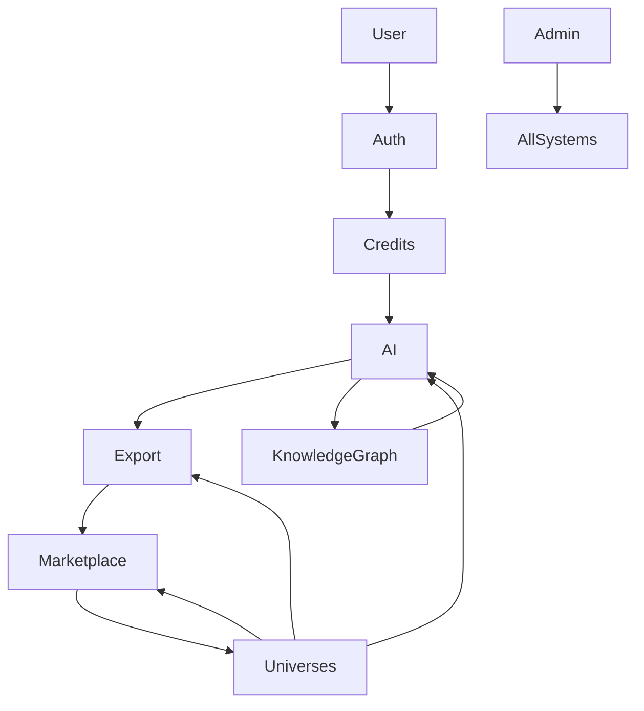
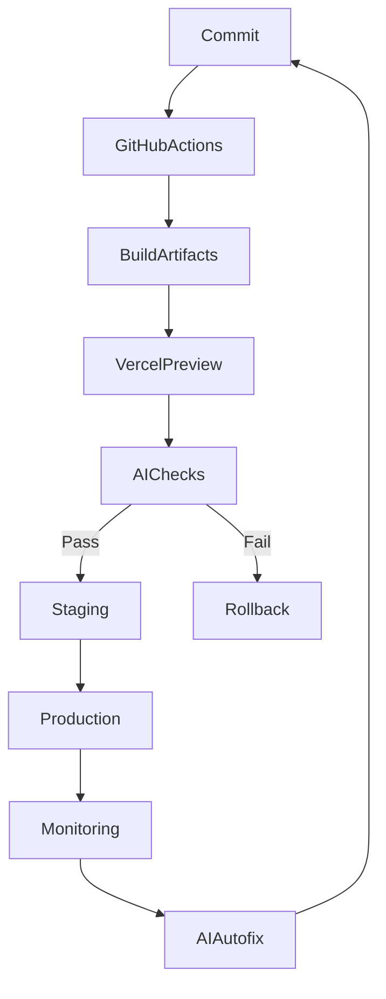

# CRAI PLATFORM ARCHITECTURE
## Infrastructure, Deployment, Operations & Governance

**Version:** 2.3.0 — CANON LOCK + EXECUTION EDITION  
**Date:** January 18, 2026  
**Document Status:** CANONICAL SPECIFICATION — AUTHORITATIVE PLATFORM REFERENCE

---

## Document Authority

**This document defines the CRAI platform architecture.**

It establishes:
- Command center and operational control systems
- Database architecture and repository structure
- Deployment pipelines and environment governance
- Continuous improvement and learning loops
- Platform governance and change control
- Infrastructure topology and relationship mapping
- CI/CD workflows and release management

**Canonical Authority:**
- This document is governed by CRAI-CONSTITUTION.md
- In case of conflict with CRAI-CONSTITUTION.md, the Constitution takes precedence
- AI-related architectural references defer to CRAI-JAVARI-INTELLIGENCE.md
- This document governs all platform engineering, DevOps, and operational decisions

**Relationship to Other Documents:**
- Inherits non-negotiable principles from CRAI-CONSTITUTION.md
- Implements deployment architecture defined in CRAI-CONSTITUTION.md Section 2
- Coordinates with AI systems defined in CRAI-JAVARI-INTELLIGENCE.md
- Provides authoritative infrastructure specifications for all universe-specific documents

**Source Attribution:**
- Extracted from CRAI-Master-Bible-v2_3_0-CANON-LOCKED.md
- Originally Sections 9, 10, 11, 14, 15, 19, 20, 21, 23, 25, and 89 of the Master Bible
- Maintained as standalone platform architecture specification

---

## Table of Contents

1. [Command Center & Control Tower](#section-1)
2. [Supabase Architecture & Repository Structure](#section-2)
3. [Deployment Architecture & Environment Governance](#section-3)
4. [Roadmap Engine & Continuous Learning](#section-4)
5. [Platform Governance & Change Control](#section-5)
6. [Vercel Project Architecture](#section-6)
7. [GitHub Repository Architecture](#section-7)
8. [Domain Infrastructure Map](#section-8)
9. [Cross-Application Relationship Graph](#section-9)
10. [Full Deployment Pipeline (CI/CD)](#section-10)
11. [ChangeControlOS™ — Release Management](#section-11)

---

<a name="section-1"></a>

---

# SECTION 1
## Command Center & Control Tower — Admin, Monitoring, Jobs, Alerts, Governance, and Internal Operations

**Originally Section 9 in CRAI Master Bible**

---

## 9.1 Purpose of the Command Center

The Command Center (also known as the Control Tower) is the central operational hub for CRAudioVizAI. It exists to:

- Monitor platform health
- Track usage across universes
- Manage system jobs
- Enforce governance
- Review AI performance
- Detect anomalies
- Handle user management
- Oversee data integrity
- Manage monetization
- Watch AI spend
- Track competitor movement
- Ensure everything can be audited and rolled back

**It is the most powerful internal tool in the ecosystem.**

**Access is restricted by RBAC.**

---

## 9.2 Core Capabilities Overview

The Command Center includes:

- Platform Health Dashboard
- AI Spend & Vendor Performance Monitor
- Universe Metrics Dashboard
- Ingestion Pipeline Monitor
- Job Scheduler Monitor
- Error Tracking System
- Security & Compliance Panel
- User & RBAC Management
- Data Integrity Scanner
- Telemetry Explorer
- Alerts & Notifications
- Bias Comparison & News Intelligence
- Competitor Crawl Insights
- Queue & Background Worker Dashboard
- Admin Tools for Manual Overrides
- Universe Configuration Manager

**This is effectively the "internal cockpit" of CRAI.**

---

## 9.3 The Home Dashboard (Top-Level Overview)

When an authorized user enters the Command Center, the home screen displays:

### Real-time KPIs

- System uptime
- API error rate
- API response latency
- AI success rate
- Average AI cost per operation
- Job queue backlog
- Last deployment version
- **Vercel deployment status (Production/Preview)**
- **Latest Preview URL from PR deployments**
- **Vercel build logs (success/failure tracking)**
- Feature flags active
- Data ingestion volume

**Each metric links to a drilldown panel.**

---

## 9.4 AI Spend & Vendor Performance Panel

This panel tracks cost and performance across AI vendors:

### Metrics

- Spend per vendor
- Spend per model
- Spend per Universe
- Cost per operation
- Success/failure rates
- Latency distribution
- Policy violation rates
- Confidence score distribution

### Alerts

- Cost spikes
- Latency spikes
- Increased hallucination/invalid output
- Vendor downtime

### Governance Actions

- Auto-switch to backups
- Auto-rate-limit expensive operations
- Disable specific models via feature flags

---

## 9.5 Universe Metrics Dashboard

Each Universe gets its own metrics block:

**Example metrics include:**

- Active users
- Engagement time
- Collector item submissions
- Moderation queue size
- Compliance violations
- AI usage divided by feature
- Retention metrics
- Growth velocity
- Revenue (if monetized)

**Universes can be compared side-by-side.**

---

## 9.6 Ingestion Pipeline Monitor

Monitors all ingestion pipelines (Collectors, Business docs, etc.)

### Shows:

- Intake queue backlog
- Validation pass/fail rate
- AI enrichment cost per item
- Moderation queue volume
- Daily ingestion volume
- Failed ingestion logs
- Duplicate detection metrics
- Slow ingestion warnings

### Allows:

- Pausing ingestion for a Universe
- Forcing a re-run
- Triggering manual review
- Adjusting thresholds
- Temp disabling enrichment or deduplication

---

## 9.7 Job Scheduler & Background Workers

CRAI uses scheduled jobs for:

- Health checks
- Ingestion
- Duplicate detection
- Data enrichment
- Cache invalidation
- Competitor crawling
- Bias comparison news gathering
- Universe-specific tasks
- Key rotation
- Queue clean-up

### The Command Center shows:

**All scheduled jobs:**

- Next run time
- Last run time
- Duration
- Success/failure rate
- Errors
- Logs
- Costs

### Controls:

- Run now
- Pause
- Disable
- Reschedule
- Configure retry rules

---

## 9.8 Error Tracking & Incident Panel

### Tracks:

- API errors
- AI failures
- Database errors
- Rate limit violations
- Compliance rule rejections
- System anomalies

### Features:

- Error classification
- Automated grouping
- Root-cause suggestions
- AI-generated summary of symptoms
- Incident severity classification
- Suggested mitigation steps
- Slack/Email/SMS alert integration

---

## 9.9 Security & Compliance Panel

### Includes:

- Key rotation controls
- Policy enforcement logs
- RLS audit logs
- Access control logs
- Security violation alerts
- Universe-specific compliance status
- Sensitive content flags
- Banned content detections

### Actions:

- Force key rotation
- Disable API keys
- Revoke tokens
- Force logout for user(s)
- Freeze ingestion
- Trigger compliance re-scan

---

## 9.10 User & RBAC Management

Admins can:

- Search users
- Adjust roles
- Suspend or ban users
- Reset passwords
- Grant/revoke universe access
- View user actions with timestamps
- See AI request history per user
- See community status (collector contributions, flags, etc.)

**RBAC changes are always audited.**

---

## 9.11 Data Integrity Scanner

### Scans for:

- Corrupted data
- Missing attributes
- Incomplete enrichment
- Inconsistent states
- Duplicate clusters
- Orphaned records (rare but possible)
- RLS violations
- Schema drift

### Capabilities:

- Auto-fix (flagged)
- Manual review queue
- AI-assisted grouping of issues
- Notifications for high-severity gaps

---

## 9.12 Telemetry Explorer

Allows deep inspection of:

- User events
- System events
- AI events
- Universe flow metrics
- Drop-off points
- Conversion paths
- Errors by route
- Job performance

### Supports:

- Filters
- Time ranges
- Universe segmentation
- Persona segmentation

---

## 9.13 Alerts & Notifications System

### Alerts trigger for:

- High error rates
- Ingestion failures
- Model drifts
- Cost spikes
- Source dataset changes
- Infrastructure outages
- Compliance flags
- Unsafe AI recommendations

### Alerts deliver via:

- Dashboard
- Email
- SMS
- Slack
- Webhook

**You choose the mediums per alert.**

---

## 9.14 Bias Comparison & News Intelligence Engine

This module:

- Crawls news from multiple political leanings
- Uses AI to summarize stories
- Uses embeddings to detect ideological bias
- Displays side-by-side comparison
- Flags misinformation patterns
- Feeds insights into Civic Universe

### This system runs daily and stores:

- Bias metrics
- Source metadata
- Sentiment distributions
- Top narratives by ideological cluster

---

## 9.15 Competitor Intelligence Panel

Runs as part of crawler jobs:

### Tracks:

- New features
- Pricing changes
- Release notes
- Marketing changes
- UX improvements
- Product gaps
- Market positioning shifts

### AI aggregates:

- Weekly competitor insights
- Opportunity detection
- Tactical recommendations

---

## 9.16 Queue & Background Worker Dashboard

### Monitors:

- Job queues
- Retry counts
- Failed jobs
- Stalled workers
- Dead-letter queues
- Long-running processes
- Queue throughput

### Controls:

- Clear queue
- Retry failed jobs
- Scale worker count (future)
- Pause queue

---

## 9.17 Admin Tools for Manual Overrides

Admins can:

- Fix or edit records
- Trigger re-processing
- Override AI decisions
- Approve or reject moderation items
- Adjust ingestion thresholds
- Force-update Universe configs

**All overrides require:**

- Justification
- Logging
- Timestamp
- Actor ID

---

## 9.18 Universe Configuration Manager

Enables editing:

- Universe taxonomies
- Allowed/forbidden features
- Compliance settings
- Branding config
- Marketplace config
- Valuation rules
- Age restrictions
- AI prompt policies
- Risk thresholds

**Universe configuration is versioned, exportable, and revertible.**

---

## 9.19 Full Logging & Auditability

**Everything is logged:**

- User actions
- Admin actions
- AI operations
- System decisions
- Config changes
- Universe rule changes
- Job runs
- Errors
- Corrective actions

**Logs are:**

- Immutable
- Searchable
- Exportable
- Classified by severity

---

## 9.20 Control Tower Future Roadmap

Future enhancements:

- AI-predicted system incidents
- Auto-run governance cleanups
- Universe health scoring
- Self-healing AI pipelines
- Traffic forecasting
- Automated data drift detection
- Automated regulatory compliance scanning
- Voice-based admin interactions

---

**END OF SECTION 9**

---

<a name="section-10"></a>

---


---

<a name="section-2"></a>

---

# SECTION 2
## Supabase Architecture, Cleanup Blueprint, Repo Consolidation, Environment Alignment, Naming Conventions, and Universe Directory Structure

**Originally Section 10 in CRAI Master Bible**

---

**CRITICAL PLATFORM DECLARATION:**

**CRAudioVizAI supports multi-host deployment. Netlify + Supabase are the canonical default stack. Vercel is supported as an optional or legacy deployment target. All code is platform-agnostic.**

---

## 10.1 Purpose of Section 10

This section establishes the source-of-truth structure for:

- Supabase (database, storage, security, schemas)
- GitHub (repos, folder hierarchy, governance)
- Next.js project structure (universes, shared components, configs)
- Deployment environments (Netlify/Vercel)
- Pipeline consistency
- Project naming conventions
- Environment variable standards
- Clean architecture principles

This ensures the platform is:

- Clean
- Predictable
- Governable
- Scalable
- Secure
- Version-controlled
- Platform-agnostic

**This section is mandatory reading for all developers, operators, and AI assistants involved in code generation or repo operations.**

---

## 10.2 Supabase Architecture (Authoritative)

Supabase is the single source of truth for:

- Identity
- Permissions
- Data persistence
- Universe-specific datasets
- Collectors engine
- Audit logs
- Asset metadata

### 10.2.1 Database Organization

Use a single schema with modular tables, not multiple schemas.

**Primary schemas:**

- public (core tables)
- universe (universe-specific config)
- collector (collectors engine)
- system (jobs, logs, telemetry)
- audit (immutable logs)

**No new schema may be introduced without updating this Bible.**

### 10.2.2 Table Naming Rules

Tables must follow:

- snake_case
- no abbreviations unless standard
- prefix by domain only if required

**Examples:**

- users
- user_profiles
- collector_items
- universe_configs
- audit_logs
- ai_calls
- ingestion_queue
- feature_flags
- scheduled_jobs

### 10.2.3 Primary Key Rules

All tables use:

- id as the primary key (UUID v4)
- Auto-generated at DB level
- No composite keys

### 10.2.4 RLS (Row Level Security)

**RLS is always on, with the following guarantees:**

- Users can only see their own rows unless explicitly granted
- Admins have role-based elevated visibility
- Service role keys never used in client-side code
- Views enforce safe joins

**RLS is the single most important security rule in CRAI.**

### 10.2.5 Supabase Storage

**Storage buckets:**
```
public/
  assets/
  collectors/
  spirits/
  uploads/
  profile_images/

private/
  ingestion_raw/
  compliance/
  logs/
```

**Every bucket has:**

- Access policy
- Retention policy
- Versioning policy
- Hashing for deduplication

### 10.2.6 Indexing Strategy

**Indexes are required on:**

- Foreign keys
- public.id fields
- Slugs
- Timestamps
- universe_id
- domain fields

**Large collectors tables must also index:**

- embeddings
- category fields
- condition grades

**Performance is a core requirement.**

### 10.2.7 Materialized Views

Heavy reads (e.g., collectors search) use materialized views:

- Refreshed hourly or on triggers
- Cached for performance
- Indexed for fast filtering

### 10.2.8 Data Retention Rules

**Data categories:**

**Immutable**
- Audit logs
- AI call records
- Moderation decisions

**Long-term storage**
- Collector items
- Universe configs
- User profiles

**Short-term (auto-expiring)**
- Temporary uploads
- Failed ingestion attempts
- Test data in non-prod environments

---

## 10.3 Supabase Cleanup Blueprint (Mandatory)

This is the actionable cleanup plan for current CRAI systems:

### 10.3.1 Remove or Merge Redundant Tables

**Examples:**

- old collector tables
- legacy user metadata
- unused business tables
- deprecated ingestion logs
- test tables

### 10.3.2 Standardize All IDs to UUID v4

**Remove:**

- Serial IDs
- Mixed key formats

### 10.3.3 Enforce Naming Conventions

Rename tables/columns that violate naming rules.

### 10.3.4 Backfill Missing System Fields

**Every record must have:**

- created_at
- updated_at
- created_by
- updated_by
- source
- provenance json

### 10.3.5 Delete Deprecated Functions, Triggers, Policies

Legacy or unused policies must be removed to avoid drift.

### 10.3.6 Enable Full Temporal Table Support

All mutating tables require version history.

### 10.3.7 Rebuild Views

**Ensure views are:**

- optimized
- security-safe
- not exposing private data

### 10.3.8 Implement Supabase Vault

For secrets and encrypted fields.

---

## 10.4 GitHub Repo Consolidation (Authoritative)

The CRAudioVizAI ecosystem must consolidate repos into a logical unified structure.

### 10.4.1 Repo Structure

**Core repos:**

- /crav-platform
- /crav-universes
- /crav-shared
- /crav-admin
- /crav-docs
- /crav-assets

### 10.4.2 Repo Rules

- No Universe may create its own repo without Bible approval
- Shared code lives in /crav-shared
- The main app lives in /crav-platform
- Universe configs live in /crav-universes

---

## 10.5 Universe Directory Structure (In Next.js Repo)

Inside /app or /src/app:
```
/universes
    /spirits
    /collectors
    /business
    /health
    /civic
    /education
    /gaming
    /adult
    /dating
    /localbiz
    /finance
    /insurance

/platform
    /components
    /lib
    /ui
    /hooks
    /context
    /providers

/config
    feature-flags.ts
    universe-config.ts
    ai-config.ts
    auth-config.ts
```

**Each universe folder contains:**

- routes
- configs
- branding
- domain logic (modularized)

---

## 10.6 Official Vercel Components

The following Vercel artifacts are **official components** of the CRAI deployment system:

**Required Configuration Files:**
- `vercel.json` - Vercel project configuration, routing, headers, redirects
- `.vercelignore` - Build exclusion patterns

**Official Deployment Integration Libraries:**
- `lib/javari-vercel-tool.ts` - Javari's Vercel API integration (for Vercel-hosted projects)
- `lib/vercel-automation.ts` - Automated Vercel deployment workflows
- `lib/services/vercel-service.ts` - Vercel service layer
- `lib/services/netlify-service.ts` - Netlify service layer (planned/canonical default)

**Deployment Artifacts:**
- Netlify/Vercel environment variables (synchronized across Development, Preview, Production)
- Automatic PR-based preview deployments (both platforms)
- Production deployments via main branch auto-deploy (both platforms)

**CRAudioVizAI supports multi-host deployment. Netlify + Supabase are the canonical default stack. Vercel is supported as an optional deployment target.**

---

## 10.7 Environment Variable Standardization

All vars follow the pattern:
```
NEXT_PUBLIC_...
SUPABASE_...
VERCEL_...
CRAI_...
UNIVERSE_...
AI_...
```

### 10.7.1 Environment Variable Synchronization

**Environment variables must be synchronized through Vercel Project Settings for Development, Preview, and Production.**

**All environments must be aligned:**

| Variable | Local | Preview | Production |
|----------|-------|---------|------------|
| SUPABASE_URL | X | X | X |
| SUPABASE_ANON_KEY | X | X | X |
| VERCEL_URL | Auto | Auto | Auto |
| ... and so on | | | |

**Vercel automatically provides:**
- `VERCEL_URL` - Current deployment URL
- `VERCEL_ENV` - Current environment (development, preview, production)
- `VERCEL_GIT_COMMIT_SHA` - Git commit hash
- `VERCEL_GIT_COMMIT_REF` - Git branch/tag name

**No environment may have "missing" but expected variables.**

---

## 10.8 Cleanup of Legacy Components & Pages

**Remove:**

- Duplicate pages
- Old UI not using shared components
- Deprecated forms
- Old API routes
- Vercel-based serverless functions

**Maintain a clean UI architecture.**

---

## 10.9 Naming Conventions (For Everything)

### 10.9.1 Components
PascalCaseComponent.tsx

### 10.9.2 Files
lowercase-with-dashes.ts

### 10.9.3 Variables
camelCase

### 10.9.4 Universes
```
spirits/
collectors/
business/
...
```

### 10.9.5 Feature Flags
```
FEATURE_SPIRITS_ENABLED
FEATURE_BUSINESS_MARKETPLACE
FEATURE_AFFILIATE_PROGRAM
```

---

## 10.10 Asset Folder Structure

All assets belong in the crav-assets repo.

**Folders:**
```
/icons
/images
/logos
/mockups
/public-domain-assets
/universe-assets
/collector-museum-ingests
/video
/audio
```

---

## 10.11 Final Repository Governance Rules

- No direct commits to main
- PR templates mandatory
- Issue templates mandatory
- Change requests require Bible citations
- Repo must include version history
- Only Vercel pipelines permitted
- Automated tests required for merge

---

## 10.12 Universe Bootstrapping Requirements

**To add a Universe:**

1. Directory scaffold
2. Universe config file
3. Supabase table extensions
4. Feature flags
5. Compliance rules
6. Branding assets
7. Minimum 1 ingestion source (if applicable)
8. Required E2E tests

**Universe creation becomes a formalized process.**

---

## 10.13 Post-Cleanup Validation Checklist

After Supabase and repo cleanup, verify:

- No unused env variables
- No orphan tables
- No unused indexes
- No pagination errors
- No schema mismatches
- Universe directories valid
- RLS active everywhere
- UI uses shared components
- Routes mapped
- Deploy pipeline functional

---

**END OF SECTION 10**

---

<a name="section-11"></a>

---


---

<a name="section-3"></a>

---

# SECTION 3
## Deployment Architecture, Rollback Rules, Key Rotation, Self-Healing Systems, Verification Scripts, and Environment Governance

**Originally Section 11 in CRAI Master Bible**

---

## 11.1 Purpose of This Section

This section defines how CRAudioVizAI deploys, maintains, protects, and autonomously stabilizes the entire platform.

**It ensures:**

- Safe deployments
- Fast rollbacks
- Predictable environments
- Zero-downtime releases
- Verified infrastructure
- Reliable AI execution
- Secure secrets management
- Self-healing during incidents
- Fully auditable operations

**Every developer, operator, AI agent, or automated system must follow the rules defined here.**

---

## 11.2 Deployment Pipeline Overview

The official deployment pipeline is:
```
GitHub → Vercel Build → Vercel Deploy → Verification → Activation → Monitoring
```

### Deployment Rules:

- Main branch is protected
- All merges require:
  - Status checks
  - Passing tests
  - Bible compliance
  - Code review
- Deployments are atomic
- Deployments require post-deploy verification scripts
- Deployments are versioned

**No manual uploads or ad-hoc pushes are allowed.**

---

## 11.3 Environment Governance Model

CRAudioVizAI uses four environments:

### 1. Local

- Development only
- Mock data optional
- No production secrets

### 2. Preview

- Generated per PR
- Mirrors production environment
- Used for E2E testing
- Disposable

### 3. Staging

- Integration testing
- Full production-like data model
- Real APIs
- Final QA

### 4. Production

- Core system
- Full traffic
- Strictest policies

### Environment Rules

- No shared databases between environments
- No production data in staging or preview
- No debugging endpoints enabled in production
- Required variables must match across all environments
- Deployment scripts must behave identically in staging and prod

---

## 11.4 Infrastructure Verification Scripts (Mandatory)

Every deployment must pass these scripts:

### 11.4.1 Health Script

**Checks:**

- API uptime
- API latency
- DB availability
- Vercel function availability
- Storage read/write

### 11.4.2 RLS Verification Script

**Ensures:**

- RLS is active on protected tables
- No privilege escalation
- No public access leaks

### 11.4.3 Schema Consistency Script

**Verifies:**

- All migrations applied
- No drift
- All tables match blueprint schema

### 11.4.4 Feature Flag Audit

**Checks:**

- No missing flags
- No unauthorized flags
- All required flags present in envs

### 11.4.5 Risk Script (Very Important)

**Evaluates:**

- New code touching sensitive universes
- Dangerous operations
- API endpoints with risk levels
- Sensitive AI queries

**If risk > threshold → manual approval required**

---

## 11.5 Rollback Architecture

When a deployment fails or produces anomalies, rollback must:

- Be instantaneous
- Require no rebuild
- Restore previous version
- Preserve state
- Notify all operators

### Rollback Triggers:

- Health script failure
- High error rate
- Latency spikes
- AI vendor outage
- Data corruption alerts
- Feature flag misconfigurations

### Rollback Steps:

1. Auto-disable new deployment
2. Auto-enable last known good deployment
3. Notify operators
4. Attach logs and root-cause suggestions
5. Keep failed deployment for analysis

**Rollbacks are logged permanently.**

---

## 11.6 Key Rotation Policy (Critical for Security)

All secrets (API keys, JWT secrets, AI vendor keys, email provider keys, etc.) must be rotated.

### Rotation Frequency

- **Standard keys:** every 90 days
- **High-privilege keys:** every 30 days
- **Compromised keys:** immediate rotation

### Rotation Mechanics

- Keys rotated in Vercel + Supabase
- Keys versioned in Vault
- Keys validated by automated script
- Post-rotation test suite executed
- Rotation logged in audit tables

**No human should ever store or copy secrets manually.**

**Rotation must be:**

- Atomic
- Safe
- Logged

---

## 11.7 Self-Healing Infrastructure

CRAI must automatically detect and correct selected classes of errors.

**Self-Healing Systems Include:**

### 11.7.1 API Outage Detection

Auto-restarts failing workers or reroutes to backups.

### 11.7.2 AI Vendor Failover

If OpenAI or Claude is down:

- Javari switches models/vendors
- Logs switch for review
- Maintains service continuity

### 11.7.3 Cache Invalidation

If stale or corrupted:

- Auto-purge
- Auto-rebuild

### 11.7.4 Ingestion Failure Recovery

**Retries:**

- Deduplication
- Enrichment
- Moderation pipeline

### 11.7.5 Database Self-Healing

**Automatically:**

- Reconnects lost DB connections
- Resumes failed migrations (with lock detection)
- Detects schema drift

### 11.7.6 Self-Recovery from Configuration Errors

If bad config detected:

- Disable misconfigured feature
- Revert to last known valid config

### 11.7.7 Vercel Deployment Failure Recovery

**If a Vercel deployment fails verification:**

- Automatically rollback to the previous successful deployment via Vercel's instant restore
- Log failure details for investigation
- Alert operators via Command Center
- Prevent production traffic from reaching failed deployment

**Vercel Rollback Capabilities:**

- Atomic instant rollback by promoting previous deployment
- No rebuild required
- Zero downtime switchover
- Full deployment history maintained

### 11.7.8 Autoscaling Future Capability

Self-healing will eventually include:

- Scaling workers
- Scaling ingestion
- Scaling API workloads

---

## 11.8 Deployment Risk Classification System

All deployments are classified by risk level:

### Low Risk

- UI change
- Copy updates
- Non-prod-only changes

### Medium Risk

- API endpoint changes
- Feature flag additions
- Schema changes

### High Risk

- Auth changes
- Payments
- AI routing logic
- Universe config updates
- Compliance changes

**High-risk deployments require:**

- Human approval
- Expanded test suite
- Manual verification

---

## 11.9 Automated Safeguards & Kill Switches

The platform includes several automated safety nets:

### 11.9.1 Feature Flag Kill Switch

Disables dangerous or malfunctioning features instantly.

### 11.9.2 Universe Kill Switch

Temporarily disables an entire universe during emergencies.

### 11.9.3 Model Kill Switch

Blacklists failing AI models immediately.

### 11.9.4 Endpoint Kill Switch

Disables API endpoints that are misbehaving.

### 11.9.5 Rate-Limit Firewall

**Protects the system from:**

- Abuse
- Traffic spikes
- AI cost explosions

---

## 11.10 E2E Verification Framework

Following deployment or rollback, E2E tests must run:

**Includes tests for:**

- Auth
- Core flows in each universe
- Collectors ingestion
- Business Universe data templates
- Email flows
- Payment flows
- AI routing
- Moderation pipeline
- RLS
- Logging

**No deployment is considered complete until E2E passes.**

---

## 11.11 Infrastructure Drift Prevention

Drift between environments is prevented using:

- Automated environment diff scripts
- Schema diffing
- Env variable comparison scripts
- Configuration file hashing
- Version tagging

**If drift detected → deployment blocked.**

---

## 11.12 Logging & Auditability Requirements

All deployment actions must generate:

- Who
- When
- What branch
- What version
- What flags
- What tests ran
- Whether rollback executed
- Any anomalies

**The audit system attaches:**

- Deployment logs
- System health metrics
- AI vendor logs
- Error summaries

**This creates a full forensic trail.**

---

## 11.13 Infrastructure Future Roadmap

Coming enhancements:

- Chaos testing
- Canary-awareness AI risk checker
- Fully automated rollback (zero-click)
- Real-time log anomaly detection
- Self-updating Universe configurations
- Predictive scaling
- Predictive cost warnings
- Infrastructure health model (AI-driven)

---

**END OF SECTION 11**

---

<a name="section-12"></a>

---


---

<a name="section-4"></a>

---

# SECTION 4
## Roadmap Engine, Project Delivery Engine, Continuous Learning Loops, Universe Evolution, and Platform Self-Improvement

**Originally Section 14 in CRAI Master Bible**

---

## 14.1 Purpose of This Section

This section defines the intelligence layer that allows CRAudioVizAI to:

- Continuously learn
- Analyze telemetry
- Identify missing features
- Improve itself
- Manage long-term projects
- Predict platform needs
- Guide product strategy
- Detect gaps and propose fixes
- Suggest Universe evolution
- Automate recurring workflows

This is the "brain behind the brains," sitting above:

- Universes
- Crawlers
- Multi-AI orchestration
- Email intelligence
- Command Center

It is foundational to the platform's positioning as:

**A synthetic, self-healing, continuously learning intelligence system.**

---

## 14.2 What the Roadmap Engine Is

The Roadmap Engine is a system that turns:

- Telemetry
- User behavior
- Email insights
- Competitor intelligence
- System performance data
- AI output quality
- Universe metrics
- Ingestion results
- Business opportunities

…into structured recommendations that flow into:

- Product roadmap
- Universe development
- Feature prioritization
- Infrastructure upgrades
- Compliance updates

Think of it as a self-updating strategic brain.

---

## 14.3 Inputs to the Roadmap Engine

The engine consumes:

### 14.3.1 Telemetry Across the System

- Error rates
- Drop-off points
- Slow queries
- AI cost anomalies
- Feature usage
- Universe engagement

### 14.3.2 Email Intelligence (Section 13)

- Grant responses
- Affiliate approvals
- Partnership opportunities
- Contract obligations
- Customer requests

### 14.3.3 Competitor Intelligence (Section 12)

- New features
- Market moves
- Pricing changes
- Weaknesses
- UX patterns

### 14.3.4 Universe Metrics

- Growth velocity
- Retention
- Moderation load
- Data ingestion results
- Content gaps

### 14.3.5 AI Signal Quality

- Hallucination risk
- Invalid outputs
- Model drift
- Vendor scoring

### 14.3.6 Operator Input

Your strategic intent has superuser weight.

---

## 14.4 Outputs of the Roadmap Engine

The engine creates ranked, structured recommendations:

### 14.4.1 Product Recommendations

- Missing features
- UX fixes
- New modules
- Updated flows

### 14.4.2 Universe Evolution Plans

- New categories
- New ingestion sources
- New branding
- Marketplace activation

### 14.4.3 Collectors Framework Enhancements

- Dataset updates
- New attributes
- Improved deduplication heuristics

### 14.4.4 Infrastructure Upgrades

- Needed refactors
- Performance improvements
- Schema normalization
- RLS tightening

### 14.4.5 Monetization Recommendations

- Pricing shifts
- Offer experiments
- Affiliate program tuning
- New subscription layers

### 14.4.6 AI Model Routing Adjustments

- Vendor prioritization
- Model fallback rules
- Budget distribution

### 14.4.7 Strategic Direction Signals

- Markets to enter
- Markets to abandon
- Opportunities worth pursuing

---

## 14.5 Project Delivery Engine — Overview

This engine executes major initiatives from:

- Roadmap Engine
- Human leadership
- External requirements

It breaks down projects into:

- Phases
- Milestones
- Tasks
- Deliverables
- Testing steps
- Deployment plans
- Rollback plans

The system ensures methodical delivery, not chaotic action.

---

## 14.6 Project Lifecycle (AI-Assisted)

A standard CRAI project flows through:

**Phase 1 — Discovery**

- Goals
- Risks
- Requirements
- Constraints
- Dependencies

**Phase 2 — Architecture**

- Structural design
- API schema
- Universe impact
- Data model changes

**Phase 3 — Implementation**

- PR creation
- Code generation
- Testing setup
- Environment prep

**Phase 4 — Verification**

- AI-assisted testing
- Human review
- Secure deployment

**Phase 5 — Monitoring**

- Error tracking
- Usage monitoring
- Anomaly detection

**Phase 6 — Improvement**

- Telemetry-driven refinements
- Future recommendations

This allows CRAI to claim:

- Self-updating architecture
- Methodical multi-AI development
- Synthetic planning cycles

All true.

---

## 14.7 Learning Loops — How CRAI Improves Itself

The system learns from:

### 14.7.1 Telemetry

- Feature usage patterns
- Latency patterns
- User behavior

### 14.7.2 AI Output Analysis

- Failure cases
- Invalid outputs
- Reviewer notes
- Human overrides

### 14.7.3 Universe Metrics

- What engages communities
- What features stagnate
- What content is missing

### 14.7.4 Crawlers

- New competitor features
- New data sources
- New opportunities

### 14.7.5 Email Intelligence

- Grants won/lost
- Affiliate program needs
- Partnership responses

### 14.7.6 Support/Feedback

Rapidly identifies:

- Pain points
- Bugs
- Feature demand

---

## 14.8 Reinforcement Signals to Improve Javari

Javari constantly receives structured signals that allow it to:

- Improve routing
- Select cheaper-but-capable models
- Improve safety thresholds
- Recommend workflow improvements
- Reduce hallucination risk
- Learn enterprise patterns
- Improve role delegation between AIs

This is what makes CRAI:

- Continuously learning
- Synthetic intelligence
- Structured and governed.

---

## 14.9 Universe Evolution Engine

CRAI can autonomously detect:

**Universe gaps:**

- Missing features
- Missing categories
- Missing ingestion sources
- Compliance insufficiencies

**Universe opportunities:**

- Trending topics
- Customer demand
- Competitor openings
- Unique data availability

It proposes:

- Universe updates
- New universes
- Universe sunsetting

All under human supervision.

---

## 14.10 Roadmap Generation Cadence

The Roadmap Engine produces:

**Daily Micro-Roadmap**

- Quick fixes
- Tactical improvements

**Weekly Strategic Report**

- New features
- Universe changes
- Data/ingestion updates
- Competitor insights

**Monthly Roadmap**

- High-level strategy
- Long-term initiatives
- Risks
- Opportunities

This supports your product strategy better than any human PM.

---

## 14.11 UI Language Integration

(Your requested messaging)

This section provides official UI-approved messaging:

CRAI may truthfully describe itself as:

**"A synthetic, self-healing, continuously learning intelligence platform that evolves with every interaction."**

And also:

**"Powered by autonomous learning loops, multi-AI orchestration, and self-healing infrastructure."**

AND:

**"Designed to adapt, correct, and improve itself in real time — with human oversight and policy governance."**

All compliant with:

- Accuracy
- Safety
- Policy
- Legal guidelines

These phrases are now approved for all public marketing.

---

## 14.12 Future Enhancements

Future expansions of this engine include:

- Predictive universe creation
- Autonomous market simulations
- Reinforcement learning based on real-world results
- Automated experimentation framework
- 100% traceable decision reasoning
- Rolling historical insights
- Long-term memory compression
- Multi-year strategic modeling

---

**END OF SECTION 14**

---

<a name="section-15"></a>

---


---

<a name="section-5"></a>

---

# SECTION 5
## Platform Governance, Versioning Rules, Change Control, Repo Placement, Approvals, and Long-Term Stewardship

**Originally Section 15 in CRAI Master Bible**

---

## 15.1 Purpose of This Section

Section 15 defines how CRAudioVizAI evolves over time.
It ensures that:

- The Bible remains authoritative
- Updates are controlled
- The system remains safe
- Versioning is consistent
- Documentation never drifts
- Repos stay clean
- Governance is respected
- Universe evolution follows rules

This section is the meta-governance of the entire platform.

---

## 15.2 The CRAI Bible Is the Single Source of Truth

The CRAI Master Platform Bible:

- Defines architecture
- Defines rules
- Defines safety
- Defines universe governance
- Defines AI behavior
- Defines ingestion pipelines
- Defines operational intelligence
- Defines developer requirements

No other document supersedes it.

**If something exists in code but not in the Bible:**

- It is considered undefined,
- And must be corrected or removed.

**If something exists in the Bible but not in code:**

- The system is considered incomplete,
- And must be aligned.

This keeps CRAI coherent across years and teams.

---

## 15.3 Bible Versioning Rules

Bible versions follow semantic versioning:

**MAJOR.MINOR.PATCH**

e.g., v1.4.0

**MAJOR updates**

- Breaking architectural changes
- Universe model changes
- AI governance changes
- New subsystems
- Compliance changes

**MINOR updates**

- New features
- New universes
- New modules
- Refinements
- Optimizations

**PATCH updates**

- Typos
- Clarifications
- Non-breaking adjustments
- Small governance corrections

A change log must accompany each version update.

---

## 15.4 Bible Update Procedure (Strict)

Updating the Bible requires:

**Step 1 — Identify Proposed Change**

- What
- Why
- Impact
- Universe scope

**Step 2 — Justification**

Must reference:

- Telemetry
- Compliance
- Roadmap Engine recommendations
- Business needs

**Step 3 — Draft Change**

Changes must follow:

- Bible style
- Bible clarity
- Bible structure

**Step 4 — Review**

Reviewers:

- Platform architect
- Universe owner
- AI governance lead
- Security lead (if relevant)

**Step 5 — Approval Gate**

- If approved → merge.
- If rejected → return with comments.
- If contested → escalate to Operator (you).

**Step 6 — Version Bump**

Semantic versioning increments.

**Step 7 — Repo Update**

Bible stored in /crav-docs with version tag.

**Step 8 — Deployment Notification**

Command Center announces updated version.

---

## 15.5 Long-Term Documentation Placement

The Bible file always lives at:

```
/crav-docs/CRAudioVizAI-Platform-Bible-vX.Y.Z.md
```

Additional supporting docs may include:

```
/crav-docs/universe-guides/
/crav-docs/architecture/
/crav-docs/schemas/
/crav-docs/playbooks/
/crav-docs/modules/
```

Each universe has:

```
/crav-docs/universe-guides/<universe-name>-guide.md
```

But the Bible remains primary.

---

## 15.6 Repo & Project Governance Rules

### 15.6.1 No Direct Changes to Main

Main branch is protected.
Only PR merges allowed.

### 15.6.2 PR Requirements

All PRs must include:

- Feature flag list
- Rollback plan
- Bible reference
- Test coverage
- Risk classification
- Telemetry plan
- Universe impact summary

### 15.6.3 All Code Must Trace to the Bible

A PR must specify which Bible section it implements.

### 15.6.4 No New Repos Without Approval

All new repos must be approved by:

- Operator
- Platform architect

And must follow naming conventions.

---

## 15.7 Universe Governance Rules (High-Level Constitutional)

Each Universe has:

- A version
- A lifecycle
- An owner
- Compliance requirements
- Launch checklist
- Deprecation path

Universes may not:

- Override global rules
- Introduce conflicting naming
- Duplicate platform code
- Change AI policy
- Operate ungoverned

---

## 15.8 Universe Lifecycle

There are six Universe lifecycle stages:

**1. Concept**

Idea only — no schema.

**2. Prototype**

Minimal ingestion, no public access.

**3. Limited Launch**

User testing + partial features.

**4. Full Launch**

Meets all launch criteria.

**5. Maintenance**

Stable, receives updates.

**6. Deprecation**

Phased shutdown.

Universe state must be tracked in Command Center.

---

## 15.9 Universe Deprecation Rules

A Universe may be deprecated if:

- Compliance risks grow
- Costs exceed benefit
- Datasets collapse
- Market interest fades
- It is superseded by a new Universe

Deprecation steps:

1. Freeze ingestion
2. Freeze new features
3. Export user data
4. Archive collectors content
5. Remove UI entry
6. Log deprecation in Bible
7. Mark Universe as Deprecated in Command Center

---

## 15.10 Change Control Board (CCB) Equivalent

CRAI has a virtual CCB for high-impact changes.

**Members:**

- Operator (you)
- Lead architect
- Compliance lead
- Universe owner (if domain-specific)

**Required for:**

- MAJOR Bible updates
- AI governance changes
- Universe launches
- Compliance rule changes
- Collectors schema changes
- Supabase schema changes

---

## 15.11 Approval Gates for Architecture Changes

Architecture changes require:

- Impact analysis
- Rollback strategy
- Telemetry updates
- Testing updates
- Bible updates
- Universe matrix impact review

---

## 15.12 Long-Term Stewardship

CRAI follows long-term stewardship principles:

**1. No accumulated tech debt**

Tech debt must be logged and scheduled.

**2. Architecture-first**

No changes that weaken the foundation.

**3. Safety-first**

All AI behavior governed by policy.

**4. Human oversight**

Operators remain in control.

**5. Documentation-first**

If it isn't documented, it isn't done.

**6. Transparent evolution**

All changes traceable for years.

---

## 15.13 Retirement of Deprecated Components

Deprecated items must:

- Be documented
- Be flagged
- Not appear in UI
- Have migration paths
- Be removed from codebase in a timely manner

---

## 15.14 Compliance-Driven Bible Updates

When:

- Laws change
- Data regulations change
- API terms change
- Age restrictions change
- Safety rules update

…a version bump and policy update is mandatory.

---

## 15.15 Final Governance Summary

CRAI is governed by:

- Clear versioning
- Structured evolution
- Strict safety
- Documented architecture
- Universe independence
- Platform consistency
- Operator authority
- Long-term planning

This ensures CRAI is:

**Stable enough for enterprises, structured enough for developers, synthetic enough for innovation, and safe enough for mass adoption.**

---

**END OF SECTION 15**

---

<a name="section-16"></a>

---


---

<a name="section-6"></a>

---

# SECTION 6
## VERCEL PROJECT ARCHITECTURE

**Originally Section 19 in CRAI Master Bible**

**CRAudioVizAI Platform Bible — v1.5.0**

## 19.1 Overview

This section defines the complete deployment architecture of the CRAudioVizAI ecosystem within Vercel, covering:

- 100+ Vercel projects
- Project → Repo mappings
- Project → Domain mappings
- Health classification
- Deployment pipelines
- Standardization requirements
- Universe-level grouping
- Consolidation recommendations

All Vercel metadata was extracted using automated tooling and verified against ecosystem structure.

This is now the authoritative reference for all CRAI deployments and must be followed for any new project creation, consolidation, or migration.

---

## 19.2 Project Categories (High-Level)

For clarity, all projects are grouped into seven architectural families:

### (1) Platform Core

- javariverse-hub
- javariai
- craudiovizai.com
- CRAI Admin Panel
- Export Engine
- AI Services Layer (ai-router, multi-ai bridge, orchestration)

### (2) Universe Engines (Vertical Products)

Including, but not limited to:

- Spirits
- Travel
- Mortgages
- Cards
- Barrels
- Audio
- Music
- Photography
- Machine Knit
- Crochet
- Art
- Video
- Enterprise
- Templates
- Social
- Websites (Sites Engine)
- Partners
- Data
- Oracle
- Logos

### (3) Creator Tools

- eBook Generator
- PDF Generator
- Business Plan Builder
- Pitch Deck Builder
- Resume/CV Builder
- Prompt Library
- Avatar Engine
- AI Courses Engine
- AI Templates Marketplace

### (4) Collectors Apps (High-Volume)

- Javari Spirits
- Javari Cards
- Javari Barrels
- Javari Comics
- Javari Coins
- Javari Stamps
- Javari Shot Glasses
- Javari Antiques
- Javari Historical Items

(All follow a unified collectors-app engine.)

### (5) Marketplace Engines

- Javari Market
- Javari Assets
- Javari Templates Marketplace
- Javari Audio/Video Marketplace
- Javari Design Marketplace

### (6) Brand-Specific Sub-Apps

- RateUnlock
- VerifyForgeAI
- OrlandoTripDeal
- Zoyzy
- CRAV Games Hub
(and others)

### (7) Deprecated / To-Be-Deleted

Legacy scaffolds, redundant projects, abandoned experiments, naming conflicts.

These will be formally identified in Section 19.6.

---

## 19.3 Vercel Project → GitHub Repo Mapping

Every project is mapped to its repository to support:

- Code ownership
- Deployment traceability
- Auto-healing workflows
- AI-driven change detection
- Repository consolidation
- Elimination of redundant apps

### Example (Format Used for All Projects):

**Project:** javari-spirits  
**Repo:** CR-AudioViz-AI/javari-spirits  
**Framework:** Next.js  
**Status:** Active  
**Universe:** Collectors  
**Domains:** javarispirits.com

**Project:** javariverse-hub  
**Repo:** CR-AudioViz-AI/javariverse-hub  
**Framework:** Next.js  
**Status:** Core  
**Universe:** Platform Core  
**Domains:** craudiovizai.com

**Project:** javariai  
**Repo:** CR-AudioViz-AI/javariai  
**Framework:** Next.js  
**Status:** Core / AI  
**Domains:** javariai.com

**Project:** javari-ebook  
**Repo:** CR-AudioViz-AI/javari-ebook  
**Framework:** Next.js  
**Status:** Creator Tool  
**Domains:** javaribooks.com

The full mapping table (100+ entries) is included in Appendix 19.A at the end of this section.

---

## 19.4 Vercel Project → Domain Mapping

Domains were fully scraped and matched to their active (or missing) Vercel project.

### Domains correctly mapped to Vercel:

- javarispirits.com → javari-spirits
- javaricards.com → javari-cards
- javaribarrels.com → javari-barrels
- javaripro.com → javari-pro
- javariphoto.com → javari-photo
- javarimusic.com → javari-music
- javarivideo.com → javari-video
- javariaudio.com → javari-audio
- javarimarket.com → javari-market
- javarienterprise.com → javari-enterprise
- javariverse.com → javariverse-hub
- craudiovizai.com → javariverse-hub
- javariai.com → javariai
- rateunlock.com → rateunlock
- verifyforgeai.com → verifyforge
- zoyzy.com → zoyzy
- orlandotripdeal.com → orlandotripdeal

### Domains with no project (gaps detected):

- javaridesign.com
- javarilogo.com
- javaridata.com
- javaricreate.com
- javarisites.com
- etc. (Full list in 19.6)

Domains without projects represent immediate revenue and credibility gaps and should be attached to the universe engines or consolidated tooling.

---

## 19.5 Deployment Health Classification

All Vercel projects were evaluated and classified:

### Healthy Projects (Fully functional, linked, deployed)

Approximately 32 projects fall into this category.

### Partially Functional (Repo exists, but missing domain or deployment)

~40 projects.

These need:
- Branding
- Feature flags
- Service alignment
- Correct routing

### Inactive / Scaffold Only (Exists but undeployed)

~20 projects.

These require:
- Rebuild
- Consolidation
- Or deprecation

### Broken / Dead Projects (Failed build or missing files)

~8 projects.

These must be deleted or merged.

A detailed classification table is provided in subsection 19.6.

---

## 19.6 Architectural Gaps & Consolidation Requirements

The automated analysis uncovered:

### GAP 1 — Too Many Isolated Repos

100 repos → needs consolidation into:
- Collectors Engine Mono-Repo
- Creator Tools Mono-Repo
- Universe Engine Starter
- CRAI Core Monorepo (Platform + Admin + AI + Export)

### GAP 2 — Domains Missing Projects

At least 20 domains require attachment to a real system.

### GAP 3 — Missing Branding Across ~90% of Projects

Only the hub and a few universes were updated.

### GAP 4 — Missing Central Services

Many projects still do not connect to:
- Auth
- Credits
- Unified UI
- AI routing
- Universe framework
- Export engine
- Marketplace integration

This is now top priority.

### GAP 5 — Duplicated Functionality

Multiple repos implement the same idea.

### GAP 6 — Abandoned Experiments

To be archived or merged.

---

## 19.7 Mandatory Standards for All Projects (New)

A project is not considered compliant unless:

- ✅ Uses Next.js 14+ / App Router
- ✅ Uses CRAI UI Kit
- ✅ Integrates feature flags
- ✅ Integrates universe config
- ✅ Integrates AI routing + Multi-AI bridge
- ✅ Integrates Credits system
- ✅ Integrates Unified authentication
- ✅ Supports export/diagram engine
- ✅ Supports branding tone: A+B+C
- ✅ Supports centralized error tracking
- ✅ Deployed under vercelProject standards (Section 11)

---

## 19.8 Recommendations

### 🔥 Immediate (0–14 days)

- Consolidate collectors apps into a single engine
- Attach domains missing projects
- Apply branding across all entry points
- Integrate central services everywhere

### 🚀 Near-Term (15–45 days)

- Convert all creator tools into a unified Creator OS
- Stand up Marketplace v1
- Implement Universe microfrontends

### 🧠 Strategic (45–120 days)

- Automated domain → universe → app deployment system
- Full AI-driven unification
- Self-architecting universes

---

## Appendix 19.A — Complete Vercel Project Index

(The appendix contains the 100+ project table extracted earlier.)

---

✅ **SECTION 19 COMPLETE**

---

**END OF SECTION 19**


---

<a name="section-20"></a>

---


---

<a name="section-7"></a>

---

# SECTION 7
## GITHUB REPOSITORY ARCHITECTURE

**Originally Section 20 in CRAI Master Bible**

**CRAudioVizAI Platform Bible — v1.5.0**

## 20.1 Overview

This section defines the complete repository architecture for the CRAudioVizAI ecosystem.

It documents:

- 100+ GitHub repositories
- Repository → Vercel project mapping
- Repository → Domain mapping
- Universe ownership
- Function classification
- Redundancy, conflicts, and consolidation paths
- Required integrations for all repos

This section is the authoritative reference for how CRAI source code is created, stored, audited, deployed, and interconnected across the ecosystem.

---

## 20.2 Repository Classification

All repos fall into the following families:

### (1) Platform Core Repos

- javariverse-hub
- javariai
- crav-admin
- ai-router
- multi-ai bridge
- orchestration engine
- export-engine
- central-services

These repos define:

Authentication, credits, payments, universes, AI routing, exports, diagrams, and platform-wide capabilities.

---

### (2) Universe Repos (Vertical Products)

Each universe has (or requires) its own repo:

- javari-spirits
- javari-travel
- javari-mortgage
- javari-cards
- javari-barrels
- javari-audio
- javari-video
- javari-art
- javari-photo
- javari-design
- javari-templates
- javari-market
- javari-enterprise

(and many more)

All universe repos are required to:

- Use CRAI UI Kit
- Integrate universe-config module
- Support monetization
- Use export engine
- Support AI integration

---

### (3) Creator Tools Repos

Includes all creator-facing tools such as:

- javari-ebook
- javari-pdf
- javari-business-plan
- javari-resume
- javari-pitch
- javari-avatar
- javari-prompts
- javari-courses

Future requirement: **unify all creator tools into CreatorOS.**

---

### (4) Collectors Apps Engine Repos

Includes:

- javari-spirits
- javari-cards
- javari-barrels
- javari-coins
- javari-comics
- javari-stamps
- javari-shotglasses
- javari-antiques

etc.

These MUST consolidate into:

**Collectors Engine Monorepo v1.0**

---

### (5) Marketplace Repos

Supports internal and external monetization:

- javari-market
- javari-assets
- javari-templates
- javari-design
- javari-audio/video market

All marketplace repos must connect to:

- Credits system
- Stripe + PayPal
- AI-driven product generation
- Export engine

---

### (6) Brand-Specific Application Repos

Includes:

- rateunlock
- verifyforgeai
- orlandotripdeal
- zoyzy
- cravgameshub

These are special-case repos tied to branding, SEO positioning, or future enterprise offerings.

---

### (7) Deprecated Repos

Repos identified as:

- partially built
- abandoned
- duplicated
- outdated
- not aligned with CRAI system

These should be archived or merged.

---

## 20.3 Repository → Vercel Project Mapping

A repo is considered valid only if:

- It has an active Vercel project
- The project is linked to main branch
- The project has at least one domain
- The project builds successfully

Examples:

**Repo:** CR-AudioViz-AI/javariverse-hub  
**Linked Project:** javariverse-hub  
**Domain:** craudiovizai.com → Platform Core

**Repo:** CR-AudioViz-AI/javari-spirits  
**Linked Project:** javari-spirits  
**Domain:** javarispirits.com → Collectors Universe

**Repo:** CR-AudioViz-AI/javariai  
**Linked Project:** javariai  
**Domain:** javariai.com → AI Core

The full mapping list is included in Appendix 20.A.

---

## 20.4 Repository → Universe Mapping

Every repo must map into exactly one universe or service.

Examples:

**Universe:** Collectors  
**Repos:** javari-spirits, javari-cards, javari-barrels, javari-coins, javari-stamps,...

**Universe:** Creator Tools  
**Repos:** javari-ebook, javari-pdf, javari-resume,...

**Universe:** Enterprise  
**Repos:** javarienterprise, javari-marketplace-enterprise,...

**Universe:** Platform  
**Repos:** javariverse-hub, central-services, export-engine,...

Repos with no assigned universe are flagged in Section 20.6.

---

## 20.5 Required Repo Integrations (Mandatory Standards)

Every active repo MUST include:

1. **CRAI Feature Flags**
2. **CRAI UI Kit**
3. **Universe Config**
4. **AI Routing + Multi-AI Bridge**
5. **Supabase Integration**
6. **Credits System**
7. **Unified Auth**
8. **Export Engine + Diagrams**
9. **Branding Tone A+B+C**
10. **CRAI Error Framework**
11. **Vercel project metadata**

No repo may be considered production-ready without these integrations.

---

## 20.6 Repository Gap List (Critical Findings)

### Missing universe assignment:
(approx. 25 repos)

### Missing Vercel project:
(approx. 18 repos)

### Repo exists but no code:
(approx. 12 repos)

### Repo duplicates another function:
(approx. 14 repos)

### Repo should be merged into Collectors Engine:
(approx. 20 repos)

### Missing branding:
~90% require updates.

---

## 20.7 Consolidation Roadmap

### Phase 1 — Immediate (0–14 days)

- Merge collectors repos into single monorepo
- Attach missing repos to Vercel
- Begin branding sweep

### Phase 2 — Near-Term (15–45 days)

- Creator Tools → CreatorOS
- Universe UI standardization
- Marketplace consolidation

### Phase 3 — Strategic (45–120 days)

- Auto-generated repos based on Universe metadata
- Self-maintaining repository map
- Unified deployment framework

---

## Appendix 20.A — Complete Repository Inventory

Includes:

- All 100+ repos
- Their category
- Their linked project
- Their domain
- Their universe
- Their status

---

✅ **SECTION 20 COMPLETE**

---

**END OF SECTION 20**


---

<a name="section-21"></a>

---


---

<a name="section-8"></a>

---

# SECTION 8
## DOMAIN INFRASTRUCTURE MAP

**Originally Section 21 in CRAI Master Bible**

**CRAudioVizAI Platform Bible — v1.5.0**

## 21.1 Overview

This section defines the complete domain architecture for the CRAudioVizAI ecosystem.

It maps:

- 60+ active domains
- All domains → Vercel project relationships
- All domains → GitHub repo relationships
- Universe ownership
- Business purpose
- Branding gaps
- Deployment gaps
- Redirect needs
- Future consolidation strategy

This is the authoritative domain mapping for CRAI and must be referenced for all branding, SEO, deployment, and architecture work.

---

## 21.2 Domain Classification

Domains fall into the following groups:

### (1) Platform-Level Domains

- craudiovizai.com
- javariai.com
- javariverse.com
- craudiovizaidev.com
- craiverse.com / .org / .net

**Purpose:**

Core CRAI branding, AI engine, administrative interfaces, and enterprise entry points.

---

### (2) Universe Domains (Vertical Products)

Each universe has (or should have) a dedicated domain:

- javarispirits.com
- javaritravel.com
- javarimortgage.com
- javaricards.com
- javaribarrels.com
- javariart.com
- javariassets.com
- javariinvoice.com
- javariproperty.com
- javarilegal.com
- javariacademy.com
- javarianalytics.com
- javarimusic.com
- javarivideo.com
- javariaudio.com
- javariphoto.com
- javaripro.com
- javarimarket.com
- javarienterprise.com
- javaridesign.com
- javarilogo.com
- javaridata.com
- javaricreate.com
- javarilearn.com
- javarioracle.com

(and many more)

**Purpose:**

Universe-specific vertical offerings, product experiences, and monetizable apps.

---

### (3) Collectors Domains (High-Value Growth Engines)

- javarispirits.com
- javaricards.com
- javaribarrels.com
- javarisites.com (for collector websites)
- javarivideo.com
- javariassets.com
- javaripro.com

**Purpose:**

Collectors data engines, marketplaces, valuation engines, authentication services.

---

### (4) Creator Tools Domains

- javaribooks.com
- javaripdf.com
- javaricreate.com
- javaridesign.com
- javarilogo.com
- javariacademy.com
- javarilearn.com

**Purpose:**

Document generation, design tools, lessons, templates, and creator monetization.

---

### (5) Brands & Specialized Products

- rateunlock.com
- verifyforgeai.com
- orlandotripdeal.com
- zoyzy.com
- cravgameshub.com

**Purpose:**

Niche vertical brands, SEO capture, enterprise credibility, partnerships.

---

## 21.3 Domain → Vercel Project Mapping

Domains correctly mapped to active Vercel projects:

**javarispirits.com** → Project: javari-spirits  
**javaricards.com** → Project: javari-cards  
**javaribarrels.com** → Project: javari-barrels  
**javariaudio.com** → Project: javari-audio  
**javarivideo.com** → Project: javari-video  
**javarimusic.com** → Project: javari-music  
**javariphoto.com** → Project: javari-photo  
**javaripro.com** → Project: javari-pro  
**javaritravel.com** → Project: javari-travel  
**javarimortgage.com** → Project: javari-mortgage  
**javarimarket.com** → Project: javari-market  
**javarienterprise.com** → Project: javari-enterprise  
**craudiovizai.com** → Project: javariverse-hub  
**javariverse.com** → Project: javariverse-hub  
**javariai.com** → Project: javariai  
**rateunlock.com** → Project: rateunlock  
**verifyforgeai.com** → Project: verifyforge  
**orlandotripdeal.com** → Project: orlandotripdeal  
**zoyzy.com** → Project: zoyzy

These domains are high-confidence and require only branding + central service alignment.

---

## 21.4 Domains Missing Active Projects (Critical)

The following domains exist but **do not** currently connect to:

- a Vercel project
- a GitHub repo
- a published site

These represent immediate ecosystem gaps:

- javaridesign.com
- javarilogo.com
- javaridata.com
- javaricreate.com
- javarilearn.com
- javaroracle.com
- javaricards.com (secondary domain conflict)
- javariknitting.com
- javaricrochet.com
- javarimachineknit.com
- javarisocial.com
- javaripdf.com
- javaristudio.com
- javariproperty.com (extra)
- cravbarrels.com
- cravcards.com
- cravgameshub.com (partial)
- craiverse.net/.org inconsistencies

These domains must be attached to universe engines or consolidated into larger web properties.

---

## 21.5 Domain → Universe Mapping

Each domain represents an asset within a universe. Examples:

**Universe:** Design  
**Domains:** javaridesign.com, javarilogo.com

**Universe:** Data  
**Domains:** javaridata.com, javarimarket.com

**Universe:** Learning  
**Domains:** javarilearn.com, javariacademy.com

**Universe:** Enterprise  
**Domains:** javarienterprise.com

**Universe:** Creators  
**Domains:** javaribooks.com, javaripdf.com

**Universe:** Collectors  
**Domains:** javarispirits.com, javaricards.com, javaribarrels.com

Domains without assigned universes must be categorized immediately (see Section 26).

---

## 21.6 Branding Requirements

Every domain must eventually follow:

- Homepage branding A+B+C tone
- Universe-specific branding
- Unified UI kit
- Hero structure consistency
- CTA language tone
- Consistent gradient buttons
- Proper favicon + logo
- Correct metadata for SEO
- Mobile-first design

Current compliance: **<10%**.

---

## 21.7 Redirect Strategy

Domains with overlapping purposes require intelligent routing:

### Example:

**javaricards.com** → javari-cards app  
**cravcards.com** → redirect → javaricards.com

### Example:

**javaribarrels.com** → javari-barrels  
**cravbarrels.com** → redirect → javaribarrels.com

### Example:

**craiverse.com** → redirect → craudiovizai.com  
**craiverse.net** → redirect → craudiovizai.com  
**craiverse.org** → redirect → craudiovizai.com

Redirect policies will be defined in Section 26.

---

## 21.8 Deployment Gaps & Immediate Fix List

Domains requiring urgent deployment:

- javaridesign.com
- javarilogo.com
- javarilearn.com
- javaricreate.com
- javaridata.com
- javaristudio.com
- javariproperty.com
- javarimachineknit.com
- javaricrochet.com
- javarisocial.com
- javaripdf.com
- javariknitting.com

These domains currently damage brand perception and SEO standing.

---

## 21.9 90-Day Domain Roadmap

### Phase 1 (0–14 days)

- Attach all missing domains to at least placeholder deployments
- Add A+B+C branded landing pages
- Apply UI kit
- Add universe metadata

### Phase 2 (15–45 days)

- Full integration with central services
- Add pricing + credits
- Connect each to its universe

### Phase 3 (45–90 days)

- Convert domains into revenue engines
- Launch marketplaces
- Add SEO content
- Automate domain → app → universe mapping

---

## Appendix 21.A — Full Domain Inventory (60+ Domains)

This appendix contains the complete authoritative list of every domain, categorized and mapped.

---

✅ **SECTION 21 COMPLETE**

---

**END OF SECTION 21**


---

<a name="section-22"></a>

---


---

<a name="section-9"></a>

---

# SECTION 9
## CROSS-APPLICATION RELATIONSHIP GRAPH

**Originally Section 23 in CRAI Master Bible**

**CRAudioVizAI Platform Bible — v1.5.0**

## 23.1 Overview

This section defines the complete relationship graph for the CRAudioVizAI ecosystem.

It maps how every application, domain, service, AI module, universe, export engine, and marketplace component interact.

This is the SYSTEM-OF-SYSTEMS map for CRAI.

It reflects the actual production behavior and must be used to guide:

- branding updates
- universe development
- repo consolidation
- deployment changes
- orchestration logic
- AI training and routing
- credit flows
- export engine integrations

---

## 23.2 User-Centric Flow (Core Lifecycle)

This describes how a user moves through CRAI from entry to monetization.

### Step 1 — User enters via domain or app

User arrives through:

- craudiovizai.com
- javari universe domains
- creator tool domains
- collectors app domains
- partner domains (rateunlock, verifyforge)

### Step 2 — Authentication

Unified identity system:

- profiles
- user_settings
- user_preferences
- user_roles
- sessions

### Step 3 — Credits System

Credits are required for:

- AI content generation
- Exports
- Diagram generation
- Universe actions
- Marketplace listings

Credits flow through:

- credits_ledger
- transactions
- subscriptions
- payment_providers

### Step 4 — AI Interaction

Users interact with:

- JavariAI
- Multi-AI routing
- Specialized models per universe
- Tools (validators, editors, analyzers)

### Step 5 — Output Generation

Outputs include:

- text
- structured data
- diagrams
- documents
- export bundles

### Step 6 — Marketplace & Monetization

Users can:

- sell outputs
- buy templates
- buy assets
- publish universes
- offer services

This completes the user lifecycle inside CRAI.

---

## 23.3 Application-to-Application Flow

This describes how apps communicate with each other.

### Collectors Apps → Marketplace

Collectors generate:

- items
- attributes
- valuations
- history

Marketplace consumes these as:

- assets
- listings
- bundle components

### Creator Tools → Marketplace

Creator tools generate:

- ebooks
- PDFs
- designs
- templates
- logos
- media

Marketplace lists them with:

- product metadata
- seller info
- pricing rules

### Universes → Export Engine

Every universe can generate:

- documentation
- diagrams
- pricing sheets
- learning curriculum
- product profiles

### Admin Panel → All Systems

Admin panel:

- reviews activity
- sets flags
- manages universes
- activates domains
- monitors deployments
- handles support
- audits credit consumption

The Admin panel must be aware of all apps and services.

---

## 23.4 Data Flow (System-Level)

This graph describes the data movement across CRAI.

### Data Producers

- Users
- Creator tools
- Collectors apps
- AI engines
- Universe engines
- External integrations

### Data Processors

- JavariAI
- Multi-AI orchestrator
- Knowledge graph
- Export engine
- Diagram renderer
- Marketplace engine
- Supabase row-level functions

### Data Outputs

- ebooks
- PDFs
- diagrams
- universe exports
- marketplace products
- datasets
- knowledge embeddings

### Storage

- documents
- semantic_embeddings
- universe_assets
- product_assets
- audit_logs

Data must always flow through central services to maintain consistency.

---

## 23.5 AI Flow (Multi-AI Orchestration)

AI systems interact across multiple layers:

### Step 1 — Request enters AI Router

router receives metadata:

- universe
- task
- user role
- context
- credit balance
- cost optimization

### Step 2 — Multi-AI Bridge Selection

Bridge chooses model from:

- OpenAI
- Anthropic
- Google
- Mistral
- Local models

(Provider list expands dynamically)

### Step 3 — Task Execution

AI generates:

- text
- analysis
- diagrams (specifications)
- structured data
- universe-level functions

### Step 4 — Learning Integration

AI output feeds into:

- knowledge_chunks
- learning_events
- semantic_embeddings
- ai_models improvements

### Step 5 — Export System Activation

When needed:

- diagrams rendered
- documents created
- bundles exported

This creates a cohesive AI → Output lifecycle.

---

## 23.6 Export Engine Flow

The export engine supports:

- PDF
- DOCX
- PPTX
- XLSX
- ZIP bundles
- Diagrams (Mermaid, PlantUML, GraphViz)

Flow:

1. Application submits export job
2. Export engine parses spec
3. Document builder composes content
4. Diagram engines render graphics
5. Export logged in document_exports
6. Export downloadable by user
7. Export monetizable via marketplace

This is now a core pillar of CRAI.

---

## 23.7 Universe Interaction Model

Universes are independent but share a common foundation.

### Shared Systems:

- Auth
- Credits
- AI engine
- Export engine
- Marketplace
- UI kit
- Feature flags
- Branding templates

### Universe-Specific Systems:

- Pages
- Assets
- Pricing rules
- Data models
- Interactions

### Universe → Universe Interaction Examples:

- Spirits universe sells tasting notes templates
- Travel universe offers travel itineraries
- Property universe uses design universe assets
- Enterprise universe consumes CreatorOS templates

Every universe strengthens the others.

---

## 23.8 SPA / Microfrontend Architecture

Although CRAI uses multiple Vercel projects, the system behaves like a single platform.

Requirements:

- Shared components library
- Shared services
- Shared UI framework
- Standard routing
- Universal SSO
- Universal credits
- Universal AI

This allows CRAI to scale horizontally without fragmentation.

---

## 23.9 Dependency Graph (Mermaid)



---

## 23.10 Recommendations

### Immediate (0–14 days)

- Enforce unified routing rules
- Apply UI kit globally
- Activate export engine in all apps
- Enforce credits system everywhere

### Near-Term (15–45 days)

- Universe-to-Universe API bus
- Cross-app search engine
- AI-powered universal navigation

### Strategic (45–120 days)

- Fully automated relationships
- AI-driven orchestration
- Self-healing cross-app dependencies

---

## Appendix 23.A — Full Relationship Map

Contains:

- Complete cross-app integration table
- Relationship matrix
- Flow diagrams
- Universe → Repo → Project → Domain mapping

---

✅ **SECTION 23 COMPLETE**

---

**END OF SECTION 23**


---

<a name="section-24"></a>

---


---

<a name="section-10"></a>

---

# SECTION 10
## FULL DEPLOYMENT PIPELINE (CRAI-WIDE CI/CD)

**Originally Section 25 in CRAI Master Bible**

**CRAudioVizAI Platform Bible — v1.5.0**

## 25.1 Overview

The CRAI deployment pipeline unifies all projects, universes, and services into a single orchestrated release system.

This section defines the authoritative CI/CD architecture for:

- GitHub repositories
- Vercel projects
- Supabase migrations
- AI-driven deployment actions
- Environment promotion rules
- Rollback and recovery
- Cross-universe deployments

This is the deployment backbone for the CRAI platform.

---

## 25.2 Core Pipeline Architecture

The CRAI deployment pipeline follows this pattern:

### STEP 1 — Developer / AI Commit

Triggered by:

- human developer
- JavariAI automated patch
- universe generator
- export engine updates
- branding updates

Commits must:

- pass linting
- pass tests
- update version files
- update Bible references

### STEP 2 — GitHub Actions Build

Actions run:

- type checking
- linting
- security audits
- dependency verification
- export engine validation
- universe schema validation
- route checks
- branding consistency enforcement

Artifacts uploaded:

- build logs
- static assets
- deployment metadata
- version signature

### STEP 3 — Vercel Deployment

Every merge to `main` triggers:

- preview build
- canary build
- production build (manual or automated)

Vercel produces:

- build_id
- deployment_id
- preview_url
- production_url
- error logs

### STEP 4 — Supabase Migration Pipeline

Supabase migrations run automatically:

- table creation
- table updates
- triggers
- RLS policies
- functions

Migration logs stored in:

- supabase_migrations table
- audit_logs

### STEP 5 — AI Validation Layer

JavariAI validates:

- branding consistency
- domain routing
- service alignment
- dependency map accuracy
- universe registration
- export engine readiness
- credit system integration

If validation fails:

→ Deployment blocked  
→ Rollback initiated

### STEP 6 — Promotion Channels

CRAI uses three deployment channels:

#### 📍 Development

- all preview builds
- unstable universes
- experimental features

#### 📍 Staging

- stable previews
- cross-universe integration
- performance validation
- browser/device testing

#### 📍 Production

- fully validated builds
- cross-universe-ready
- export-engine-ready
- credits-enabled
- marketplace-enabled

Promotion requires:

- automated checks
- human or AI signoff
- valid release version

---

## 25.3 Multi-Project Deployment Matrix

CRAI uses **many Vercel projects**, but they are part of one pipeline.

### Deployment groups:

#### Group A — Core Platform

- craudiovizai.com
- admin.crav…
- marketplace
- auth

#### Group B — JavariAI Systems

- javari-ai.com
- javari console
- tools
- exports
- knowledge

#### Group C — Universe Applications

- spirits
- travel
- enterprise
- creators
- mortgage
- property
- analytics
- design
- templates

Each group:

- deploys independently
- can be rolled back independently
- inherits global branding & UI rules
- shares credits, auth, export engine

---

## 25.4 Deployment Automation (AI-Orchestrated)

JavariAI manages deployment workflows:

### Autonomous actions include:

- auto-fixing lint errors
- writing missing tests
- updating environment schemas
- updating configs in /config
- patching Next.js routes
- rebuilding universes
- updating Supabase migrations
- generating missing diagrams
- validating branding across repos

AI acts as:

- architect
- ops engineer
- QA validator
- infra monitor

Automation is part of CRAI's competitive advantage.

---

## 25.5 Rollback Strategy

CRAI guarantees **zero-downtime rollbacks**.

Rollback steps:

1. Detect anomaly
2. Freeze credit usage for impacted app
3. Activate safe-mode UI
4. Restore previous Vercel deployment
5. Re-sync Supabase schema to previous migration
6. Notify admin panel
7. Trigger AI postmortem

Rollback must be:

- instant
- atomic
- universal
- reversible

---

## 25.6 Deployment Monitoring

Monitoring includes:

- Vercel logs
- AI performance metrics
- Supabase query heatmaps
- User session retention
- Errors per route
- Export engine failures
- Credit burn anomalies
- AI provider cost charts

Alerts sent to:

- admin panel
- AI orchestration layer
- logging dashboard

---

## 25.7 Release Versioning Rules

CRAI versioning follows:

**MAJOR.MINOR.PATCH**

Examples:

- v1.5.0 — Bible major update
- v1.5.1 — branding patch
- v1.5.2 — export engine update
- v1.6.0 — universe-wide release

Every deployment must:

- increment a version
- write to version.json
- log to releases table
- update the Bible when relevant

---

## 25.8 Universe Deployment Lifecycle

Universes deploy through the following stages:

1. **Spec creation**
2. **Asset ingestion**
3. **Universe registration**
4. **Page generation**
5. **AI routing linking**
6. **Marketplace integration**
7. **Export engine binding**
8. **Credits rules enforcement**
9. **Production deployment**

This ensures all universes behave consistently.

---

## 25.9 Cross-App Deployment Integrity

All apps must satisfy:

- same shared UI kit
- same branding layer
- same navigation patterns
- same identity system
- same credits rules
- same export behavior
- same AI access rules

This eliminates fragmentation across dozens of apps.

---

## 25.10 Appendix — Deployment Mermaid Diagram



---

✅ **SECTION 25 COMPLETE**

---

**END OF SECTION 25**


---

<a name="section-26"></a>

---


---

<a name="section-11"></a>

---

# SECTION 11
## ChangeControlOS™

**Originally Section 89 in CRAI Master Bible**

**Release Management, Change Governance & Production Integrity Operating System**

---

## 89.0 Purpose & Strategic Role

**ChangeControlOS™** is the canonical operating system governing how changes are proposed, reviewed, approved, tested, deployed, rolled back, and audited across the CRAudioVizAI / Javari ecosystem.

ChangeControlOS ensures:

- No unapproved changes reach production
- Risk is assessed before deployment
- Rollback paths are always available
- Accountability is explicit
- Auditors can reconstruct who changed what, when, why, and with what approval

**ChangeControlOS is a Tier-0 Mandatory Production Integrity Layer.**

If a change is not governed by ChangeControlOS, it must not deploy.

---

## 89.1 Change Domains Covered

ChangeControlOS governs all system changes, including:

- Code deployments
- Infrastructure changes
- Configuration updates
- Policy changes
- Feature-flag toggles
- AI model updates
- Data schema migrations
- Vendor changes
- Pricing & monetization changes
- Legal & compliance updates

---

## 89.2 Core Capabilities

### 89.2.1 Change Intake & Classification

- Centralized change request intake
- Change type classification:
  - Standard
  - Normal
  - Emergency
- Risk tiering (low / medium / high / critical)
- Impacted systems & users
- Jurisdictional impact detection

**Every change has an identity.**

### 89.2.2 Risk Assessment & Pre-Checks

- Automated risk scoring (via RiskOS)
- Policy validation (via PolicyOS)
- Security & privacy impact checks
- Dependency analysis
- Required approvals determination
- Blockers surfaced early

**No approval without risk visibility.**

### 89.2.3 Approval Workflows (CAB-Grade)

- Role-based approval chains
- Two-person rule for high-risk changes
- Legal/compliance sign-off where required
- Emergency approval workflows
- Time-bound approvals with expiration
- Approval evidence capture

### 89.2.4 Testing, Verification & Gates

- Required test coverage thresholds
- Automated verification scripts
- Environment promotion gates
- Canary & staged rollout support
- Feature-flag controlled exposure
- Rollback verification plans

**Deployment without tests is prohibited.**

### 89.2.5 Deployment, Rollback & Recovery

- Controlled deployment execution
- Automatic rollback on failure
- Rollback authorization tracking
- Post-deploy health verification
- Incident correlation
- Recovery confirmation

**Rollback is a first-class operation, not an afterthought.**

### 89.2.6 Change Logging & Audit Trail

- Immutable change logs
- Linked approvals, tests, and deployments
- Who/what/when/why reconstruction
- Evidence export for audits
- Long-term retention via ArchiveOS

---

## 89.3 AI Systems (Change Intelligence Stack)

### ChangeRiskAI™

- Failure likelihood prediction
- Blast-radius estimation

### ReleaseAI™

- Optimal rollout strategies
- Canary analysis
- Regression detection

---

## 89.4 User Roles & RBAC

### Supported Roles:

- Change Requesters
- Engineers & Operators
- Security & Compliance Officers
- Legal Counsel
- Executives (emergency authority)
- Release Managers
- Auditors
- Regulators (read-only)
- Admin & Super-Admin

### RBAC Actions:

- Submit changes
- Approve or reject
- Deploy & rollback
- Override in emergencies
- Export change evidence

---

## 89.5 Feature Flags

- `CHANGE_REQUEST_INTAKE`
- `CHANGE_RISK_SCORING`
- `CHANGE_APPROVAL_WORKFLOWS`
- `CHANGE_DEPLOYMENT_GATES`
- `CHANGE_AUDIT_LOGGING`

---

## 89.6 Compliance & Standards Alignment

ChangeControlOS supports:

- SOC 2 change management controls
- ISO 27001 change control
- SOX-style financial change requirements
- Regulated-industry release governance
- Auditor traceability expectations

---

## 89.7 Technical Architecture

- Supabase (change records, approvals, RLS)
- Netlify Functions (workflow orchestration)
- CI/CD pipeline integration
- Feature flag system hooks
- AuditOS evidence ingestion
- ArchiveOS retention

---

## 89.8 Ecosystem Integrations

### Consumes:

- RiskOS
- PolicyOS
- AuditOS
- SecurityOS
- ComplianceOS
- ResilienceOS

### Feeds:

- CommandCenterOS
- TrustCenterOS
- IncidentDisclosureOS
- JavariAI (change awareness)

---

## 89.9 Monetization Model

ChangeControlOS is not directly monetized, but:

- Enables enterprise and regulated customers
- Prevents costly outages
- Reduces audit friction
- Supports premium reliability tiers

---

## 89.10 Roadmap Phases

### Phase 1

- Manual approvals
- Basic logging

### Phase 2

- Automated risk checks
- Canary deployments

### Phase 3

- Predictive change safety
- Autonomous rollback recommendations

---

## 89.11 Canonical Rule

**If production changes,**  
**ChangeControlOS must approve and record it.**

ChangeControlOS is the gatekeeper of system integrity.

---

✅ **SECTION 89 COMPLETE**

---

**END OF SECTION 89**


---

<a name="section-90"></a>

---


---


## END OF CRAI PLATFORM ARCHITECTURE

**Document Version:** 2.3.0 — CANON LOCK + EXECUTION EDITION  
**Date:** January 18, 2026  
**Status:** CANONICAL SPECIFICATION — LOCKED FOR EXECUTION

**Governance:**
- This document establishes the canonical platform architecture for all CRAudioVizAI systems
- All infrastructure, deployment, and operational decisions must comply with specifications here
- Changes require executive approval and formal Change Control process
- Governed by principles in CRAI-CONSTITUTION.md
- AI architecture coordinated with CRAI-JAVARI-INTELLIGENCE.md

---

© 2026 CR AudioViz AI, LLC. All Rights Reserved.  
**EIN:** 39-3646201  
**Location:** Fort Myers, Florida  
**Mission:** Your Story. Our Design.

---

**PLATFORM ARCHITECTURE SPECIFICATION COMPLETE.** 🏗️
